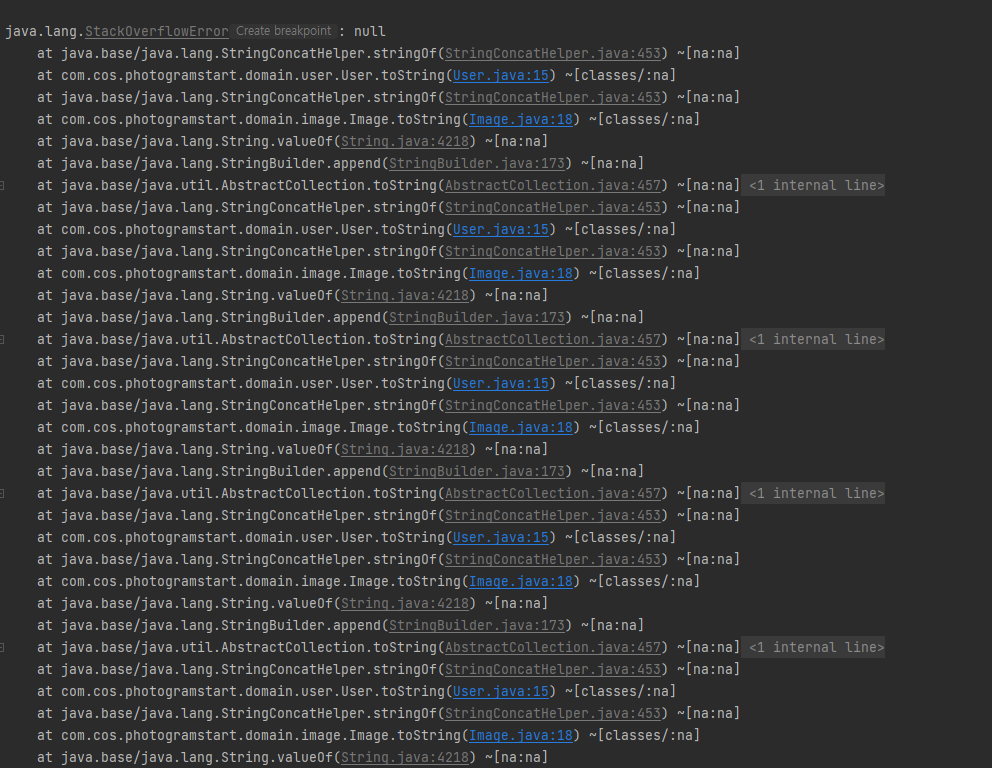
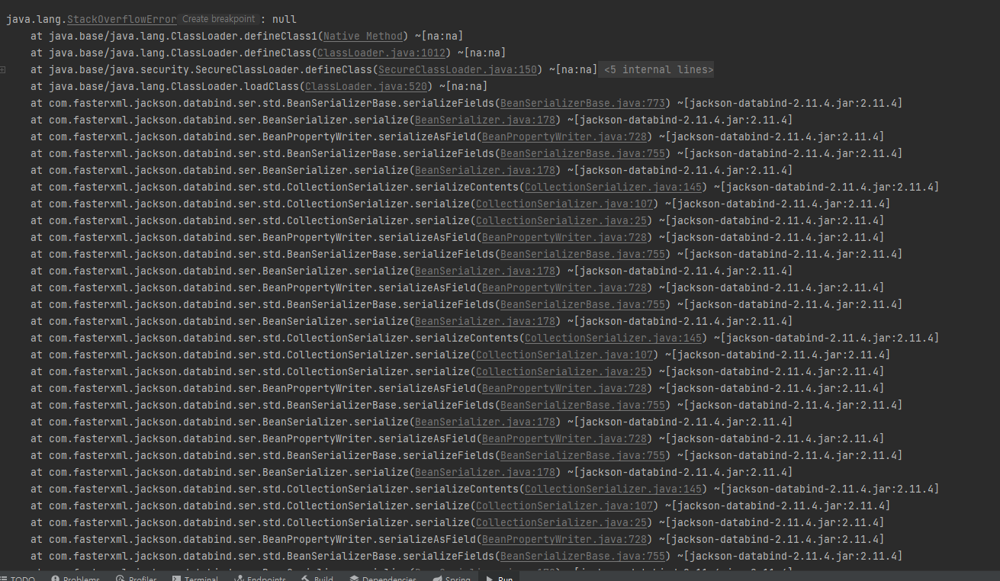
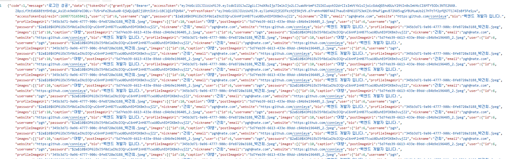
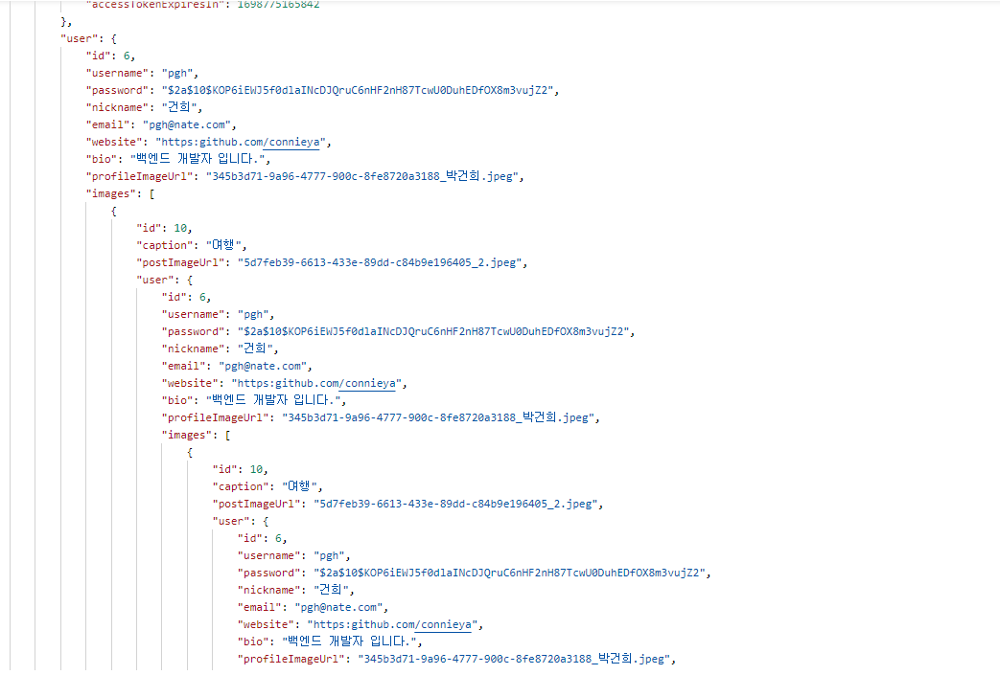
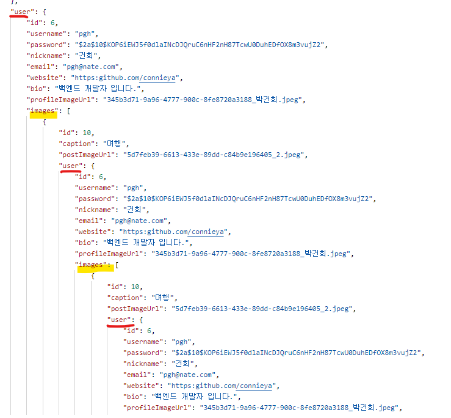
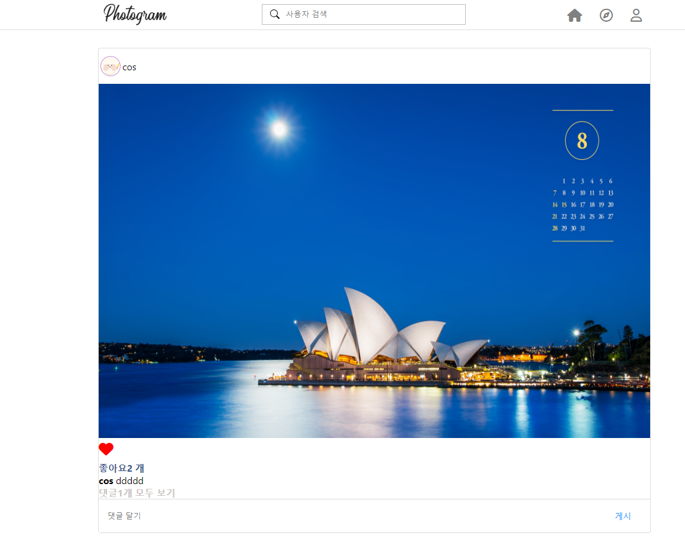

연관 관계 매핑을 하고 서버를 실행 한 뒤, 클라이언트에서 요청을 했는 데 에러가 발생하였다.


### 스택 오버 플로우 

#### 발생 상황

로그인을 시도 했는데 500에러가 발생하였다.  

서버 콘솔을 살펴보니 다음과 같은 에러 로그를 발견하였다.




어디서 에러가 발생했는지 확인해보니

 UserDetailsService 구현한 PrincipleDetailService 의 loadUserByUsername 메소드


```java
@Service
public class PrincipleDetailService implements UserDetailsService {

    private final UserRepository userRepository;

    @Override
    public UserDetails loadUserByUsername(String username) throws UsernameNotFoundException {
        System.out.println("loadUser 아이디 => "+ username);
        User userEntity = userRepository.findByUsername(username).orElseThrow(() -> {
            throw new CustomApiException("존재하지 않는 아이디 입니다.");
        });
        System.out.println("로그인 요청 => " +userEntity);
        return new PrincipalDetails(userEntity);
    }
}
```

로그인 과정을 확인하기 위해
System.out.println("로그인 요청 => " +userEntity); 작성한 코드에서 에러가 발생하였다.


#### 원인

 모든 엔티티에 있는 @Data 애노테이션이 원인이었다.

영방향 관계를 가지고 있는 User 와 Image

```java
@Entity
@Data
public class User {

    @Id
    @GeneratedValue(strategy = GenerationType.IDENTITY)
    private int id;
    private String username;
    private String password;
    private String nickname;
    private String email;
    ....

    @OneToMany(mappedBy = "user")
    private List<Image> images;

    ...

    
}
```

```java
@Entity
@Data
public class Image { // N : 1
    @Id
    @GeneratedValue(strategy = GenerationType.IDENTITY)
    private int id;
    private String caption;
    private String postImageUrl; // 사진을 전송받아서 사진을 서버에 특정 폴더에 저장

    @JoinColumn(name = "userId")
    @ManyToOne
    private User user;

    @OneToMany(mappedBy = "image") // 연관관계의 주인이 아니다.
    private List<Likes> likes;
    

    @OneToMany(mappedBy = "image")
    private List<Comment> comments = new ArrayList<>();
    

}
```

Likes, Comment ,Follow 등 모든 엔티티도 위와 같이 @Data 애노테이션 사용

> @Data 애노테이션은 롬복 라이브러리에서 제공하는 기능으로
> getters, setters, toString , equals, hashCode 메서드 등을 자동으로 생성해준다.


여기서 toString 이 문제를 발생시켰다.

User 객체에 있는 toString 메서드에서 Image 객체를 호출하고 
Image 객체는 또 toString 메서드에서 User 객체 , Likes 객체 , Comment 객체를 호출하고
이렇게 서로가 서로를 계속 무한으로 호출하면서 스택오버 플로우가 발생하게 된 것이다.


#### 해결 

1. @Data 애노테이션 제거

@Data 애노테이션을 제거하고 @Setter , @Getter 애노테이션만 추가 하는 방법으로 스택오버 플로우를 해결 할 수 있다.


2. @ToString 재정의 하기

```java
@Entity
@ToString(exclude = "images")
public class User {

    @Id
    @GeneratedValue(strategy = GenerationType.IDENTITY)
    private int id;
    private String username;
    private String password;
    private String nickname;
    private String email;
    ...

    @OneToMany(mappedBy = "user")
    private List<Image> images;

    ....

}
```

@ToString 의 exclude 속성을 사용하여 , 특정 필드를 문자열 출력에서 제외 시킬 수 있다.
위의 코드에서는 무한 호출을 방지하기 위해 images 필드를 제거하였다.


두 가지 방법 중 1번 방법을 사용하여 스택오버 플로우를 해결 하였다.

하지만 여기서, 끝나지 않았다.

다시 로그인을 시도 하였는데 , 또 다른 에러가 발생하였다.

### 순환 참조 

toString 호출 하는 부분에서 무한 호출할 수 있는 코드를 제거했지만,

여전히 로그인을 시도 했을 때 에러가 발생 했다.



이번에도 StackOverflow 에러가 발생 하였다.

#### 발생 상황

toString() 제거 했는데, 왜 또 발생 한 것일까?
원인을 찾기 위해 포스트맨으로 api를 요청 해보았다.

그리고 결과를 보니,



(몇 초후에 포스트맨이 친절하게 보기 좋게 변환해주었다. )



사진에 다 담을수 없지만 데이터 엄청나게 많은 값이 계층적으로 나타났다.

포스트맨의 스크롤을 내려도 끝이 없었다..

로그인 요청은 성공했는데, 값을 응답 해줄 때 에러가 발생 한 것이다.


#### 원인

```java
    @Transactional
    public ResponseEntity<?> signin(SignInRequest signInRequest) {
        UsernamePasswordAuthenticationToken authenticationToken = signInRequest.toAuthentication();
        Authentication authenticate;
        try {
            authenticate = authenticationManager.getObject().authenticate(authenticationToken);
        } catch (BadCredentialsException e) {
            return ResponseEntity.status(HttpStatus.OK).body(new RespDto<>(-1,"비밀번호가 일치 하지 않습니다.",null));
        }
        TokenDto tokenDto = tokenHelper.generateTokenDto(authenticate);
        PrincipalDetails principal = (PrincipalDetails) authenticate.getPrincipal();
        return ResponseEntity.status(HttpStatus.OK).body(new RespDto<>(1,"로그인 성공",new SignInResponse(tokenDto,principal.getUser())));
    }
```
클라이언트에 토큰 값과 스프링 시큐리티의 사용자 세부 정보를 응답 하는데,

principal.getUser() 는 User 엔티티다.

User 엔티티를 다시 살펴보자

```java
@Entity
@Getter @Setter
public class User {

    @Id
    @GeneratedValue(strategy = GenerationType.IDENTITY)
    private int id;
    private String username;
    private String password;
    private String nickname;
    private String email;
    ....

    @OneToMany(mappedBy = "user")
    private List<Image> images;
    

    ...

    
}
```
응답 할 값에 images 객체도 포함되어 있다.

여기서 스프링의 JSON 응답 개념을 알고 있어야 위의 에러 상황을 이해할 수 있다.

- JSON 은 키-값 쌍으로 이루어진 데이터 표준 포맷으로 , 서버와 클라이언트 간의 데이터를 교환 할 때 주로 사용한다.
- 클라이언트에 응답 하기 위해 java 객체를 json 형식으로 변환 해주어야 하는데 보통 Jackson 라이브러리를 사용한다.
- 스프링 부트에는 Jackson 라이브러리가 기본으로 내장되어 있다.
- @RestController 애노테이션이 붙은 경우 , 클래스 패스에 Jackson이 존재하면 JSON 형식으로 변환해서 응답한다.

위의 과정 속에서 클라이언트로 응답 하는 User 객체가 JSON 으로 변환 되는데, 이때  user 와 images 가 서로의 정보를 
계속 순환하여 참조하게 된다.




#### 해결

1. @JsonIgnore 사용하기

 @JsonIgnore 애노테이션을 사용하여 응답 결과에서 제외 시키자

```java
@Entity
@Getter
public class Image { 
    @Id
    @GeneratedValue(strategy = GenerationType.IDENTITY)
    private int id;
    private String caption;
    private String postImageUrl; //저장

    @JoinColumn(name = "userId")
    @ManyToOne
    @JsonIgnore //  응답 결과에서 제외
    private User user;

    @OneToMany(mappedBy = "image")
    private List<Likes> likes;
    

    @OneToMany(mappedBy = "image")
    private List<Comment> comments = new ArrayList<>();
    

}
```

```java
@Getter @Setter
@Entity

public class User {

    @Id
    @GeneratedValue(strategy = GenerationType.IDENTITY)
    private int id;
    private String username;
    private String password;
    private String nickname;
    ....


    @OneToMany(mappedBy = "user")
    @JsonIgnore // 응답 결과에서 제외
    private List<Image> images;

    
    ....

}
```

2. Entity 대신 DTO 반환

entity 대신 사용할 DTO 생성

```java
@Data
@Builder
@AllArgsConstructor
public class UserInfo {

    private int id;
    private String username;
    private String profileImageUrl;
}

```

엔티티 대신 DTO 사용

```java
@Getter
@NoArgsConstructor
@AllArgsConstructor
public class SignInResponse {
    private TokenDto tokenDto;
//    private User user;
    private UserInfo userInfo;
}
```

엔티티 대신 DTO 응답 

```java
  @Transactional
public ResponseEntity<?> signin(SignInRequest signInRequest) {
        UsernamePasswordAuthenticationToken authenticationToken = signInRequest.toAuthentication();
        Authentication authenticate;
        try {
        authenticate = authenticationManager.getObject().authenticate(authenticationToken);
        } catch (BadCredentialsException e) {
        return ResponseEntity.status(HttpStatus.OK).body(new RespDto<>(-1,"비밀번호가 일치 하지 않습니다.",null));
        }
        TokenDto tokenDto = tokenHelper.generateTokenDto(authenticate);
        PrincipalDetails principal = (PrincipalDetails) authenticate.getPrincipal();
        User user = principal.getUser();
        UserInfo userInfo = UserInfo.builder()
        .username(user.getUsername())
        .id(user.getId())
        .profileImageUrl(user.getProfileImageUrl()).build();
        return ResponseEntity.status(HttpStatus.OK).body(new RespDto<>(1,"로그인 성공",new SignInResponse(tokenDto,userInfo)));
        }

```

위의 2가지 방법 모두 에러가 나지 않고 로그인을 진행 할 수 있었다.




프로젝트에서는 DTO를 사용하여 응답하는 방법을 적용하였다.


