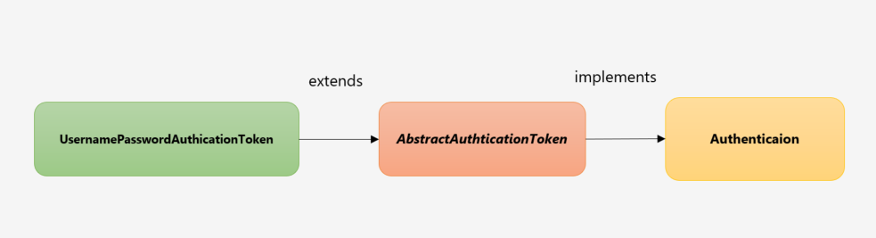
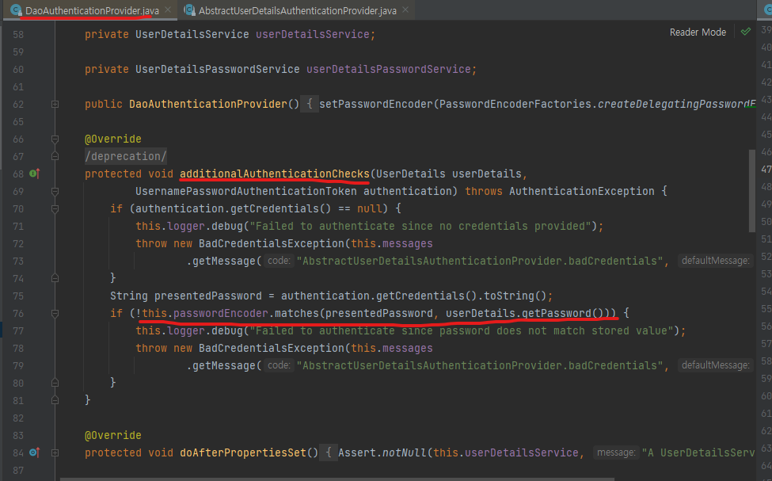
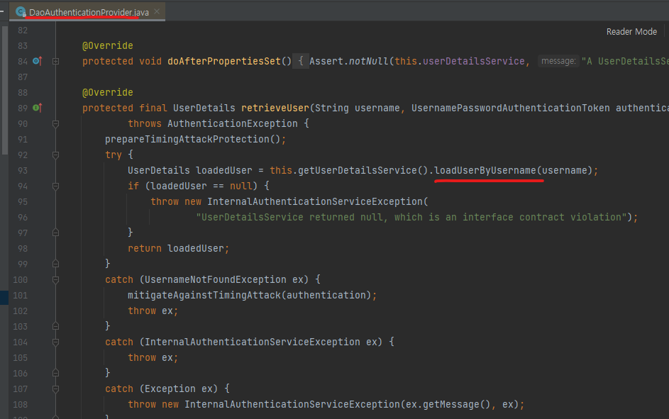
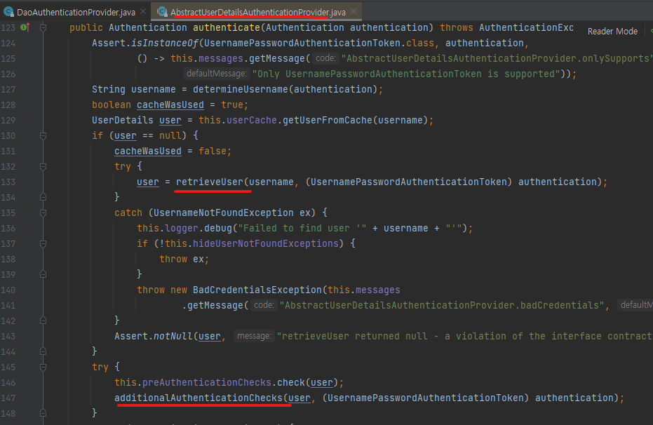
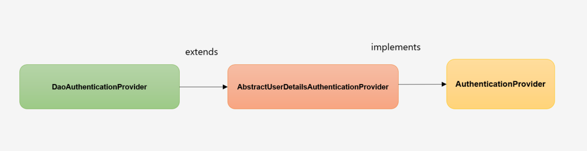

개인 프로젝트를 하면서  Spring Security와 JWT를 활용하여 사용자 인증을 구현했습니다.


## 의존성 설정

```xml
<dependency>
    <groupId>org.springframework.boot</groupId>
    <artifactId>spring-boot-starter-security</artifactId>
</dependency>

<dependency>
  <groupId>com.auth0</groupId>
  <artifactId>java-jwt</artifactId>
  <version>3.18.1</version>
</dependency>

<dependency>
  <groupId>io.jsonwebtoken</groupId>
  <artifactId>jjwt-api</artifactId>
  <version>0.11.2</version>
</dependency>

      
<dependency>
  <groupId>io.jsonwebtoken</groupId>
  <artifactId>jjwt-jackson</artifactId>
  <version>0.11.2</version>
  <scope>runtime</scope>
</dependency>

<dependency>
  <groupId>io.jsonwebtoken</groupId>
  <artifactId>jjwt-impl</artifactId>
  <version>0.11.2</version>
  <scope>runtime</scope>
</dependency>
```

## 시큐리티 커스텀하기

```java
@EnableWebSecurity
@Configuration
public class SecurityConfig extends WebSecurityConfigurerAdapter {
    
    @Override
    protected void configure(HttpSecurity http) throws Exception {
        http
                .csrf().disable()
                .sessionManagement().sessionCreationPolicy(SessionCreationPolicy.STATELESS)
                .and()
                .addFilterBefore(new JWTAuthenticationFilter(tokenHelper) , UsernamePasswordAuthenticationFilter.class)
                .authorizeRequests()
                .antMatchers("/auth/**")
                .permitAll()
                .anyRequest().authenticated();
    }
}

```

- WebSecurityConfigureAdapter 를 상속받으면 시큐리티 설정파일로 인식이 된다.
- @Configuration 으로 해당 클래스를 IoC 컨테이너에 등록
- @EnableWebSecurity 로 시큐리티 설정파일로 인식된 파일을 활성화 시킴
- csrf().disable() : csrf 설정 disable
- sessionManagement().sessionCreationPolicy(SessionCreationPolicy.STATELESS) : 시큐리티는 기본적으로 세션을 사용하기 때문에 Stateless 로 설정
- configure(HttpSecurity http) : Http 보안을 설정하는 메서드이다.
    - authorizeRequest() :  요청에 대한 권한을 설정하는 메서드이다.
    - antMatchers("/auth/\*\*").permitAll() :  "/auth/**" 로 시작하는 요청은 전부 허용 (로그인 , 회원가입은 인증이 필요 없음)
    - anyRequest().authenticated() : 나머지 API 는 전부 API 요청이 필요함


```java
@EnableWebSecurity
@Configuration 
public class SecurityConfig extends WebSecurityConfigurerAdapter {
    

    @Override
    protected void configure(HttpSecurity http) throws Exception {
        System.out.println("시큐리티 config @@");
        http
                .formLogin().disable()
                .httpBasic().disable()
                .csrf().disable()
                .sessionManagement().sessionCreationPolicy(SessionCreationPolicy.STATELESS)
                .and()
                .authorizeRequests()
                .antMatchers("/api/**")
                .authenticated()
                .anyRequest().permitAll();

    }
}

```

## 로그인 구현에 필요한 인터페이스와 클래스

**로그인을 할 때 사용할  Dto 클래스**

```java
@Getter
@AllArgsConstructor
@NoArgsConstructor
public class SignInRequest {

    @NotBlank
    private String username;
    @NotBlank
    private String password;
    
    public UsernamePasswordAuthenticationToken toAuthentication(){
        return new UsernamePasswordAuthenticationToken(username,password);
    }

}
```

여기서 toAuthentication 메서드는 UsernamePasswordAuthenticationToken 를 생성한다.
UsernamePasswordAuthenticationToken 은 사용자의 인증 정보를 담고, 이후 Spring Security 에서
사용자의 인증 및 권한 부여를 수행하는 데 사용된다.



UsernamePasswordAuthenticationToken 클래스는  추상 클래스 AbstractAuthenticationToken 의 자식 클래스이고
AbstractAuthenticationToken 는 Authentication 인터페이스를 구현하였다.


#### Authentication 인터페이스

```java
public interface Authentication extends Principal, Serializable {

	
	Collection<? extends GrantedAuthority> getAuthorities();


	Object getCredentials();

	
	Object getDetails();

	
	Object getPrincipal();

	
	boolean isAuthenticated();

	
	void setAuthenticated(boolean isAuthenticated) throws IllegalArgumentException;

}
```

- 사용자의 인증 정보를 저장하는 토큰 개념
- 인증 시 id 와 password 를 담고 인증 검증을 위해 전달 되어 사용된다.
- 인증 후 최종 인증 결과를 담고 SecurityContext 에 저장되어 전역적으로 참조가 가능하다.


**토큰 생성  Dto**


```java
@Getter
@NoArgsConstructor
@AllArgsConstructor
@Builder
public class TokenDto {

    private String grantType;
    private String accessToken;
    private Long accessTokenExpiresIn;
}

```

인가 유형, ,엑세스 토큰 , 엑세스 토큰의 만료 시간


```java
public interface UserDetailsService {
    
	UserDetails loadUserByUsername(String username) throws UsernameNotFoundException;

}
```

Spring Security 에 있는 UserDetailsService 인터페이스


**UserDetailService** 란?

Spring Security 에서 유저의 정보를 가져오는 인터페이스이다.

loadUserByUsername(String username) 메서드 :

username 을 기반으로 사용자 정보를 가져오는 메서드이다.  이 메서드를 구현하여 사용자의 인증 정보를 
데이터베이스나 다른 소스로부터 읽어오게 된다.

사용자 정보를 가져온 뒤, 해당 정보를 스프링 시큐리티가 이해할 수 있는 UserDetails 객체로 변환하여 반환한다.


Spring Security의 **UserDetails** 인터페이스

사용자의 정보를 담는 인터페이스이다. 

```java
public interface UserDetails extends Serializable {

	
	Collection<? extends GrantedAuthority> getAuthorities();
    
	String getPassword();
    
	String getUsername();
    
	boolean isAccountNonExpired();
    
	boolean isAccountNonLocked();
    
	boolean isCredentialsNonExpired();
    
	boolean isEnabled();

}

```

- getAuthorities() : 계정이 갖고 있는 권한 목록을 리턴한다.
- getPassword() : 계정의 비밀번호를 리턴한다.
- getUsername() : 계정의 이름을 리턴한다.
- isAccountNonExpired() : 계정이 만료되지 않았는지 리턴한다.
- isAccountNonLocked() : 계정이 잠겨 있지 않았는지 리턴한다.
- isCredentialsNonExpired() : 비밀번호가 만료되지 않았는지 리턴한다. 
- isEnabled() : 계정이 사용 가능한지 리턴한다.


**UserDetailsService 구현하기**

UserRepository 에서 유저 정보를 가져 온다.

```java
@RequiredArgsConstructor
@Service
public class PrincipleDetailService implements UserDetailsService {

    private final UserRepository userRepository;

    @Override
    public UserDetails loadUserByUsername(String username) throws UsernameNotFoundException {
        User userEntity = userRepository.findByUsername(username).orElseThrow(() -> {
            throw new CustomApiException("존재하지 않는 아이디 입니다.");
        });
        return new PrincipalDetails(userEntity);
    }
}
```

**UserDetails 구현하기**

```java
@Data
public class PrincipalDetails implements UserDetails {

    private User user;

    public PrincipalDetails(User user) {
        this.user = user;
    }

    @Override
    public Collection<? extends GrantedAuthority> getAuthorities() {
        Collection<GrantedAuthority> collector = new ArrayList<>();
        collector.add(() -> "USER_ROLE");
        return collector;
    }

    @Override
    public String getPassword() {
        return user.getPassword();
    }

    @Override
    public String getUsername() {
        return user.getUsername();
    }

    @Override
    public boolean isAccountNonExpired() {
        return true;
    }

    @Override
    public boolean isAccountNonLocked() {
        return true;
    }

    @Override
    public boolean isCredentialsNonExpired() {
        return true;
    }

    @Override
    public boolean isEnabled() {
        return true;
    }
}
```


**토큰 생성 클래스**

```java
@Service
@Slf4j
public class JWTTokenHelper {

    @Autowired
    private UserRepository userRepository;
    private static final String AUTHORITIES_KEY = "auth";
    private static final String BEARER_TYPE = "Bearer";
    private static final long ACCESS_TOKEN_EXPIRE_TIME = 1000 * 60 *30;

    private Key key;
    
    public JWTTokenHelper(@Value("${jwt.secret}") String secretKey) {
        byte[] keyBytes = Decoders.BASE64.decode(secretKey);
        this.key = Keys.hmacShaKeyFor(keyBytes);
    }
    public TokenDto generateTokenDto(Authentication authentication) {
        long now = (new Date()).getTime();
        PrincipalDetails principalDetails = (PrincipalDetails) authentication.getPrincipal();
        Date accessTokenExpiresIn = new Date(now + ACCESS_TOKEN_EXPIRE_TIME);
        User userEntity = principalDetails.getUser();

        ClaimDto claimDto = ClaimDto.builder().id(userEntity.getId())
                .nickname(userEntity.getNickname())
                .email(userEntity.getEmail()).build();

        String accessToken = Jwts.builder()
                .setSubject(authentication.getName())
                .claim(AUTHORITIES_KEY, claimDto)
                .setExpiration(accessTokenExpiresIn)
                .signWith(key, SignatureAlgorithm.HS512)
                .compact();
        

        return TokenDto
                .builder()
                .grantType(BEARER_TYPE)
                .accessToken(accessToken)
                .accessTokenExpiresIn(accessTokenExpiresIn.getTime())
                .build();
    }

    public Authentication getAuthentication(String accessToken){
        Claims claims = parseClaims(accessToken);
        if(claims.get(AUTHORITIES_KEY) == null){
            throw new RuntimeException("권한 정보가 없는 토큰입니다.");
        }
        ObjectMapper mapper = new ObjectMapper();
        ClaimDto claimDto = mapper.convertValue(claims.get(AUTHORITIES_KEY), ClaimDto.class);
        User user = userRepository.findById(claimDto.getId()).orElseThrow(() -> {
            throw new CustomApiException("존재하지 않는 아이디 입니다.");
        });
        PrincipalDetails principalDetails = new PrincipalDetails(user);
        return new UsernamePasswordAuthenticationToken(principalDetails,"",principalDetails.getAuthorities());
    }

    public boolean validateToken(String token) {
        try {
            Jwts.parserBuilder().setSigningKey(key).build().parseClaimsJws(token);
            return true;
        }catch (io.jsonwebtoken.security.SecurityException | MalformedJwtException e){
            log.info("잘못된 JWT 서명입니다.");
        } catch (ExpiredJwtException e) {
            log.info("만료된 JWT 토큰입니다.");
        } catch (UnsupportedJwtException e) {
            log.info("지원되지 않는 JWT 토큰입니다.");
        } catch (IllegalArgumentException e) {
            log.info("JWT 토큰이 잘못되었습니다.");
        }
        return false;
    }

    private Claims parseClaims(String accessToken) {
        try {
            return Jwts.parserBuilder().setSigningKey(key).build().parseClaimsJws(accessToken).getBody();
        }catch (ExpiredJwtException e){
            return e.getClaims();
        }
    }
}
```

- **generateTokenDto**
  - 유저 정보를 파라미터로 받아서 access token 과 refresh token 을 생성한다.
  - 엑세스 토큰의 만료 시간을 30분으로 지정
  - 사용자의 id와 닉네임, 이메일로 클레임을 생성 (JWT 이 헤더 , 페이로드 , 서명 중 페이로드에 해당 함)
  - 시크릿 키와 HS516 암호화 알고리즘을 통해 토큰을 서명한다. 
- **getAuthentication**
  - JWT 토큰을 복호화하여 토큰에 들어 있는 정보를 꺼낸다.
  - UserDetails 를 구현한 PrincipalDetails 객체를 만들어서 Authentication 을 리턴한다.
- **validateToken**
  - 토큰 정보를 검증한다.
  - Jwts 모듈이 알아서 Exception 을 던져준다.


**필터 등록하기**

```java
@RequiredArgsConstructor
public class JWTAuthenticationFilter extends OncePerRequestFilter {

    public static final String AUTHORIZATION_HEADER = "Authorization";
    public static final String BEARER_PREFIX ="Bearer ";

    private final JWTTokenHelper tokenHelper;

    @Override
    protected void doFilterInternal(HttpServletRequest request, HttpServletResponse response, FilterChain filterChain) throws ServletException, IOException {
        String jwt = resolveToken(request);
        
        if (StringUtils.hasText(jwt) & tokenHelper.validateToken(jwt)){
            Authentication authentication = tokenHelper.getAuthentication(jwt);
            SecurityContextHolder.getContext().setAuthentication(authentication);
        }
        filterChain.doFilter(request,response);
    }

    private String resolveToken(HttpServletRequest request) {
        String bearerToken = request.getHeader(AUTHORIZATION_HEADER);
        if (StringUtils.hasText(bearerToken) && bearerToken.startsWith(BEARER_PREFIX)){
            return bearerToken.substring(7);
        }
        return null;
    }
}
```

- OncePerRequestFilter 인터페이스를 구현하기 때문에 요청 받을 때 단 한번만 실행된다. 
- doFilterInternal
  - 실제 필터링 로직을 수행하는 곳이다.
  - Request Header 에서 Access Token 을 꺼내서 여러가지 검사 후 유저 정보를 꺼내서 SecurityContext 에 저장한다.
  - 가입/로그인/재발급을 제외한 모든 Request 요청은 이 필터를 거치기 때문에 토큰 정보가 없거나, 유효하지 않으면 정상적으로 수행되지 않는다.


그리고 위의 작성한 필터를 스프링 시큐리티 설정 클래스에 추가하자 

```java
@RequiredArgsConstructor
@EnableWebSecurity
@Configuration 
public class SecurityConfig extends WebSecurityConfigurerAdapter {

    private final JWTTokenHelper tokenHelper;
    private final JwtAuthenticationEntryPoint jwtAuthenticationEntryPoint;
    private final CorsConfig corsConfig;


    @Override
    @Bean
    public AuthenticationManager authenticationManagerBean() throws Exception {
        return super.authenticationManagerBean();
    }

    @Bean
    public BCryptPasswordEncoder encode(){
        return new BCryptPasswordEncoder();
    }

    @Override
    protected void configure(AuthenticationManagerBuilder auth) throws Exception {
        super.configure(auth);
    }

    @Override
    protected void configure(HttpSecurity http) throws Exception {
        http
                .csrf().disable()
                .sessionManagement().sessionCreationPolicy(SessionCreationPolicy.STATELESS)
                .and()
                .exceptionHandling()
                .authenticationEntryPoint(jwtAuthenticationEntryPoint)
                .and()
                .addFilter(corsConfig.corsFilter())
                .addFilterBefore(new JWTAuthenticationFilter(tokenHelper) , UsernamePasswordAuthenticationFilter.class)
                .authorizeRequests()
                .antMatchers("/auth/**")
                .permitAll()
                .anyRequest().authenticated();
    }
}
```


로그인에 필요한 클래스와 인터페이스를 생성했으니, 
이제 로그인을 구현 해보자.

## 로그인 구현


### **백엔드** 

컨트롤러 

```java
    @PostMapping("/auth/signin")
    public ResponseEntity<?> signin(@RequestBody SignInRequest signInRequest) {
        return ResponseEntity.status(HttpStatus.OK).body(new RespDto<>(1,"로그인 성공",authService.signin(signInRequest)));
    }
```

비즈니스 로직 

```java
    @Transactional
    public SignInResponse signin(SignInRequest signInRequest) {
        UsernamePasswordAuthenticationToken authenticationToken = signInRequest.toAuthentication();
        Authentication authenticate = authenticationManager.getObject().authenticate(authenticationToken);
        PrincipalDetails principal = (PrincipalDetails) authenticate.getPrincipal();
        TokenDto tokenDto = tokenHelper.generateTokenDto(authenticate);
        

        return new SignInResponse(tokenDto,principal.getUser());
    }
```

클라이언트로 받은 요청 DTO를 통해  UsernamePasswordAuthenticationToken 토큰을 생성하고,

생성된 authenticationToken와 AuthenticationManager를 사용하여 사용자를 인증한다.

authenticate() 메서드가 실행 될 때  UserDetailsService 를 구현한 PrincipleDetailService 클래스의 
loadUserByUsername 메서드가 실행이 된다.

이때, 사용자의 유저 정보를 점검한다. 그런데, 아무리 봐도 비밀번호를 체크하는 코드는 없다.
스프링 시큐리티는 언제, 어디서 비밀번호를 체크하는 것일까??

관련 자료를 찾던 중에 [Spring Security의 사용자 비밀번호 검사](https://github.com/HomoEfficio/dev-tips/blob/master/Spring%20Security%EC%9D%98%20%EC%82%AC%EC%9A%A9%EC%9E%90%20%EB%B9%84%EB%B0%80%EB%B2%88%ED%98%B8%20%EA%B2%80%EC%82%AC.md) 라는 글을 발견 하였다.

그리고 위 글에서 DaoAuthenticationProvider 클래스에서 비밀번호를 검사한다고 하여 

인텔리제이 메서드 검색 기능을 활용하여 DaoAuthenticationProvider 클래스를 찾아보았다.



DaoAuthenticationProvider 클래스의 additionalAuthenticationChecks 메서드에서 비밀번호를 검증한다.

- Request 로 받아서 만든 authentication 과 DB에서 꺼낸 값인 userDetails의 비밀번호를 비교
- DB에 있는 값은 암호화 된 값이고 사용자가 입력한 값은 raw 값이지만 passwordEncoder 를 사용하여 비교 가능


그리고 비밀번호를 검증하는 메서드 외에 발견한 것이 있었다. 




DaoAuthenticationProvider 클래스의 
retrieveUser 메소드 내부에서 loadUserByUsername() 메서드를 호출한다.


그리고 retrieveUser 메서드는 어디서 호출하는 지 찾아보니



DaoAuthenticationProvider 클래스의 부모 클래스인 AbstractUserDetailsAuthenticationProvider 클래스의
authenticate 메소드에서 호출하고 있었다. 

그리고 여기서 비밀번호를 검증하는 additionalAuthenticationChecks 메서드로 호출하고 있었다.


클래스 구조를 그림으로 나타내면 다음과 같다.




### **프론트 엔드**

로그인 요청 버튼 클릭  (signIn 메소드 호출)


```javascript
  const signin = async (e: any) => {
    e.preventDefault();
    const res = (
      await SignInUser({
        createPayload: {
          username: username,
          password: password,
        },
      })
    ).entity;
    if (res.code === 1) {
      sessionStorage.setItem("access_token", res.data.tokenDto.accessToken);
      const id = res.data.user.id;
      const username = res.data.user.username;
      dispatch(setUser({ id: id, username: username }));
      alert(res.message);
      navigate("/story");
    } else {
      alert(res.message);
      console.log("로그인 실패 ", res);
    }
  };
```

로그인 버튼을 클릭하고 인증에 성공 하게 되면, 응답으로 token 객체를 받게 된다.
응답 받은 토큰을 세션 스토리지에 저장한다.

※ 세션스토리지에 저장하면 XSS 공격에 의해 토큰이 탈취될 수도 있는 위험이 있고, 브라우저 탭을 닫으면 스토리지에 있는
데이터가 날아가는 단점이 있다. 


세션 스토리지에서 엑세스 토큰을 가져온다.


```javascript
export function authHeader() {
  const user = sessionStorage.getItem("access_token");
  if (user) {
    return { Authorization: "Bearer " + user };
  }
  return {};
}
```

이 후 서버에 요청 할때 마다 http 헤더에 토큰을 실어서 요청한다.

```javascript
export function produceCreateAPI<entityCreateProp, returnEntityType>(
  apiPath: string
) {
  return async function ({
    createPayload,
  }: CreateProps<entityCreateProp>): Promise<{ entity: returnEntityType }> {
    try {
      const res: any = await client.post(`/${apiPath}`, createPayload, {
        headers: authHeader(),
      });
      return { entity: res.data };
    } catch (error: any) {
      if (error.response.status === 400) {
        alert(error.response.data.data.content);
      }
      throw error;
    }
  };
}
```