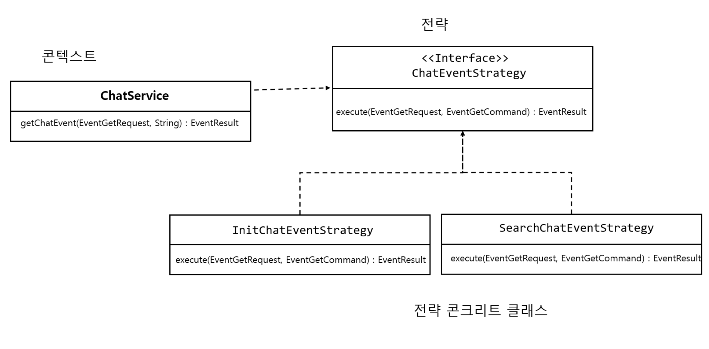
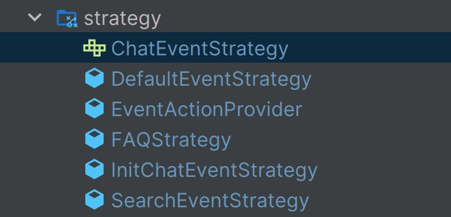

## 서문

내가 맡고 있는 프로젝트의 유지 보수를 마치고 다른 팀원이 하고 있는 챗봇 API 개발에 투입 되었다.

일정이 빠듯하게 진행되는 프로젝트로 기존 팀원이 하고 있는 API 개발을 나눠서 진행해야 했다.

팀원 분 혼자서 빠르게 개발하다 보니, 요구사항에 맞는 비즈니스 로직 우선으로 코드를 작성하셨다.

코드를 살펴보니 기능은 잘 동작하지만, 코드가 길어 가독성이 떨어졌다.

여기서 새로운 기능이 추가될 때 코드를 확장해나가면 나중에 유지보수 하기가 무척 어려줘 질 것이라 판단하였다.
일정이 빠듯하긴 하지만, 동작에 영향을 미치지 않을 정도로만 리팩토링을 하기로 하였고, 팀원분께 양해를 구하고
리팩토링을 진행하였다.

## 기존 코드

아래 코드는 클라이언트가 보낸 이벤트에 맞는 챗봇 응답 값을 리턴하는 메서드이다.

여기에서 사용되는 코드는 실제 회사에서 사용한 코드는 아니라 포스팅을 위해 유사하게 만들어진 코드 입니다.

```java
public EventResult getChatEvent(EventGetRequest eventRequest) {
        EventGetCommand eventGetCommand = EventGetCommand.create(eventRequest);
        List<Menus> menusList = chatMapper.getMenus(eventGetCommand);
        EventResult eventResult = new EventResult();

        processMenus(menusList, eventResult);
        if ("INIT".equals(eventGetCommand.getActEventCode())) {
            List<HamMenus> hamMenusList = chatMapper.getHamMenus(eventGetCommand);
            eventResult.setHamMenus(hamMenusList);

            processSimpleResponsesInit(chatMapper.getSimpleResponsesInit(eventGetCommand), menusList, eventResult);

            processCommons(chatMapper.getCommons(eventGetCommand), eventResult);
            // 생략

            List<PhraseContent> phraseContents = chatMapper.getPhrase(eventGetCommand);
            processPhrases(phraseContents, eventResult);
        } else if("SEARCH_EVENT".equals(eventGetCommand.getActEventCode())) {
            // .. 생략
        } else if("FAQ".equals(eventGetCommand.getActEventCode())) {
            //.. 생략
        }

        processSuggestions(chatMapper.getSuggestions(eventGetCommand), eventResult);

        eventResult.setLinkOutSuggestion(chatMapper.getLinkOutSuggestion(eventGetCommand));
        eventResult.setLocalCode(eventGetCommand.getCountryCode());
        eventResult.setLanguageCode(eventGetCommand.getLanguageCode());
        return eventResult;
    }


    private void processMenus(List<Menus> menusList, EventResult eventResult) {
        if (menusList == null || menusList.isEmpty())
            return;

        List<MainLink> mainLinks = menusList.stream()
                .filter(menu -> EventType.MAIN_LINK.name().equals(menu.getEventType()))
                .map(this::convertToMainLink)
                .collect(Collectors.toList());
        if (!mainLinks.isEmpty()) {
            eventResult.setMainLinks(mainLinks);
        }

        List<Menus> filteredMenus = menusList.stream()
                .filter(menu -> EventType.MENU.name().equals(menu.getEventType()))
                .collect(Collectors.toList());
        if (!filteredMenus.isEmpty()) {
            eventResult.setMenus(filteredMenus);
        }
        // 생략
    }

    private MainLink convertToMainLink(Menus menu) {
        MainLink mainLink = new MainLink();
        mainLink.setFromMenus(menu);
        return mainLink;
    }

    private Prods convertToProd(Menus menu) {
        Prods prod = new Prods();
        prod.setFromMenus(menu);
        return prod;
    }


    private void processSimpleResponsesInit(List<SimpleResponses> responses, List<Menus> menusList,
            EventResult eventResult) {
        if (responses == null || responses.isEmpty())
            return;

        if (!menusList.isEmpty() && EventCode.INIT.name().equals(menusList.get(0).getFromEventCode())) {
            List<Greeting> greetings = responses.stream()
                    .map(this::convertToGreeting)
                    .collect(Collectors.toList());

            eventResult.setGreetings(greetings);
            eventResult.setInputYn("N");
            eventResult.setPopupYn("N");
        } else {
            eventResult.setSimpleResponses(responses);
        }
    }

    private void processSimpleResponses(List<SimpleResponsesInputYn> responses, List<Menus> menusList,
            EventResult eventResult) {
        if (responses == null || responses.isEmpty())
            return;

        List<SimpleResponses> simpleResponses = responses.stream()
                .map(this::convertToSimpleResponses)
                .collect(Collectors.toList());
       //.. 생략

    }

    private SimpleResponses convertToSimpleResponses(SimpleResponsesInputYn simpleResponsesInputYn) {
        SimpleResponses simpleResponses = new SimpleResponses();
        simpleResponses.setFromSimpleResponsesInputYn(simpleResponsesInputYn);
        return simpleResponses;
    }

     private Greeting convertToGreeting(SimpleResponses simpleResponses) {
        Greeting greeting = new Greeting();
        greeting.setFromGreeting(simpleResponses);
        return greeting;
    }

    private void processSuggestions(List<Suggestions> suggestions, EventResult eventResult) {
        if (suggestions != null && !suggestions.isEmpty()) {
            eventResult.setSuggestions(suggestions);
        }
    }
   // .... 그 외에 메서드들 생략

```

클래스가 여러 가지 일을 하고 있다.

코드의 길이가 생략을 했는데도 불구하고 엄청 길다.

가독성이 떨어져서 코드를 이해하기 어렵다.

왜 가독성이 떨어질까?

### 절차지향 프로그래밍 (Procedural Programming)

위의 코드는 절차지향으로 되어 있다.

절차지향은 기능이 중심이 되며, "어떤 기능을 어떤 순서로 처리할 것인가?" 를 관점으로 프로그래밍 한다.

그래서 하나의 큰 기능을 처리하기 위해 작은 단위의 기능들로 나누어 처리하는 Top-Down 접근 방식으로 설계 된다.

챗봇 이벤트에 따른 응답 결과를 리턴하기 위해서 데이터를 가져오는 것, 변환하는 것 , 상태를 변화시키는 것등 여러 기능을 함수나 프로시저로 만들어서 하나의 클래스에서 데이터를 조작하고 있다.

만약에 프로그램의 규모가 커지게 된다면 데이터의 종류가 증가하고 함수와 프로시저도 따라서 증가하게 된다면

다음과 같은 문제가 발생할 수 있다.

- 데이터 타입이나 의미를 변경해야 할 때, 함께 수정해야 하는 프로시저가 증가한다.
- 같은 데이터를 프로시저들이 서로 다른 의미로 사용하는 경우가 발생한다.

또한,
애플레이션 레이어에서 많은 일을 하기 때문에
코드를 분석하고 수정하기 위해서 스크롤을 여러 번 왔다 갔다 해야 했다.

절차지향은 컴퓨터의 처리 구조와 유사해 실행 속도가 빠른 장점이 있지만
프로그램이 커질수록 위의 사례 처럼 유지보수가 어렵다는 단점이 있다.

## 리팩토링 1

### 객체지향 프로그래밍 (Object-Oriented Programming)

> 객체 지향은 소프트웨어의 핵심을 기능이 아닌 객체로 삼으며 "누가 어떠한 일을 할것인가? 에 초점을 맞춘다.

객체를 도출하고 객체에게 명령 대신 요청을 담은 메시지를 전달하면 객체는 이를 어떻게 처리할지 자율적으로
판단하고, 내부에 가지고 있는 데이터를 이용해 필요한 작업을 수행한다.

#### 변환 로직 위임하기

기존에는 애플리케이션 레이어에서 챗봇 응답 데이터를 DB에서 가져와 클라이언트가 원하는 데이터를 응답하기 위해 데이터를 변환하는 작업을 하고 있다.

```java
    // .. 생략

      private void processSimpleResponsesInit(List<SimpleResponses> responses, List<Menus> menusList,
            EventResult eventResult) {
        if (responses == null || responses.isEmpty())
            return;

        if (!menusList.isEmpty() && EventCode.INIT.name().equals(menusList.get(0).getFromEventCode())) {
            List<Greeting> greetings = responses.stream()
                    .map(this::convertToGreeting)
                    .collect(Collectors.toList());

            eventResult.setGreetings(greetings);
            eventResult.setInputYn("N");
            eventResult.setPopupYn("N");
        } else {
            eventResult.setSimpleResponses(responses);
        }
    }


     private Greeting convertToGreeting(SimpleResponses simpleResponses) {
        Greeting greeting = new Greeting();
        greeting.setFromGreeting(simpleResponses);
        return greeting;
    }
    // ..  생략

```

이 부분을 객체에게 위임하는 것이 좋을 것 같다. 애플리케이션 레벨에서 변환하는 것은 코드만 길어지고 책임이 많이 진다.

```java
@Getter
public class Greeting {

    private String stringToSpeech;
    private String displayText;
    private String displayType;

    @Builder
    private Greeting(String stringToSpeech, String displayText, String displayType) {
        this.stringToSpeech = stringToSpeech;
        this.displayText = displayText;
        this.displayType = displayType;
    }

    public static Greeting from(SimpleResponses simpleResponses) {
        return Greeting
                .builder()
                .stringToSpeech(simpleResponses.getStringToSpeech())
                .displayText(simpleResponses.getDisplayText())
                .displayType(simpleResponses.getDisplayType())
                .build();
    }
}
```

애플리케이션 레이어에서 작업하던 변환 로직을 Greeting 객체에게 위임하면 자율적으로 처리하게 하였다.

이제 애플리케이션 레이어에 변환 메서드는 전부 지워버렸다.

#### 챗봇 응답 정보 위임

챗봇 응답 정보를 처리하는 것을 아래 애플리케이션 레이어가 아닌

```java
private void processMenus(List<Menus> menusList, EventResult eventResult) {
        if (menusList == null || menusList.isEmpty())
                return;

        List<MainLink> mainLinks = menusList.stream()
                .filter(menu -> EventType.MAIN_LINK.name().equals(menu.getEventType()))
                .map(this::convertToMainLink)
                .collect(Collectors.toList());
        if (!mainLinks.isEmpty()) {
            eventResult.setMainLinks(mainLinks);
        }

        List<Menus> filteredMenus = menusList.stream()
                .filter(menu -> EventType.MENU.name().equals(menu.getEventType()))
                .collect(Collectors.toList());
        if (!filteredMenus.isEmpty()) {
            eventResult.setMenus(filteredMenus);
        }

        List<Prods> prods = menusList.stream()
                .filter(menu -> EventType.PROD_GROUP.name().equals(menu.getEventType())
                        || EventType.PROD.name().equals(menu.getEventType()))
                .map(this::convertToProd)
                .collect(Collectors.toList());
        if (!prods.isEmpty()) {
            eventResult.setProds(prods);
        }
    }

```

EventResult 객체에 위임해서 EventResult 가 자율적으로 처리한다.

```java
public class EventResult {
    private List<Menus> menus;
    private List<Prods> prods;
    private List<HamMenus> hamMenus;
    private List<SimpleResponses> simpleResponses;
    // .. 생략


    public EventResult() {

    }

    public void processMenus(List<Menus> menusList) {
        if (menusList == null || menusList.isEmpty())
            return;

        this.mainLinks = menusList
                .stream()
                .filter(menu ->
                        EventType.MAIN_LINK.name().equals(menu.getEventType())
                )
                .map(MainLink::from)
                .collect(Collectors.toList());

        this.menus = menusList.stream()
                .filter(menu -> EventType.MENU.name().equals(menu.getEventType()))
                .toList();

        this.prods = menusList.stream()
                .filter(menu -> EventType.PROD_GROUP.name().equals(menu.getEventType())
                        || EventType.PROD.name().equals(menu.getEventType()))
                .map(Prods::from)
                .toList();
    }


    // 그 외 메서드
}
```

### 결과

#### 캡술화

변환 로직과 응답 정보를 처리하는 것을 객체 내부로 감추었다.

이제 요구사항이 추가되거나 수정되어도 객체 내에서 코드를 수정하면 되기 때문에 시스템 전체에 영향을 덜 주게 된다.

#### 단일 책임 원칙 준수

데이터를 변환하거나 응답 정보를 처리하는 것을 객체에게 위임했기 때문에

애플리케이션 레이어의 클래스는 챗봇 응답 결과를 리턴한다는 주요 역할에 집중할 수 있다.

```java
   public EventResult getChatEvent(EventGetRequest eventRequest, String chatId) {
        EventGetCommand eventGetCommand = EventGetCommand.create(eventRequest);
        List<Menus> menusList = chatMapper.getMenus(eventGetCommand);
        EventResult eventResult = new EventResult();

        eventResult.processMenus(menusList);
        if ("INIT".equals(eventGetCommand.getActEventCode())) {
            eventResult.processHamMenus(chatMapper.getHamMenus(eventGetCommand));
            eventResult.processSimpleResponses(chatMapper.getSimpleResponsesInit(eventGetCommand), menusList);
            List<PopupsContent> combinedPopups = Stream.concat(
                    chatMapper.getPopups(eventGetCommand).stream(),
                    chatMapper.getPopupsProds(eventGetCommand).stream()).collect(Collectors.toList());
            eventResult.processePopups(combinedPopups);
            eventResult.processeCommons(chatMapper.getCommons(eventGetCommand));
            eventResult.processPhaseList(chatMapper.getPhrase(eventGetCommand));
        }else if("SEARCH_EVENT".equals(eventGetCommand.getActEventCode())) {
            // .. 생략
        } else if("FAQ".equals(eventGetCommand.getActEventCode())) {
            //.. 생략
        } else {
            eventResult.processSimpleResponses(chatMapper.getSimpleResponses(eventGetCommand));
        }
        eventResult.processSuggestions(chatMapper.getSuggestions(eventGetCommand));
        eventResult.processeLinkOutSuggestion(chatMapper.getLinkOutSuggestion(eventGetCommand));
        eventResult.setLocaleCode(eventGetCommand.getCountryCode());
        eventResult.setLanguageCode(eventGetCommand.getLanguageCode());
        return eventResult;
    }

    // 변환 로직 객체에 위임

    // 응답 처리 로직 객체에 위임
```

객체에 변환 로직과 응답 처리 로직을 위임한 결과로 코드 라인이 130줄이 사라졌으며, 가독성이 조금 향상되고 유지보수 하기 좋아졌다.

### 챗봇 이벤트 요청에 맞는 다양한 응답 결과

클라이언트가 요청하는 이벤트의 종류에 따라서 다른 응답 결과를 반환 해야 한다.

현재 코드는 if else 문을 통해 각 이벤트 요청에 맞는 응답 결과를 처리하고 있다.

```java
    if ("INIT".equals(eventGetCommand.getActEventCode())) {
           // .. 생략
    }else if("SEARCH_EVENT".equals(eventGetCommand.getActEventCode())) {
            // .. 생략
    } else if("FAQ".equals(eventGetCommand.getActEventCode())) {
            //.. 생략
    } else {
           // .. 생략
    }
```

하지만 위의 코드는 이벤트 종류에 따른 응답 결과가 한 코드에 섞여 있어 코드를 이해하기 어렵다.

이벤트가 추가될 때마다 if 블록을 계속 추가해야 하기 때문에 더욱 복잡해질 수 있고 나중에는 유지 보수 할 때 많은 어려움을 겪을 수 있다.

## 리팩토링 2

### 전략 패턴 (Strategy Pattern) 적용

위의 문제를 해결하기 위해서 각 이벤트에 대한 처리 로직을 별도 객체로 분리하여 관리 해야 한다.

이벤트 처리 로직에 맞게 분리 된 객체는 ChatService 클래스에서 요청한 이벤트에 맞는 전략을 선택하여 실행한다.



```java
public interface ChatEventStrategy {

    EventResult execute(EventGetRequest eventGetRequest, EventGetCommand eventGetCommand);
}
```

ChatEventStrategy 인터페이스는 챗봇 이벤트 응답 정보 처리를 추상화한다.

```java
@RequiredArgsConstructor
@Service
public class InitChatEventStrategy implements ChatEventStrategy{

    private final ChatMapper chatMapper;

    @Override
    public EventResult execute(EventGetRequest eventGetRequest, EventGetCommand eventGetCommand) {
        EventResult eventResult = new EventResult();
        List<Menus> menusList = chatMapper.getMenus(eventGetCommand);
        eventResult.processHamMenus(chatMapper.getHamMenus(eventGetCommand));
        eventResult.processSimpleResponses(chatMapper.getSimpleResponsesInit(eventGetCommand),
                menusList);
        // .. 생략
        return eventResult;
    }
}

```

클라이언트가 처음 챗봇을 호출 했을 때의 응답 처리 전략

```java
@RequiredArgsConstructor
@Service
public class SearchChatEventStrategy implements ChatEventStrategy{

    private final ChatMapper chatMapper;

    @Override
    public EventResult execute(EventGetRequest eventGetRequest, EventGetCommand eventGetCommand) {
        EventResult eventResult = new EventResult();
        eventResult.processLinkOutSuggestion(
                chatMapper.getModelNumberLinkOutSuggestion(eventGetCommand));
        eventResult.processSimpleResponses(chatMapper.getSimpleResponses(eventGetCommand));
        // .. 생략
        return eventResult;
    }
}
```

클라이언트가 제품 모델 번호를 통해 상세 답변을 요청 했을 때의 응답 처리 전략

```java
public class ChatService {

    private final EventActionProvider eventActionProvider;

    // 생략
    public EventResult getChatEvent(EventGetRequest eventRequest, String chatId){

        ChatEventStrategy eventStrategy = eventActionProvider.getEventStrategy(eventRequest.getActEventCode());
        return eventStrategy.execute(eventRequest, eventGetCommand);

    }
    // 생략
}
```

ChatService는 콘텍스트로 챗봇 이벤트에 따른 응답을 처리하는 책임을 갖고 있다.

전략 패턴에서 콘텍스트는 사용할 전략을 직접 선택하지 않는다.

DI 를 이용해서 콘텍스트에 전략을 전달해 준다.

```java
@Component
public class EventActionProvider {

    private  Map<String, ChatEventStrategy> eventActions;

    public EventActionProvider(final InitChatEventStrategy initEventStrategy, final SearchEventStrategy searchEventStrategy, final FAQStrategy faqStrategy, final DefaultStrategy defaultStrategy) {
        this.eventActions = new HashMap<>();
        this.eventActions.put("INIT", initEventStrategy);
        this.eventActions.put("SEARCH_EVENT", searchEventStrategy);
        this.eventActions.put("FAQ", faqStrategy);
        this.eventActions.put("DEFAULT", defaultStrategy);
    }

    public ChatEventStrategy getEventStrategy(String event) {
        ChatEventStrategy strategy = eventActions.get(event);
        if (strategy == null) {
            strategy = eventActions.get("DEFAULT"); // Get DEFAULT strategy if event not found
        }
        return strategy;
    }

}
```

챗봇 이벤트 전략들을 관리하면서 반환 값을 전달해주는 클래스이다.

### 결과

#### 개방-폐쇄 원칙 (OCP) 준수



전략 패턴을 적용했기 때문에 새로운 챗봇 이벤트에 대한 응답을 처리하기 위해서 ChatService 의 코드 변경 없이

새로운 챗봇 응답 전략을 추가할 수 있다. 즉, 챗봇 응답 정책은 확장에는 열려 있고 변경에는 닫혀 있는
OCP 를 따르는 구조를 갖게 된다.

## 후기

전략 패턴과 객체 지향 코드로 기존 코드를 리팩토링 했다.

위에서 작성한 코드가 완벽한 코드라고 생각하지 않는다.
아직은 역량이 부족해서 위의 방법 보다 조금 더 깔끔하게 리팩토링 할 수 있는 방법은 잘 모르겠다.

그래도 리팩토링 한 결과를 팀원에게 공유하고, 고민한 내용과 코드에 대한 설명을 전달 했을 때 뿌듯함을 느꼈다.

### No Silver Bullet

"은총알은 없다"

객체지향 프르그래밍이 은총알은 아니다. 객체지향이 적합하지 않은 상황에서는 언제라도 다른
패러다임을 적용할 수 있는 시야를 기르고 지식을 갈고 닦아야 한다.

현재 개발 중인 소프트웨어 소프트웨어 구조에서 적절한 방법을 생각하여 최적화 할 수 있게
꾸준히 공부하고 공부한 것을 적용해나가면서 많은 훈련을 해야겠다.

### 참고

https://joanne.tistory.com/104

도서 : 개발자가 반드시 정복해야 할 객체 지향과 디자인 패턴
