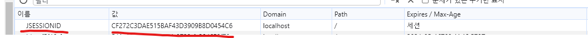
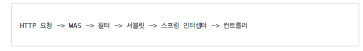

## 로그인 요청

```java
 @PostMapping("/auth/signin")
    public ResponseEntity<?> signIn(@RequestBody SignInRequest signInRequest, HttpServletRequest request) {
       return authService.signIn(signInRequest, request);
    }

```


### HttpSession 사용하기

서블릿은 세션을 위해 HttpSession 이라는 기능을 제공한다.

```java
import javax.servlet.http.HttpSession;

HttpSession session = request.getSession();
session.setAttribute(SessionConst.LOGIN_USER, user);
```


#### 세션 생성

`request.getSession();`

getSession() 메서드를 통해 세션을 생성하는데, 파라미터로 boolean 값을 넘길 수가 있다.
디폴트 값은 true 이며,

request.getSession(true) 와 request.getSession() 는 동일하다.

**true 와 false 의 차이**

- request.getSession(true)
  - 세션이 있으면 기존 세션을 반환한다.
  - 세션이 없으면 새로운 세션을 생성해서 반환한다.
- request.getSession(false)
  - 세션이 있으면 기존 세션을 반환한다.
  - 세션이 없으면 새로운 세션을 생성하지 않고 null 을 반환한다. 


#### 세션 보관

session.setAttribute()

setAttribute() 메서드 파라미터에 세션의 key 와 value 를 넘겨준다.

```java
public interface SessionConst {
    String LOGIN_USER = "loginUser";
}

```

세션 key 는 "loginUser" 로 지정하였고, 세션의 key 로 보관하고 조회하기 때문에 계속 사용할 것 같아서 상수로 지정하였다.


```java
session.setAttribute(SessionConst.LOGIN_USER, user);
```

로그인을 성공하고 브라우저의 쿠키를 확인하여 세션이 잘 생성 되었는지 확인 해보았다.





`JSESSIONID`  ???? 

나는 분명 키 값으로 "loginUser" 를 지정했는데  "loginUser" 가 아닌 JSESSIONID 라는 값이 들어있다. 

검색을 해서 찾아보니 JSESSIONID 는 "스프링 톰켓 컨테이너에서 세션을 유지하기 위해 발급하는 키" 라고 한다. 

JSESSIONID 는 브라우저와 서버 간의 현재 사용자를 매칭하는 키이고
 JSESSIONID 와 SessionConst.LOGIN_USER 는 대응되지 않는다.

JSESSIONID 를 통해 특정 사용자를 위한 세션 (key , value) 를 가져오고 , 
가져온 세션의 키 값에 SessionConst.LOGIN_USER 를 사용하여 user 객체를 가져 온다.

코드로 보면

```java
Map<JSESSIONID, Map<String, Object>>
```

이런 모습일 것 같다.


정리하면,

세션 저장소라는 것이 서버에 존재하고,  각각의 세션을 보관한다.
HttpSession 은 세션 저장소에 저장되는 세션이다.


예를 들어 requset.getSession() 를 하면

```java
private Map<String, Object> sessionStore = new ConcurrentHashMap<>();
```

이런 식으로 sessionStore 를 호출하고

session.setAttribute() 를 하면

sessionStore.put 를 사용하여 세션을 보관한다고 보면 된다.


#### 로그인 로직


```java
    @Transactional
    public ResponseEntity<?> signIn(SignInRequest signInRequest, HttpServletRequest request) {
        User user =   userRepository.findByUsername(signInRequest.getUsername())
                .orElse(null);
        if (user == null) {
            log.info("존재하지 않는 아이디");
            return ResponseEntity.status(HttpStatus.UNAUTHORIZED).body(new RespDto<>(-1, "존재하지 않는 아이디 입니다.", null));
        }
        if (!PasswordEncoder.encodePassword(signInRequest.getPassword()).equals(user.getPassword())) {
            log.info("비밀번호가 틀립니다.");
            return ResponseEntity.status(HttpStatus.UNAUTHORIZED).body(new RespDto<>(-1, "비밀번호가 일치하지 않습니다.", null));
        }
        log.info("로그인 성공");

        HttpSession session = request.getSession();
        session.setAttribute(SessionConst.LOGIN_USER, user);
        return ResponseEntity.status(HttpStatus.OK).body(new RespDto<>(1, "로그인 성공", user));
    }
```

### 로그아웃

```java
    @PostMapping("/auth/logout")
    public void logout(HttpServletRequest request){
        HttpSession session = request.getSession(false);
        if (session !=null){
            session.invalidate();
        }
    }
```

session.invalidate() 를 호출하여 세션을 제거한다.


## 관심사 분리하기

HttpSession 을 사용하여 로그인을 구현하였다.

그 다음에 해야할 것이 무엇일까? 로그인 여부를 체크 해야한다.

로그인 하지 않는 사용자는 
게시물 피드 목록 , 사용자 프로필 조회 등을 **로그인, 회원가입** 을 제외한 모든 화면을 볼 수 없게 
막아야 한다. 

로그인 체크를 위해 세션이 있는지 확인해야 하는데,

코드로 작성하면 다음과 같다.
```java
 HttpSession session =request.getSession();
if (session == null || session.getAttribute(SessionConst.LOGIN_USER) == null) {
       // ...     
}
        
```
위의 코드를 로그인,회원가입을 제외한 모든 컨트롤러에 적용하면 될 것 같다.

그런데 위의 코드는 유지보수 관점에서 좋지 않다.
만약에 로그인 관련 로직이 변경 될 때마다 , 위에 작성한 코드 전부를 다 수정해줘야 한다.

그 뿐 아니라 로그인 관련 로직은 여러 로직에서 공통으로 관심이 있는 '공통 관심사' 이다.

객체지향 원칙 중 '단일 책임의 원칙'에 따라 하나의 메서드는 하나의 책임을 가져야 한다.
게시물 피드의 목록을 가져오는 것과 로그인 여부 체크의 관심사는 다르다. 관심사를 분리해야 한다.


웹과 관련된 공통 관심사는 서블릿 필터나 스프링 인터셉터를 사용하면 된다.

필터와 인터셉터 중 인터셉터를 사용하였다.

### 인터셉터

인터셉터는 스프링 MVC가 제공하는 기술이다.

인터셉터를 사용하려면 HandlerInterceptor 인터페이스를 구현하면 된다.

```java
public interface HandlerInterceptor {
    
	default boolean preHandle(HttpServletRequest request, HttpServletResponse response, Object handler)
			throws Exception {

		return true;
	}
	default void postHandle(HttpServletRequest request, HttpServletResponse response, Object handler,
			@Nullable ModelAndView modelAndView) throws Exception {
	}
    
	default void afterCompletion(HttpServletRequest request, HttpServletResponse response, Object handler,
			@Nullable Exception ex) throws Exception {
	}

}
```

각 메서드를 살펴보자

- preHandle : 컨트롤러 호출 전에 호출된다. preHandle 응답 값이 true 이면 다음으로 진행하고, false 이면 더는 진행하지 않는다.
- postHandle : 컨트롤러 호출 후에 호출된다.
- afterCompletion : 뷰가 렌더링까지 완료 된 이후에 호출되는 메서드이다. 이 메서드는 예외가 발생하더라고 호출되며,
주로 리소스의 정리나 로깅과 같은 작업을 수행한다.


### 인터셉터 구현하기

로그인 인증은 컨트롤러 호출 전에만 호출 하면 되기 때문에 `preHandle` 만 구현하면 된다.

```java
@Slf4j
public class LoginCheckInterceptor implements HandlerInterceptor {

    @Override
    public boolean preHandle(HttpServletRequest request, HttpServletResponse response, Object handler) throws Exception {
        HttpSession session =request.getSession(false);
        if (session == null || session.getAttribute(SessionConst.LOGIN_USER) == null) {
            log.info("미 인증 사용자");
            response.setStatus(HttpServletResponse.SC_UNAUTHORIZED);
            response.sendError(401,"로그인이 필요합니다");
            return false;
        }

        return true;
    }
}

```


### 스프링 인터셉터를 사용한 이유




필터는 스프링 컨테어너가 아닌 톰캣과 같은 웹 컨테이너에 의해 관리가 되고  스프링 인터셉터는 스프링 컨테이너가 관리를 한다.

그렇기 때문에 필터는 스프링이 처리해주는 내용들을 적용 받을 수 없다. 

따라서 스프링과 무관하게 전역적으로 처리 해야하는 작업이 아니기 때문에 필터 대신 인터셉터를 사용했다.

