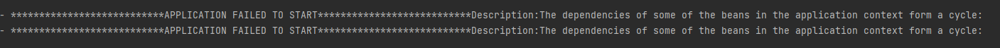
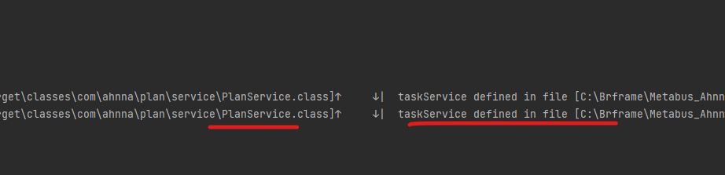

## 개요

서비스 개발 중에 스프링 객체간 의존성 주입을 한 뒤 애플리케이션 로딩 과정에서
스프링 컨테이너가 예외를 발생시킴

**코드**

예)

```java
@Service
@RequiredArgsConstructor
public class TaskService {

    private final PlanService planService;

    /// ... 기타 메서드
}
```

스케줄러와 관련된 비즈니스 로직에서 계획과 관련된 비즈니스 로직을 사용하기 위해 **_생성자를 통해 의존성 주입_**
을 하였다.

따로 코드를 작성하기 보다는 해당 로직을 재사용하기 위한 목적으로 다른 서비스 로직을 의존성 주입을 한것인데 문제가 발생하였다.

### 문제

**순환 의존성 문제가 발생 할 수 있음**

순환 의존성이란 ?

> A 서비스가 B 서비스를 주입하고 B 서비스가 A 서비스를 다시 주입하는 경우 순환 의존성이 발생한다.
> 이는 런타임 에러를 일으킬 수 있으므로 주의가 필요하다.

위의 코드에서는 TaskService => PlanService 만 주입하기 때문에
문제가 발생하지 않았지만
만약에 여기서 PlanService => TaskService 도 주입한다면??

```java
@Service
@RequiredArgsConstructor
public class PlanService {
    private final TaskService taskService;

    // 기타 메서드
}
```

애플리케이션을 실행 했을 때 스프링 컨테이너가 예외를 발생시킨다.





그림과 같이 PlanService 클래스와 TaskService 클래스 빈들이
서로 참조를 하여 맞물리게 된다.

즉, 스프링에서 어떤 스프링 빈을 먼저 만들어야 할 지 결정할 수 없게 되는 상황이다.

위의 코드 방식은 생성자 주입을 통해 의존성을 주입 하였다.

만약 @Autowired 를 통한 필드 주입 방식을 한다면?

```java
@Service
public class TaskService {

    @Autowired
    private PlanService planService;

    /// ... 기타 메서드
}
```

```java
@Service

public class TaskService {
    @Autowired
    private PlanService planService;

    // 기타 메서드..
}
```

스프링 컨테이너가 로딩 당시 예외를 발생시키지 않는다.

그러면 순환 참조 문제가 발생하지 않는걸까?

@Autowired 필드 주입 방식과 Setter 방식은 애플리케이션 구동 시점에서는
필요한 의존성이 없을 경우 null 상태로 유지하고 실제로 사용하는 시점에
주입을 하기 때문에 예외가 발생하지 않지만
순환 참조를 일으킬 수 있는 메서드를 호출하는 시점에는 순환참조 문제가 발생할 수 있다.

### 해결

스케줄러 관련 서비스에서는 계획과 관련된 단순 DB 조회만 필요하기 때문에

Repository 의존성 주입으로 해결하였다.
