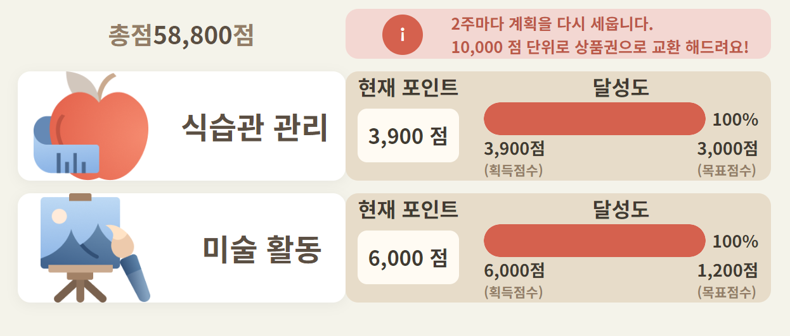

건강, 식습관 관리 서비스를 개발하면서 스프링 캐시를 적용해보았다.

건강 , 식습관 관리 서비스에서 사용자가 계획한 시간과 빈도에 맞게 활동을 잘 수행하면
그에 맞는 포인트를 제공한다.

그리고 활동이 끝나면 획득한 총 포인트를 상품권을 교환해준다.



사용자는 메인 화면에서 이번 회차에서 설정한 목표와 획득 점수 그리고 총 점수를 볼 수 있다.

## 캐시 도입 하기

획득한 총 점수는 식이 관리 점수 + 활동 (미술 or 운동) 점수를 합한 점수로
활동 로그가 저장된 테이블에서 쿼리한 결과를 응답 받아서 렌더링 한다.

그리고 개발 하던 중에 다음과 같은 생각이 들었다.

"활동 로그가 저장된 테이블은 오전 12시에 한 번 스케줄링으로 업데이트 되기 때문에
총 점수는 다음 날까지 변경이 되지 않잖아?? "

하루가 지나기 전에는 계속 같은 결과일 텐데
DB로 계속 쿼리를 날리는 것은 비효율적이라고 판단하여 캐시를 도입하였다.

## 스프링 캐시 사용

스프링 캐시를 사용하기 전, 선택해야 할 것이 있었다.

로컬 캐싱과 글로벌 캐싱 두 가지 전략 중 하나를 선택해야 한다.

### Local Cache vs Global Cache

**로컬 캐싱**은 서버 내부 저장소에 캐시 데이터를 저장한다. 따라서
속도는 빠르지만 서버 간의 데이터 공유가 안된다는 단점이 있다.
예를 들어, 사용자가 같은 리소스에 대한 요청을 반복해서 보내더라도,
A 서버에서는 이전 데이터를, B 서버에서는 최신 데이터를 반환하여
각 캐시가 서로 다른 상태를 가질수도 있다.
즉, 일관성 문제가 발생할 수 있다는 것이다.

**글로벌 캐싱**은 서버 내부 저장소가 아닌 별도의 캐시 서버를 두어
서버에서 캐시 서버를 참조하는 것이다. 캐시 데이터를 얻으려 할때 마다
네트워크 트래픽이 발생하기 때문에 로컬 캐싱보다 속도는 느리지만,
서버간 데이터를 쉽게 공유할 수 있기 때문에 로컬 캐싱의 정합성 문제와
중복된 캐시 데이터로 인한 서버 자원 낭비 등 문제점을 해결할 수 있다.

지금 개발하고 있는 서비스는 단일 서버에서 서비스를 운영하며,
다수의 서버 인스턴스 간 데이터 공유가 필요하지 않으며
클라이언트의 트래픽도 관리할 필요가 없는 상황이었다.

그래서 고민할 것도 없이 로컬 캐싱 전략을 선택하였다.

### 적용

#### maven 설정

```xml
 <dependency>
    <groupId>org.springframework.boot</groupId>
    <artifactId>spring-boot-starter-cache</artifactId>
</dependency>
```

#### @EnableCacheing 설정

```java
@SpringBootApplication
@EnableCaching
public class Application {

    public static void main(String[] args) {
        SpringApplication.run(Application.class, args);
    }

}
```

@EnableCaching 은 이 프로젝트에서 캐시 관련 애노테이션(@Cacheable, @CacheEvict)을
사용하겠다는 선언이다.

#### 캐시할 데이터에 @Cacheable 사용

```java
@Cacheable(value = "pointInfoCache",  key = "#planDto.userId")
public Map<String, Object> selectTotalPoint(PlanDto planDto)
        log.info("총점 가져오기 ");
    return planDAO.selectTotalPoint(param);
}
```

여기서 value는 캐시 데이터의 이름이고, Key는 캐시 데이터의 키 값이 된다.

사용자별로 총점을 가져오는 쿼리이기 때문에

userId 에 따라 캐시 여부를 체크하여 캐시가 안되어 있을 경우, 캐시를 하고,
있으면 캐시 된 것을 응답하게 된다.

실제로 실행 해본 결과,

최초로 실행 되었을 때만

"log.info("총점 가져오기 ");"

에 해당하는 문장이 출력되었고, 이 후 요청에는 메서드가 실행 되지 않고
캐싱 된 데이터가 응답되었다.

**@Cacheable 동작 원리**

@Cacheable 은 AOP 기반으로 동작한다.

- @Cacheable 애노테이션을 가진 메서드에 대한 캐싱 동작을 정의한다.
- 스프링은 @Cacheable 애노테이션을 가진 메서드를 호출할 때 프록시 객체를 생성한다.
  이 프록시 객체는 AOP를 사용하여 메서드 호출을 가로채고 캐싱 동작을 처리한다.
- AOP 프록시는 실제 메서드 호출 전에 캐시에 캐시된 결과가 있는지 확인하고, 결과가 존재하는 경우 메서드 실행을
  스킵하고 캐시 된 결과를 반환한다.

#### CacheManager로 캐시 삭제

CahceManager로 캐시를 삭제해보자.

사용자 별 총점 값이 수정되거나 삭제가 일어났을 때 캐시를
삭제하지 않으면 총점을 캐시 메모리에서 조회 할 때
변경 하기 전 총점을 반환하게 되면서 일관성이 깨지게 된다.

스케줄러를 통해 매일 사용자의 활동 로그를 저장하는 데,
이때 캐시를 삭제 하면 일관성이 깨지지 않게 된다.

```java
    @Scheduled(cron = "0 1 0 * * *")
    public synchronized void saveActivityDailyHis() {
        try {
            scheduler.saveActivityDailyHis();
            Cache cache = cacheManager.getCache("pointInfoCache");
            if (cache != null) {
                cache.clear();
            }
        }catch (Exception e) {
            e.printStackTrace();
        }
    }
```
