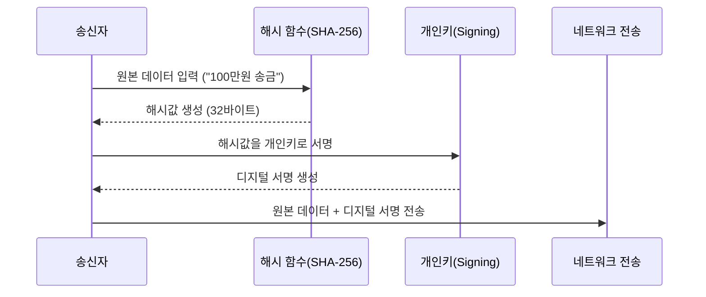
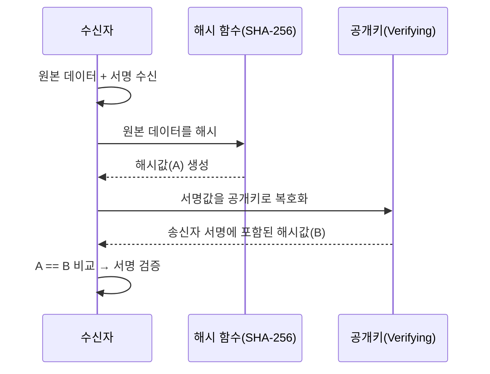

## 들어가며

우리는 살면서 알게 모르게 꽤 많은 '서명'을 한다.

가장 흔한 건 택배를 받을 때다. 기사님이 내미는 단말기에 쓱쓱 이름을 적는다. 은행에서도 마찬가지다. 복잡한 금융 상품 설명을 듣고 나면 태블릿이나 서류에 수차례 서명을 하곤 한다.

문득 그런 생각이 들었다. **우리는 왜 서명을 할까?**

택배 서명은 내가 물건을 확실히 수령했다는 확인이다. 나중에 "물건 못 받았는데요?" 라는 분쟁이 생겼을 때, 택배사는 이 서명을 증거로 제시할 것이다. 은행도 마찬가지다.

"나는 설명을 듣고 직접 가입했다" 라는 사실을 본인인 내가 인증해야, 나중에 문제가 생겼을 때 은행이 책임을 회피하거나 혹은 내가 딴소리를 못 하게 막을 수 있다.

즉, **책임과 신원 확인** 이 핵심이다.

그렇다면 종이와 펜이 없는 디지털 세상에서의 서명은 어떨까? 우리가 현실에서 하는 서명과 똑같은 원리일까?

## "서명도 결국 암호화인가?"

"키를 쓰고 데이터를 변환하니깐... 이것도 결국 암호화(Encryption)라고 봐야 하나?"

결론부터 말하자면, 기술적으로는 '암호화' 과정이 맞다. (특히 RSA 알고리즘에서는 수학적으로 동일한 연산을 수행한다.) 하지만 목적이 완전히 다르기 때문에 용어를 구분해서 쓴다.

- 일반적인 암호화 : 목적은 **기밀성(비밀 유지)** 이다. 남들이 못 보게 내용을 숨겨야 한다. 그래서 누구나 잠글 수 있게(공개키) 하고, 나만 열 수 있게(개인키) 한다.
- 디지털 서명 : 목적은 **무결성(변조 방지)** 과 **인증(신원 확인)** 이다. 내용을 숨기는 게 아니라, 이거 내가 쓴 거 맞아!" 라고 알리는 게 목표다.

그래서 디지털 서명은 암호화와 반대로 동작한다.

"나만 가진 '개인키'로 잠그고(서명), 남들이 가진 '공개키'로 연다(검증)."

내 공개키로 열린다는 사실 자체가, "아, 이건 짝이 맞는 개인키를 가진 그 사람이 보낸 게 확실하구나"라는 증거가 되기 때문이다.

## 디지털 서명의 동작 원리

그렇다면 실제 데이터는 어떤 과정을 거쳐서 전송되고 검증될까?
단순히 데이터를 보내는 것과는 다르게, 송신자와 수신자는 아래와 같은 약속된 절차를 밟는다.

### 보내는 사람

1. 원본 데이터 준비: 예를 들어 "100만원 송금"이라는 텍스트가 있다.
2. 해시(Hash) 생성: 원본 데이터를 해시 함수(SHA-256 등)에 넣어 고정된 길이의 **요약된 값(해시값)** 을 만든다.
3. 서명 생성 (Signing): 이 해시값을 보내는 사람의 **'개인키'** 로 암호화한다. 이 암호화된 결과물이 바로 **'디지털 서명'** 이다.
4. 전송: 상대방에게 **원본 데이터** 와 **디지털 서명** 두 가지를 함께 보낸다.

※ 앞서 설명했듯이 디지털 서명은 암호화와 목적이 다르지만,
RSA 서명에서는 ‘개인키 연산’이 수학적으로 암호화 연산과 동일해 보이기 때문에
편의상 “개인키로 암호화한다”는 표현을 사용한다.
실제로는 원본 전체를 암호화하는 것이 아니라 해시값에 개인키 연산을 적용하는 것이다.

### 받는 사람

1. 데이터 수신: 원본 데이터와 서명값을 받았다.
2. 직접 해시: 받은 원본 데이터를 똑같은 해시 함수에 넣어 **'내가 계산한 해시값(A)'** 를 만든다.
3. 검증 (Verifying): 받은 [디지털 서명]을 송신자의 **'공개키'** 로 복호화한다. 그러면 서명 안에 들어있던 **'송신자가 보낸 해시값(B)'** 이 나온다.
4. 비교: (A)와 (B)가 일치하는지 확인한다.

값이 토씨 하나 안 틀리고 똑같다면?

우리는 이 데이터가 신뢰할 수 있는 사람이 보냈으며, 전송 도중 해커가 데이터를 조작하지 않았다는 것을 100% 확신할 수 있다.

## "왜 굳이 중간에 해시(Hash)를 할까?"

"번거롭게 왜 해시를 하지? 그냥 원본 데이터를 통째로 개인키로 서명(암호화)해서 보내면 더 확실한 거 아닌가?"

그냥 원본을 바로 암호화해도 될 것 같은데, 굳이 '해시'라는 단계를 끼워 넣은 데에는 매우 현실적이고 치명적인 이유들이 있었다.

### 속도와 효율성

비대칭키 암호화 방식(RSA 등)은 우리가 생각하는 것보다 연산 비용이 매우 비싸고 느리다. 만약 1GB짜리 동영상 파일에 서명한다고 가정해보자. 파일 전체를 개인키로 암호화하려면 CPU가 비명을 지르고 시간도 한참 걸릴 것이다. 하지만 해시를 하면 아무리 큰 파일도 고작 32바이트(SHA-256 기준) 정도의 문자열로 요약된다. 우리는 이 짧은 문자열만 암호화하면 되니 0.1초도 안 걸려 서명을 끝낼 수 있다.

### 암호화 기술의 용량 한계

RSA 같은 알고리즘은 한 번에 암호화할 수 있는 데이터의 크기가 정해져 있다. (예를 들어 2048비트 키를 쓰면 고작 245바이트 정도밖에 못 잠근다.) 원본 데이터를 그대로 서명하려면 데이터를 200바이트씩 조각내서 수천, 수만 번 서명해야 한다는 소리다. 이는 현실적으로 불가능하다.

### 눈사태 효과(Avalanche Effect)

해시 함수는 입력값이 점 하나만 바뀌어도 결과값이 완전히 뒤집어지는 특성이 있다. 이 특성 덕분에 원본 데이터가 전송 중에 아주 미세하게 변조되더라도, 검증 단계에서 해시값이 불일치하게 되어 즉각적으로 잡아낼 수 있다

## 디지털 서명이 실제로 사용되는 곳

디지털 서명은 사실 몇 가지 서비스에서만 쓰이는 기술이 아니다.  
웹 브라우징, 모바일 결제, 전자문서, 앱 설치, 블록체인, 클라우드 API 호출, 서버 간 통신, 패키지 배포까지…  
“신뢰가 필요한 거의 모든 기술”에서 보이지 않는 곳에서 항상 돌아가고 있다.

아래는 그중에서도 우리가 일상에서 자주 마주치는 대표적인 사례들이다.

### HTTPS / TLS 인증서

우리가 웹 브라우저 주소창에서 보는 🔒 자물쇠 아이콘의 핵심이 바로 디지털 서명이다.  
구글, 네이버 같은 웹사이트는 서버 인증서를 보유하고 있고 이 인증서는 CA(인증기관)의 디지털 서명을 포함한다
브라우저는 CA의 공개키를 이용해 인증서를 검증한다.

### 전자문서·전자계약 (전자세금계산서, 전자서명 등)

우리가 종이에 도장 대신 간편인증으로 서명하는 모든 문서 뒤에는
디지털 서명이 있다.

- 전자계약서
- 전자세금계산서
- 전자청구서
- 전자 소송 문서 제출

문서를 서버에 저장할 때
문서 내용 + 서명값 같이 저장되기 때문에

- 누군가 문서를 살짝 수정해도 서명이 무효가 되고
- 누가, 언제 서명했는지 추적 가능

즉, 문서의 위·변조 방지가 가능해진다.

### 모바일 결제 시스템 (Apple Pay, Samsung Pay, Visa/Mastercard 인증)

Apple Pay · Samsung Pay · Visa/Mastercard 거래 승인 과정에도
디지털 서명이 핵심적으로 사용된다.

- 단말기가 생성한 거래 데이터(cryptogram)
- 카드 브랜드에 전송 시 키 기반 서명 적용
  = VTS/MDES에서 공개키로 검증

이를 통해
“이 거래가 실제 단말기에서 생성된 것이 맞다! 중간에서 변조되지 않았다”
라는 것을 증명한다.

실제로 결제 분야에서는 RSA/ECDSA/3DS 기반 서명이 필수다.

### 소프트웨어 업데이트 검증 (Android, iOS, macOS, Linux)

스마트폰이나 운영체제가 업데이트될 때
가장 먼저 확인하는 것이 바로 서명 검증이다.

예: Android APK 설치

- APK 내부에 개발사의 디지털 서명이 있다
- 설치할 때 시스템이 공개키로 검증
- 서명이 틀리면 설치 거부

이 덕분에

- 악성 앱이 정상 앱으로 위장하는 것을 막고
- OS 업데이트가 중간에서 변조되는 것을 방지합니다.

즉, 서명 = SW 공급망(Supply Chain) 보안의 핵심

## 맺으며

디지털 서명은 단순히 데이터를 ‘잠그는 기술’이 아니다. ㄴ
**데이터가 누구에게서 왔는지**, **중간에 변조되지 않았는지**, **신뢰할 수 있는 정보인지**를 보증하는 현대 보안의 기초다.

우리가 당연하게 사용하는 HTTPS 접속, 스마트폰 결제, 앱 설치, 소프트웨어 업데이트, 전자문서 서명, 블록체인 트랜잭션까지 모든 신뢰의 바닥에는 ‘해시로 데이터를 요약하고, 개인키로 그 요약본에 도장을 찍는’ 이 단순하면서도 강력한 원리가 숨어 있다.

종이에 도장을 찍듯이,  
디지털 세계에서도 우리는 매 순간 서명을 하고 있다.
