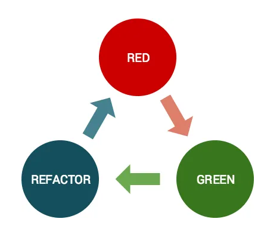

개발자라면 한 번쯤 TDD(Test-Driven Development)라는 단어를 들어봤을 겁니다. 마치 개발의 성배처럼 여겨지기도 하죠.

저도 처음 TDD를 접했을 때, 그 개념 자체는 너무나 매력적이었습니다.

## TDD, 그리고 Red-Green-Refactoring 사이클

TDD는 말 그대로 테스트 주도 개발입니다. 코드를 작성하기 전에 테스트 코드를 먼저 작성하는 방식이죠

TDD는 아래와 같은 Red-Green-Refactoring 사이클을 반복하며 진행됩니다.



이미지 출처 https://mbauza.medium.com/red-green-refactor-1a3fb160e649

<br/>

<br/>

1. Red (실패하는 테스트 작성): 구현할 기능에 대한 테스트 코드를 먼저 작성합니다. 당연히 아직 기능이 구현되지 않았으므로 이 테스트는 실패합니다.
2. Green (테스트 통과를 위한 최소한의 코드 작성): 실패한 테스트를 통과시키기 위한 최소한의 코드를 작성합니다. 이 단계에서는 오직 테스트 통과에만 집중하며, 코드를 아름답게 만드는 것은 중요하지 않습니다.
3. Refactoring (코드 개선): 테스트가 모두 통과하는 것을 확인한 후, 작성된 코드를 리팩토링하여 더 깔끔하고 효율적으로 만듭니다. 이때 중요한 것은 리팩토링 과정에서 테스트가 실패하지 않도록 하는 것입니다.

<br/>

이 사이클을 반복하면서 개발자는 자연스럽게 견고하고 유지보수하기 쉬운 코드를 작성하게 된다고 합니다.

하지만 막상 실제 프로젝트에 적용하려고 하면 생각만큼 쉽지 않은 것이 TDD였습니다.

그래서 저는 TDD의 큰 그림보다는, 우선 테스트 코드를 작성하는 것부터 시작하기로 했습니다.

"일단 테스트를 해보자!"는 마음으로요.

## 테스트 코드, 그 시작부터 쉽지 않네?

테스트 코드 작성이 분명 코드의 안정성을 높여주고 미래의 버그를 방지해 줄 것이라 믿었습니다.

그래서 막 새로 추가한 주문 생성 로직에 대한 단위 테스트를 작성하기 시작했습니다.

```java
@Service
@RequiredArgsConstructor
public class OrderService {

    private final ProductRepository productRepository;
    private final OrderRepository orderRepository;
    private final UserRepository userRepository;
    private final PointService pointService;

    // 주문 전에 재고 차감
    public void createOrder(OrderPostRequest request) {
        User user = userRepository.findById(request.getUserId()).get();
        List<ProductRequestForOrder> productRequest = request.getProducts();
        Map<Long, Long> productIdQuntitiyMap = productRequest.stream()
                .collect(Collectors.toMap(ProductRequestForOrder::getProductId, ProductRequestForOrder::getQuantity));
        // product id 추출
        List<Product> products = productRepository.findAllById(productRequest.stream().map(ProductRequestForOrder::getProductId).collect(Collectors.toList()));

         // 재고 차감
        deductQuantity(products, stockMap);


        // 주문
        Order order = Order.create(user, products);
        orderRepository.save(order);

        // 결제
        pointService.processPayment(savedOrder);
    }


    private static void deductQuantity(List<Product> products, Map<Long, Long> productIdQuntitiyMap) {
        for (Product product : products) {
            Long quantity = productIdQuntitiyMap.get(product.getId());
            if (product.isLessThanQuantity(quantity)){
                throw new InsufficientStockException(INSUFFICIENT_STOCK);
            }
            product.deductQuantity(quantity);
        }
    }

}
```

<br/>

createOrder 메서드는 주문 생성의 전체적인 흐름을 담고 있습니다. 그런데 문제가 발생했습니다.

이 메서드 안에는 deductQuantity라는 재고 차감 로직을 담당하는 private 메서드가 포함되어 있었습니다.

이 deductQuantity 메서드만을 독립적으로 테스트하고 싶었는데, private 접근 제어자 때문에 외부에서 직접 호출할 수 없는 겁니다!

<br/>

## 코드가 신호를 보내고 있다: "리팩토링 해달라고!"

테스트 코드를 작성하기 어렵다는 것은 단순히 테스트 작성 방법을 몰라서가 아닐 수도 있습니다.

오히려 테스트하기 어렵게 코드가 작성되어 있을 가능성이 높다는 신호일 수 있습니다. 마치 코드가 "나를 좀 더 테스트하기 좋게 바꿔줘!"라고 외치는 것처럼 말이죠.

deductQuantity 메서드는 주문 생성 로직 중 재고 차감이라는 독립적인 관심사를 가지고 있습니다.

이 부분을 OrderService에서 private 메서드로 가지고 있기보다는, 별도의 클래스로 분리하여 독립적인 책임을 갖게 하는 것이 더 좋을 것 같다는 생각이 들었습니다.

<br/>

### 리팩토링의 첫걸음 : 관심사 분리

deductQuantity 메서드는 주문 생성 로직 중 재고 차감이라는 독립적인 관심사를 가지고 있습니다.

이 부분을 OrderService에서 private 메서드로 가지고 있기보다는, 별도의 클래스로 분리하여 독립적인 책임을 갖게 하는 것이 더 좋을 것 같다는 생각이 들었습니다.

<br/>

```java
// StockManager 클래스 분리
public class StockManager {
    public void deductQuantity(List<Product> products, Map<Long, Long> productIdQuantityMap) {
        for (Product product : products) {
            Long quantity = productIdQuantityMap.get(product.getId());
            if (product.isLessThanQuantity(quantity)){
                throw new InsufficientStockException(INSUFFICIENT_STOCK);
            }
            product.deductQuantity(quantity);
        }
    }
}

// OrderService 수정
public class OrderService {

    private final UserRepository userRepository;
    private final ProductRepository productRepository;
    private final OrderRepository orderRepository;
    private final PointService pointService;
    private final StockManager stockManager; // StockManager 주입

    public OrderService(UserRepository userRepository, ProductRepository productRepository,
                        OrderRepository orderRepository, PointService pointService,
                        StockManager stockManager) { // 생성자 주입
        this.userRepository = userRepository;
        this.productRepository = productRepository;
        this.orderRepository = orderRepository;
        this.pointService = pointService;
        this.stockManager = stockManager;
    }

    public void createOrder(OrderPostRequest request) {
        // ... (이전 코드와 동일)

        // 재고 차감 (이제 private이 아닌 외부 객체의 메서드 호출)
        stockManager.deductQuantity(products, productIdQuntitiyMap);

        // ... (이전 코드와 동일)
    }

}

```

<br/>

이제 StockManager의 deductQuantity 메서드는 public이므로 손쉽게 단위 테스트를 작성할 수 있게 되었습니다!

단순히 테스트 코드를 작성하려 했을 뿐인데, 자연스럽게 관심사 분리와 단일 책임 원칙(SRP)을 지키는 방향으로 코드가 개선되었습니다.

<br/>

### 진정한 단위 테스트를 위한 여정: Repository의 독립

다음으로 저를 고민하게 만든 부분은 바로 Repository였습니다.

OrderService는 userRepository와 productRepository, orderRepository에 강하게 의존하고 있었죠.

주문 생성 로직을 테스트하려면 실제 DB에 상품을 등록하고 조회하는 과정이 필요했는데, 이는 스프링 부트 테스트(통합 테스트)로 진행해야만 했습니다.

하지만 실제 스프링 컨텍스트와 DB를 사용하는 테스트는 속도가 느리고, 테스트 환경 설정이 복잡하며, 외부 환경에 의존적이라는 단점이 있습니다.

저는 이를 단위 테스트로 전환하여 더 빠르고 독립적인 테스트를 만들고 싶었습니다.

이를 위해 ProductRepository에 대한 Fake 객체를 만들어 사용하려고 했습니다.

테스트 시에는 실제 DB에 접근하지 않고, 메모리 상에서 동작하는 Fake 객체를 주입하여 테스트의 속도와 독립성을 확보하는 것이 목표였죠.

<br/>

```java
public class FakeProductRepository implements ProductRepository {

    private final AtomicLong autoGeneratedId= new AtomicLong(0);
    private final List<Product> data = new ArrayList<>();

    @Override
    public List<Product> findAllById(List<Long> ids) {
        return data.stream()
                .filter(product -> ids.contains(product.getId()))
                .collect(Collectors.toList());
    }

    @Override
    public Optional<Product> findById(Long id) {
        return data.stream().filter(item -> item.getId().equals(id)).findAny();
    }
    @Override
    public List<Product> saveAll(List<Product> products) {
        data.addAll(products);
        return data;
    }
    @Override
    public Product save(Product product) {
        if (product == null || product.getId() == null) {
            Product newProduct = Product
                    .builder()
                    .id(autoGeneratedId.incrementAndGet())
                    .name(product.getName())
                    .price(product.getPrice())
                    .quantity(product.getQuantity())
                    .build();
            data.add(newProduct);
            return newProduct;
        }else {
            data.removeIf(item -> Objects.equals(item.getId(), product.getId()));
            data.add(product);
            return product;
        }
    }

    // JPA Repository가 가진 모든 메서드를 Fake 객체에서 구현해야 하는 문제
    @Override
    public List<Product> findAllByPessimisticLock(List<Long> productIds) { return null; }
    @Override
    public List<Product> findAll() { return data; }
    @Override
    public List<Product> findAllByPessimisticLock2(List<Long> productIds) { return null; }
    @Override
    public Optional<Product> findByIdPessimisticLock(Long productId) { return Optional.empty(); }
}
```

<br/>

문제는 기존의 ProductRepository 인터페이스가 JpaRepository를 상속받고 있었다는 점이었습니다.

JpaRepository는 매우 많은 메서드를 가지고 있고, 이 모든 메서드를 FakeProductRepository에서 구현해야만 했습니다.

당장 사용하지 않는 메서드들(findAllByPessimisticLock 등)까지도요. 이는 불필요한 작업이었고, ProductRepository가 JPA라는 구체적인 기술에 강하게 결합되어 있다는 명확한 신호였습니다.

이 또한 코드가 보내는 신호였습니다.

OrderService가 JpaRepository라는 구체적인 구현체에 너무 강하게 의존하고 있다는 것을요.

이는 의존성 역전 원칙(DIP)을 위반하는 상황이었습니다. DIP는 "고수준 모듈은 저수준 모듈에 의존해서는 안 되며, 둘 다 추상화에 의존해야 한다"는 원칙입니다.

즉, OrderService가 구체적인 JpaRepository가 아닌, 추상화된 Repository 인터페이스에 의존하도록 만들어야 했습니다.

<br/>

```java
// ProductRepository 인터페이스: OrderService에서 필요한 메서드만 정의
public interface ProductRepository {
    Optional<Product> findById(Long id);
    List<Product> findAllById(List<Long> ids);
    Product save(Product product);
    List<Product> saveAll(List<Product> products);
    // PessimisticLock 관련 메서드나 기타 JPA 메서드는 이 인터페이스에 정의하지 않음
}

// 실제 JPA Repository 구현체: ProductRepository 인터페이스를 구현
@Repository
@RequiredArgsConstructor
public class ProductRepositoryImpl implements ProductRepository {

    private final ProductJpaRepository productJpaRepository; // 실제 JpaRepository 주입

    @Override
    public List<Product> findAllById(List<Long> ids) {
        return productJpaRepository.findAllById(ids);
    }
    @Override
    public List<Product> saveAll(List<Product> products) {
        return productJpaRepository.saveAll(products);
    }
    @Override
    public Product save(Product product) {
        return productJpaRepository.save(product);
    }

    @Override
    public Optional<Product> findById(Long id) {
        return productJpaRepository.findById(id);
    }

    // JpaRepository의 다른 메서드들은 ProductRepositoryImpl 내부에서만 사용하고
    // ProductRepository 인터페이스에는 노출하지 않음
    public List<Product> findAllByPessimisticLock(List<Long> productIds) {
        return productJpaRepository.findAllByPessimisticLock(productIds);
    }
    public List<Product> findAll() {
        return productJpaRepository.findAll();
    }
    // ... 등등
}
```

<br/>

이제 ProductRepository 인터페이스는 OrderService가 필요로 하는 최소한의 메서드만 정의하게 되었습니다.

실제 JPA의 복잡한 메서드들은 ProductRepositoryImpl 내부에서 처리하고, OrderService는 오직 ProductRepository 인터페이스를 통해 필요한 기능에만 접근합니다.

이로 인해 FakeProductRepository를 만들 때도, ProductRepository 인터페이스에 정의된 몇 개의 메서드만 구현하면 됩니다.

굳이 필요 없는 findAllByPessimisticLock 같은 메서드까지 구현할 필요가 없어지는 것이죠.

덕분에 OrderService의 단위 테스트는 외부 환경에 의존하지 않고 독립적으로 실행할 수 있게 되었고, 테스트 코드 작성도 훨씬 용이해졌습니다.

<br/>

## 테스트 코드가 알려주는 신호들

처음에는 단순히 테스트 코드를 작성하려 했을 뿐인데, 그 과정에서 의미 있는 발견들을 할 수 있었습니다.

- **테스트하기 어려운 코드는 리팩토링이 필요한 코드일 가능성이 높다.** private 메서드나 강결합된 의존성은 테스트를 방해하는 동시에 코드의 설계 문제를 드러냈습니다.

- **관심사 분리를 통한 단일 책임 원칙(SRP) 적용.** deductQuantity 로직을 별도의 StockManager 클래스로 분리함으로써 각 클래스가 하나의 책임만 가지도록 개선되었고, 이는 코드의 가독성과 유지보수성을 크게 향상시켰습니다.

- **의존성 역전 원칙(DIP)의 중요성 체감.** 구체적인 구현체가 아닌 추상화된 인터페이스에 의존하게 함으로써 코드의 유연성을 확보하고 테스트 용이성을 극대화할 수 있었습니다. 특히 JPA Repository와 같은 특정 기술에 대한 의존성을 끊어내어 단위 테스트의 독립성을 확보하는 데 큰 도움이 되었습니다.

이 외에도 테스트 코드를 작성하면서 얻을 수 있는 장점은 많습니다.

## 테스트 코드가 주는 실질적인 이점들

- **버그 감소 및 안정성 향상**: 테스트 코드는 잠재적인 버그를 미리 발견하고, 코드 변경 시 기존 기능이 망가지지 않도록 안전망 역할을 합니다.
- **문서화 효과**: 테스트 코드는 해당 기능이 어떻게 동작해야 하는지에 대한 살아있는 문서 역할을 합니다.
- **빠른 피드백**: 변경된 코드가 올바르게 작동하는지 즉각적인 피드백을 받을 수 있습니다.
- **자신감 있는 리팩토링**: 테스트 코드가 있다면 코드 변경에 대한 두려움을 줄이고 자신감 있게 리팩토링을 할 수 있습니다.

## 맺으며

테스트 코드는 단순히 버그를 잡는 도구가 아닙니다. 좋은 테스트 코드를 작성하려는 노력은 곧 좋은 코드를 작성하려는 노력과 직결됩니다.

만약 테스트 코드 작성이 어렵게 느껴진다면, 그 어려움이 코드가 보내는 리팩토링 신호일 수 있다는 점을 기억하고 코드를 개선하는 기회로 삼아보세요.

분명 더 나은 개발 경험과 높은 품질의 코드를 만날 수 있을 겁니다!
