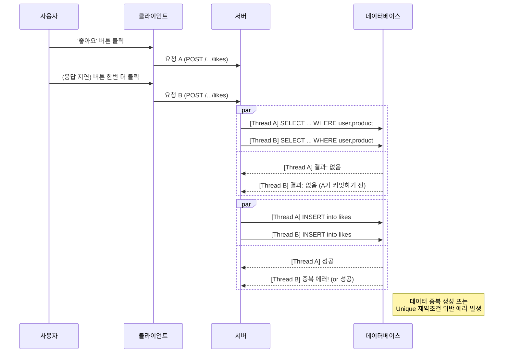
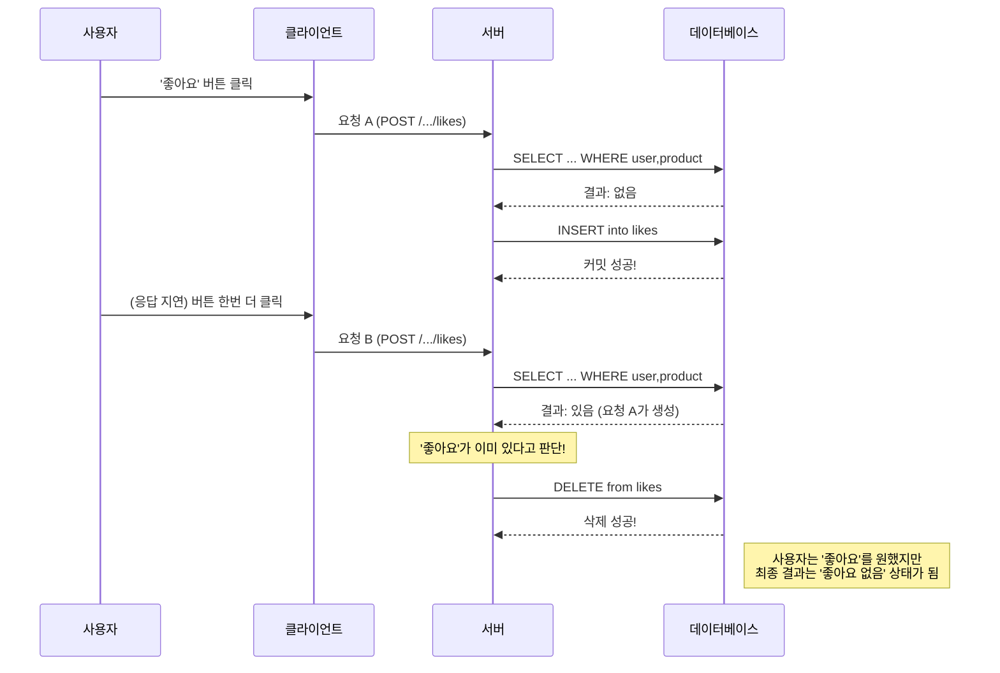
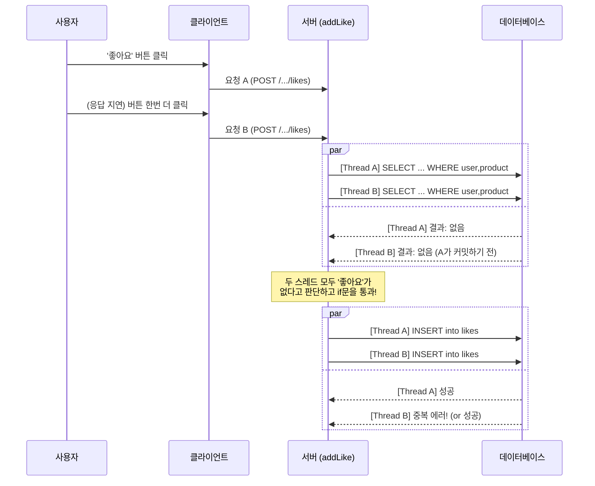

개인 프로젝트에서 좋아요 기능을 설계 하던 중 , 시퀀스 다이어그램을 작성하다가 하나의 엔드포인트로 좋아요 등록/취소를 처리할 수 있을지 고민하게 되었습니다.

## 클라이언트의 '토글' 버튼 , 서버 API도 따라가야 할까?

"클라이언트의 버튼이 토글 방식이니, 서버 API도 그에 맞춰 하나로 합치는 게 좋지 않을까?"


하나의 POST `/products/{productId}/likes` 엔드포인트가 호출될 때마다, 서버가 내부적으로 '좋아요'의 존재 여부를 확인해 알아서 추가(INSERT) 혹은 삭제(DELETE)를 수행하는 것이죠.

프론트엔드 개발자 입장에서는 현재 상태를 관리할 필요 없이 그저 이 API 하나만 호출하면 되니, 분명 편리한 설계였습니다.

하지만 생각해보면 이 편리함 뒤에 숨겨진 위험이 있습니다. "만약 사용자가 네트워크가 불안정한 곳에서 이 버튼을 여러 번 누르면 어떻게 될까?"


### 멱등성, 너 대체 정체가 뭐니?

멱등성의 사전적 정의는 다음과 같습니다. '어떤 연산을 여러 번 반복해도 결과가 동일하게 유지되는 성질'


즉, **"몇 번을 호출하든 결과는 항상 똑같아야 한다"** 는 네트워크 API 설계의 중요한 원칙 중 하나입니다.

좋아요 등록을 한 번을 요청하든 열 번을 요청하든 최종 결과는 '좋아요가 추가된 상태' 하나로 동일해야 합니다.


## 토글 API의 함정: 멱등성과의 충돌

토글 버튼에 맞춰 좋아요 등록,취소를 하나의 API로 만든다고 가정해보겠습니다.

로직은 아래와 같은 모습일 겁니다.

```java
public void toggleLike(Long productId, Long userId) {
    // 1. 먼저 DB에서 '좋아요'가 있는지 확인한다 (읽기)
    Optional<ProductLike> like = repository.findByUserIdAndProductId(userId, productId);

    // 2. 결과에 따라 분기한다 (결정)
    if (like.isPresent()) {
        // 3a. 있으면 삭제한다 (쓰기)
        repository.delete(like.get());
    } else {
        // 3b. 없으면 추가한다 (쓰기)
        repository.save(new ProductLike(userId, productId));
    }
}
```

결론부터 말하자면, 이 토글 API는 멱등성을 보장하기 매우 어렵습니다. 오히려 멱등성을 해치는 주범이 될 수 있죠. 왜 그런지 구체적인 가상 시나리오를 통해 그 위험성을 파헤쳐 보겠습니다.

가장 먼저 고려해야 할 변수는, 클라이언트의 네트워크가 항상 안정적이지 않다는 점입니다. 네트워크가 불안정한 상황을 가정하고 시뮬레이션해 봅시다.

**가상 시나리오 : '좋아요' 중복 생성**

1. 사용자가 '좋아요' 버튼을 누릅니다. 클라이언트는 요청 A를 서버로 전송합니다.

2. 네트워크 지연으로 응답이 오지 않자, 사용자는 버튼을 한 번 더 누릅니다.
3. 서버에는 거의 동시에 요청 A와 요청B가 도착합니다.
4. 서버의 각 스레드는 토글 로직을 실행합니다.
   - 스레드 A: SELECT 결과 '좋아요'없음 -> INSERT 실행 준비
   - 스레드 B : (스레드 A가 커밋하기 전) SELECT 결과 '좋아요' 없음 -> INSERT 실행 준비.

5. 결과적으로 두 스레드 모두 INSERT 쿼리를 실행하게 됩니다.



결과 : product_likes 테이블에 동일한 (userId, productId) 데이터가 2개 쌓입니다. 이는 '좋아요' 카운트를 왜곡시키고 데이터 정합성을 파괴합니다. 

만약 DB에 UNIQUE 제약조건을 걸어두었다면, 두 번째 INSERT는 실패하며 사용자에게 뜬금없는 500 에러를 보여주게 될 겁니다.

<br/>

**가상 시나리오: '좋아요' 의 증발**

1. 사용자가 '좋아요' 버튼을 누릅니다. 클라이언트는 요청 A를 서버로 전송합니다.

2. 서버는 요청 A를 성공적으로 받아 INSERT 쿼리를 실행합니다. 이제 DB에는 '좋아요'가 있는 상태입니다. 하지만 서버의 응답이 네트워크 지연으로 클라이언트에 늦게 도착합니다.
3. UI 반응이 없자 답답해진 사용자는 버튼을 한 번 더 누릅니다. 클라이언트는 요청 B를 서버로 전송합니다.
4. 서버는 요청 B를 받습니다. 이번에는 SELECT 결과 '좋아요'가 이미 존재합니다(요청 A가 만들었으므로).
5. 결국 if (like.isPresent()) 조건이 참이 되어, DELETE 로직이 실행됩니다!



결과: 사용자는 분명 '좋아요'를 원했지만, 서버의 최종 상태는 '좋아요 없음'이 됩니다.

이처럼 요청 순서에 따라 결과가 완전히 뒤바뀌는 예측 불가능한 API는 서비스의 신뢰도를 심각하게 훼손할 수 있습니다.

둘 이상의 요청이 공유 자원(likes 테이블) 에 접근할 때 순서에 따라 결과가 달라지는 현상을 **경쟁 상태(race Condition)** 라고 부릅니다.

토글 API는 구조적으로 이 경쟁 상태에 취약할 수 밖에 없습니다.

이 두 가지 가상 시나리오만으로도, 우리는 왜 토글 API를 선택하면 안 되는지에 대한 충분한 근거를 찾을 수 있습니다. 그렇다면 대안은 무엇일까요?

## API 분리와 남겨진 숙제

토글 방식이 문제의 근원임을 깨닫고, 책임을 분리하기로 했습니다.

- 좋아요 추가: POST /products/{productId}/likes
- 좋아요 취소: DELETE /products/{productId}/likes

이를 코드로 구현하면 아래와 같은 모습이 될 겁니다.

좋아요 추가 

```java
public void addLike(Long productId,  Long userId) {
    // 중복 문제를 해결하기 위해, 먼저 데이터가 있는지 확인한다.
    Optional<ProductLike> like = repository.findByUserIdAndProductId(userId, productId);

    // 없을 때만 INSERT를 수행한다.
    if (!like.isPresent()) {
        repository.save(new ProductLike(userId, productId));
    }
}
```

좋아요 취소

```java
public void removeLike(Long productId, Long userId) {
    // 삭제는 여러 번 실행해도 결과가 같으므로, 별도의 확인 없이 바로 삭제를 시도할 수 있다.
    repository.deleteByUserIdAndProductId(userId, productId);
}
```

이렇게 하니 '좋아요 증발' 문제는 해결되었습니다. POST API는 절대 DELETE 로직을 실행할 리가 없으니까요.

하지만 이걸로 충분할까요? 아니었습니다. 

'좋아요 추가' API의 코드를 다시 한번 살펴보면,  여전히 '좋아요 추가' 요청이 중복으로 들어오는 문제는 해결되지 않았습니다.

이 로직 또한 두 개의 요청이 거의 동시에 들어온다면, 토글 API와 마찬가지로 경쟁 상태에 빠지게 됩니다.



결국, API를 분리하더라도 SELECT 후 INSERT를 하는 구조 자체의 취약점 때문에 다음과 같은 문제가 발생합니다.


- DB UNIQUE 제약조건이 없다면: 중복 데이터가 쌓임.
- DB UNIQUE 제약조건이 있다면: 두 번째 요청부터는 DB 에러가 발생하여 사용자에게 500 에러를 보냄.

여전히 사용자 경험은 엉망이었습니다. API를 분리하는 것은 올바른 방향이었지만, 그것만으로는 충분하지 않았습니다.

곰곰이 생각해보니, 문제의 패턴은 항상 똑같았습니다. 토글 API든, 분리된 '좋아요 추가' API든, 제 코드는 항상 이런 구조를 따르고 있었습니다.


1. 먼저, 데이터가 있는지 확인한다. (읽기, SELECT)
2. 그리고, 확인된 결과에 따라 데이터를 조작한다. (쓰기, INSERT)

한 번에 하나의 요청만 처리된다면 완벽하게 동작할 이 로직. 하지만 웹 서버는 수많은 요청을 '거의 동시에' 처리합니다. <br/>바로 이 '거의 동시에'라는 지점에서 모든 문제가 발생하고 있었습니다. 

한 요청이 '읽기'를 마치고 '쓰기'를 시작하기 전, 그 찰나의 순간에 다른 요청이 끼어들어 모든 것을 망쳐버리는 것입니다.

결국 제가 마주한 것은 '토글 API'나 'API 분리'의 문제가 아니었습니다. 
그보다 더 깊은 곳에 있는, **'동시성(Concurrency)'** 환경에서의 데이터 처리라는 근본적인 문제였습니다.

그렇다면 이 불안정한 '읽고-쓰기' 로직을 어떻게 하면 동시성 문제로부터 안전하게 만들 수 있을까요? 


## 해결을 위한 여정 

'읽고-쓰는' 과정의 동시성 문제를 해결하기 위해 데이터베이스의 가장 강력한 무기인 **'락(Lock)'** 을 먼저 떠올릴 수 있습니다. 

하지만 '좋아요' 기능에 비관적 락까지 사용하는 것은, 마치 닭 잡는 데 소 잡는 칼을 쓰는 것처럼 과하게 느껴질 수 있습니다.

락으로 인한 성능 저하를 감수하기보다는, 더 가볍고 실용적인 방법은 없을까요?


### Upsert 활용하기 


가장 깔끔하고 효율적인 방법은 데이터베이스가 제공하는 'Upsert' 기능을 활용하는 것입니다.

 Upsert는 'Update or Insert'의 줄임말로, 데이터가 없으면 INSERT하고, 있으면 UPDATE (또는 아무것도 안 함)를 하나의 원자적(Atomic) 쿼리로 처리해 줍니다.


 이를 위해서는 먼저 product_likes 테이블의 (userId, productId) 컬럼 조합에 UNIQUE 제약조건이 반드시 걸려 있어야 합니다.

 이 방식은 SELECT와 INSERT를 애플리케이션 레벨에서 분리하지 않고, DB에 한 번의 쿼리로 위임합니다. DB가 알아서 동시성을 제어해주므로, 경쟁 상태가 원천적으로 발생하지 않습니다. 
 
 애플리케이션 코드는 그저 이 쿼리를 호출하기만 하면 됩니다.


### 예외를 활용하는 방어적 코딩

try-catch를 이용한 방어적인 코딩도 훌륭한 대안이 될 수 있습니다. 이 방법 역시 UNIQUE 제약조건이 필수입니다.


```java
public void addLike(Long userId, Long productId) {
    try {
        // 1. 일단 INSERT를 시도한다.
        repository.save(new ProductLike(userId, productId));
    } catch (DataIntegrityViolationException e) {
        // 2. 만약 DB의 Unique 제약조건 위반 예외가 발생하면?
        //    -> 이미 '좋아요'가 존재한다는 뜻이므로, 정상적인 상황으로 간주하고 무시한다.
    }
}
```

이 방법은 '일단 실행하고, 문제가 생기면 수습한다'는 접근 방식입니다.

중복 요청 시 예외는 발생하지만, 이를 에러가 아닌 정상 흐름의 일부로 처리합니다.
 
 클라이언트 입장에서는 여러 번 요청해도 항상 성공 응답을 받게 되어, 멱등성이 보장되는 것처럼 동작합니다.

### 상황에 맞는 최적의 무기를 선택하자


'좋아요' 기능의 동시성 문제는  다양한 방법으로 해결할 수 있습니다. 

개인적으로는 DB의 기능을 최대한 활용하는 Upsert 방식이 가장 이상적이라고 생각합니다.

 하지만 상황에 따라 try-catch 방식도 충분히 실용적인 선택지가 될 수 있습니다. 
 
 중요한 것은 문제의 성격과 비용을 고려하여 가장 적절한 해결책을 선택하는 기술적 판단일 것입니다.


## 한 걸음 더: 서버 부하 줄이기

이제 백엔드 서버는 어떤 중복 요청이 들어와도 데이터 정합성을 완벽하게 지켜낼 수 있게 되었습니다. 

하지만 여기서 한 걸음 더 나아가 시스템 전체의 효율을 생각해 봅시다. 

사용자가 '좋아요' 버튼을 "따다닥!" 하고 여러 번 누를 때마다, 불필요한 HTTP 요청들이 계속해서 네트워크를 타고 서버까지 도달합니다.

서버는 이 모든 요청을 받아 처리해야 하고, 데이터베이스 커넥션도 그만큼 사용하게 됩니다. 

데이터는 안전하지만, 서버의 리소스는 조용히 낭비되고 있는 것입니다.

이 불필요한 트래픽을 서버에 도달하기 전에, 즉 클라이언트 단에서부터 사전에 차단할 방법은 없을까요?

다행히 프론트엔드에는 이런 문제를 해결할 아주 효과적인 기법들이 있습니다.


### 디바운싱(Debouncing)과 쓰로틀링(Throttling)


> `디바운싱 (Debouncing)` : 연이은 이벤트를 하나의 그룹으로 묶어, 마지막 이벤트가 발생한 후 **일정 시간이 지났을 때 딱 한 번만 함수를 실행**하는 기법입니다. '검색어 자동완성'에 주로 사용됩니다. <br/>

> `쓰로틀링 (Throttling)` : 이벤트를 **일정 시간 동안 최대 한 번만 실행**되도록 강제로 제한하는 기법입니다. '무한 스크롤'에 주로 사용됩니다.

'좋아요' 버튼처럼 사용자의 마지막 의도가 중요한 경우에는, 여러 번의 클릭 중 마지막 클릭만을 유효하게 처리하는 디바운싱이 더 적합해 보입니다.

'좋아요' 버튼의 클릭 이벤트에 300ms 디바운스를 적용하면, 사용자가 0.5초 안에 버튼을 10번 누르더라도 서버로는 단 한 개의 API 요청만 전송됩니다.

이렇게 백엔드와 프론트엔드가 함께 노력할 때, 우리는 데이터 정합성을 지키는 것을 넘어 시스템 전체의 효율을 높일 수 있습니다.

- 백엔드: Upsert, try-catch 등으로 데이터의 정합성을 보장한다. (안정성)
- 프론트엔드: 디바운싱으로 불필요한 API 호출을 사전에 차단하여 서버 부하를 줄인다. (최적화)


## 맺으며

단순한 '좋아요' 기능 하나를 설계하며, `멱등성`에서 시작해 `경쟁 상태`, `동시성 제어`, 그리고 `시스템 전체의 최적화`까지 폭넓게 고민해 볼 수 있는 좋은 기회였습니다.

당연해 보이는 것 뒤에 숨은 복잡성을 파헤치고, 여러 대안을 비교하며 더 나은 해결책을 찾아가는 과정이야말로 개발의 진짜 묘미가 아닐까 싶습니다.

혹시 여러분은 '좋아요' 기능, 혹은 비슷한 토글 기능을 어떻게 구현하고 계신가요? 더 좋은 아이디어가 있다면 댓글로 함께 이야기 나누면 좋겠습니다.
