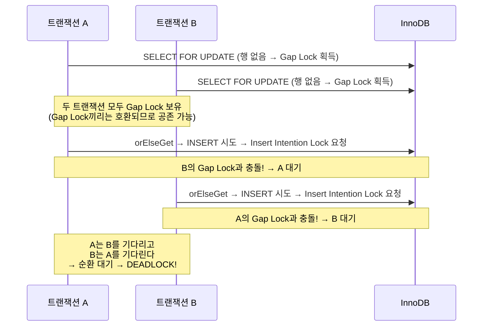

[지난 글](/like-feature-idempotency-and-concurrency)에서는 한 사용자가 좋아요 버튼을 따닥 누를 때 중복이 생기는 문제를 다뤘습니다. 조회하고 저장하는 사이에 다른 요청이 끼어드는 게 원인이었고, Upsert로 해결했습니다.

오늘은 다른 문제입니다. **여러 사용자가 같은 상품에 동시에 좋아요를 누를 때**, 좋아요 수를 얼마나 정확하게 집계할 수 있을까요?

## like_summary 도입 배경

[이전 글](/why-is-my-query-slow-after-indexing/#읽기-전용-집계-테이블-비정규화-도입)에서 `COUNT(*)` 쿼리의 성능 문제를 겪고 비정규화 집계 테이블 `like_summary`를 도입했습니다.

좋아요 수를 보여주는 가장 단순한 방법은 `COUNT(*)` 쿼리입니다.

```sql
SELECT COUNT(*) FROM likes WHERE target_id = 100 AND target_type = 'PRODUCT';
```

하지만 트래픽이 많아질수록 매번 집계를 계산하는 이 쿼리는 부담이 됩니다.

그래서 도입한 것이 비정규화 집계 테이블 `like_summary`입니다. 상품 목록을 조회할 때마다 좋아요 수를 실시간으로 계산하는 대신, 변경이 발생하는 시점에 `like_count`를 미리 집계해 저장해두는 방식입니다.

이제 핵심은 이 집계 값을 **정확하게** 관리하는 것입니다. 여러 사용자가 동시에 같은 상품에 좋아요를 눌러도 `like_count`가 틀어지지 않아야 합니다.

## 신중한 설계 — 원래 코드

동시성 문제를 인식하고 나름 신중하게 설계한 코드입니다.

```java
@Transactional
public LikeInfo add(Long userId, Long targetId, LikeTargetType targetType) {
    int inserted = likeRepository.saveIfAbsent(userId, targetId, targetType);

    if (inserted > 0) {
        LikeSummary summary = likeSummaryRepository
            .findByTargetForUpdate(LikeTarget.create(targetId, targetType))
            .orElseGet(() -> likeSummaryRepository.save(
                LikeSummary.create(targetId, targetType)
            ));
        summary.increase();
    }

    return LikeInfo.of(targetType, targetId, getCount(targetId, targetType));
}
```

두 가지를 신경 썼습니다.

**비관적 락 선택 이유**: 같은 상품에 여러 사용자가 동시에 좋아요를 누를 수 있습니다. 충돌이 빈번할 것이라 판단했고, 낙관적 락보다 `SELECT FOR UPDATE`로 확실하게 막는 편이 낫다고 봤습니다.

**orElseGet으로 최초 생성 처리**: 어떤 상품에 처음으로 좋아요가 눌릴 때는 `like_summary` 행이 아직 존재하지 않습니다. `findByTargetForUpdate`가 `Optional.empty()`를 반환할 수 있으므로, `orElseGet`으로 새로 생성해 저장합니다.

두 가지 상황 모두 대비한 것처럼 보입니다. 동시성 테스트로 검증해봅시다.

## 동시성 테스트 — 10명이 동시에 좋아요를 누르면?

아직 좋아요가 한 번도 없는 상품에 10명의 사용자가 동시에 좋아요를 누르는 상황을 테스트했습니다. 정상적이라면 10명 모두 성공하고, `likeCount`는 10이어야 합니다.

```java
@Test
@DisplayName("LikeSummary가 없는 상품에 10명이 동시에 좋아요하면 모두 성공해야 한다")
void concurrent_first_likes_should_all_succeed() throws InterruptedException {
    int threadCount = 10;
    Long targetId = 9999L;
    LikeTargetType targetType = LikeTargetType.PRODUCT;

    ExecutorService executor = Executors.newFixedThreadPool(threadCount);
    CountDownLatch readyLatch = new CountDownLatch(threadCount);
    CountDownLatch startLatch = new CountDownLatch(1);
    AtomicInteger failCount = new AtomicInteger(0);

    for (int i = 0; i < threadCount; i++) {
        long userId = i + 1;
        executor.submit(() -> {
            try {
                readyLatch.countDown();
                startLatch.await();
                likeServiceGapLock.add(userId, targetId, targetType);
            } catch (Exception e) {
                failCount.incrementAndGet();
            }
        });
    }

    readyLatch.await();
    startLatch.countDown();
    executor.shutdown();
    executor.awaitTermination(30, SECONDS);

    long likeCount = likeSummaryGapLockJpaRepository
            .findByTarget(LikeTarget.create(targetId, targetType))
            .map(LikeSummary::getLikeCount)
            .orElse(0L);

    assertAll(
            () -> assertThat(failCount.get()).as("실패한 스레드 수").isEqualTo(0),
            () -> assertThat(likeCount).as("좋아요 수").isEqualTo(threadCount)
    );
}
```

`CountDownLatch`로 10개 스레드가 동시에 출발하도록 맞추고, 모든 스레드가 성공하는지 확인합니다.

## 예상 밖의 실패

테스트 결과는 기대와 완전히 달랐습니다.

```
Multiple Failures (2 failures)
    [실패한 스레드 수] expected: 0 but was: 9
    [좋아요 수] expected: 10L but was: 1L
```

10명 중 9명이 실패하고, 좋아요는 1건만 기록됐습니다. 뭐가 문제일까요?

## 원인 추적 — Deadlock

처음에는 원인을 알 수 없었습니다. `failCount`가 9인 건 보이는데, 어떤 예외가 발생했는지는 콘솔에 아무것도 찍히지 않았습니다. catch 블록이 예외를 삼키고 카운트만 올리고 있었기 때문입니다.

catch 블록에 예외 클래스명과 메시지를 출력하도록 한 줄을 추가하고 다시 돌려봤습니다.

```java
} catch (Exception e) {
    System.out.println("[Thread-" + userId + "] 예외 발생: "
        + e.getClass().getSimpleName() + " - " + e.getMessage());
    failCount.incrementAndGet();
}
```

그제서야 원인이 보였습니다.

```
[Thread-2] 예외 발생: CannotAcquireLockException - could not execute statement
  [...] Deadlock found when trying to get lock; try restarting transaction
[Thread-3] 예외 발생: CannotAcquireLockException - could not execute statement
  [...] Deadlock found when trying to get lock; try restarting transaction
...
```

9개 스레드 모두 `CannotAcquireLockException`으로 실패했고, 메시지 안에 **"Deadlock found"** 가 찍혀 있었습니다.

데드락이 발생한다는 사실은 확인했는데, **왜** 발생하는지는 감이 오지 않았습니다. 비관적 락으로 안전하게 만들었다고 생각했거든요. `SELECT FOR UPDATE`로 행을 잠그고, 없으면 새로 만드는 흐름이니 문제가 없어야 하는 거 아닌가?

결국 AI에게 코드와 에러 메시지를 보여주며 물어봤습니다. 돌아온 답에서 처음 본 키워드가 있었습니다 — **Gap Lock**. 조건에 맞는 행이 없을 때 `FOR UPDATE`가 레코드가 아닌 "빈 공간"에 락을 건다는 것이었습니다. 그리고 이 Gap Lock끼리는 서로 호환되기 때문에 여러 트랜잭션이 동시에 획득할 수 있고, 이후 INSERT에서 순환 대기가 발생한다는 설명이었습니다.

처음 들어보는 개념이라 제대로 이해하고 싶었습니다.

## Gap Lock이란?

어떤 상품에 아직 좋아요가 한 번도 없다고 가정해봅시다. `like_summary` 테이블에 해당 행이 없는 상태입니다.

이 상황에서 두 사용자가 **거의 동시에** 처음으로 좋아요를 누릅니다. 트랜잭션 A와 B가 각각 `findByTargetForUpdate`를 실행합니다.

```sql
SELECT * FROM like_summary
WHERE target_id = 100 AND target_type = 'PRODUCT'
FOR UPDATE;
```

조건에 맞는 행이 없습니다. 그런데 `FOR UPDATE`는 어딘가에 락을 걸어야 합니다. 락을 걸 행 자체가 없으니, InnoDB는 **Gap Lock(갭 락)** 을 겁니다.

> **Gap Lock이란?**
> 특정 레코드가 아닌, **레코드 사이의 "빈 공간(Gap)"에 거는 락**입니다.
> 행이 없는 범위에 `SELECT FOR UPDATE`를 실행하면 그 빈 공간에 락이 걸려, 해당 범위에 새로운 행이 INSERT되는 것을 방지합니다.
>
> — [MySQL 공식 문서: InnoDB Locking - Gap Locks](https://dev.mysql.com/doc/refman/9.6/en/innodb-locking.html#innodb-gap-locks)

Gap Lock의 결정적인 특성이 있습니다.

**Gap Lock끼리는 서로 호환됩니다(compatible).**

트랜잭션 A가 Gap Lock을 보유하고 있어도, 트랜잭션 B가 **같은 Gap에 Gap Lock을 동시에** 획득할 수 있습니다. 두 트랜잭션이 모두 `SELECT FOR UPDATE`를 성공적으로 마칩니다.

## Deadlock 발생 과정

이제 두 트랜잭션이 각자 `orElseGet`에 진입합니다. 행이 없었으니 둘 다 `save()`를 호출합니다. INSERT를 실행하려면 **Insert Intention Lock(삽입 의도 락)** 이 필요한데, 이것은 **Gap Lock과 충돌합니다.**



**순환 대기(Circular Wait)**. 전형적인 데드락 조건입니다.

- 트랜잭션 A는 B의 Gap Lock이 해제되기를 기다립니다.
- 트랜잭션 B는 A의 Gap Lock이 해제되기를 기다립니다.
- 둘 다 영원히 기다립니다.

InnoDB는 이를 감지하고 한 트랜잭션을 강제로 롤백시킵니다.

```
ERROR 1213 (40001): Deadlock found when trying to get lock;
try restarting transaction
```

비관적 락으로 안전하게 만들려 했는데, 오히려 더 심각한 문제가 생긴 것입니다.

결국 Gap Lock은 `SELECT FOR UPDATE` 시점에 이미 걸리기 때문에, `orElseGet` 같은 코드 레벨 분기로는 이 교착 상태를 막을 수 없습니다.

## 터미널로 직접 재현해보기

Gap Lock의 동작 원리가 궁금해서 직접 두 개의 MySQL 세션으로 재현해봤습니다.

**준비: 테이블 생성**

```sql
CREATE DATABASE IF NOT EXISTS gap_lock_demo;
USE gap_lock_demo;

CREATE TABLE like_summary (
    id          BIGINT AUTO_INCREMENT PRIMARY KEY,
    target_id   BIGINT      NOT NULL,
    target_type VARCHAR(20) NOT NULL,
    like_count  BIGINT      NOT NULL DEFAULT 0,
    created_at  DATETIME    NOT NULL,
    updated_at  DATETIME    NOT NULL,
    UNIQUE KEY uq_like_summary (target_id, target_type)
);
```

**재현 순서**

두 개의 터미널을 열고 아래 순서대로 실행합니다.


**1.** 터미널 A — `BEGIN;`
트랜잭션 시작

**2.** 터미널 B — `BEGIN;`
트랜잭션 시작

**3.** 터미널 A — `SELECT ... FOR UPDATE`
결과 없음 → Gap Lock 획득

**4.** 터미널 B — `SELECT ... FOR UPDATE`
결과 없음 → Gap Lock 획득 (Gap Lock끼리는 호환)

**5.** 터미널 A — `INSERT INTO like_summary ...`
Insert Intention Lock 필요 → B의 Gap Lock에 **블로킹**

**6.** 터미널 B — `INSERT INTO like_summary ...`
Insert Intention Lock 필요 → A의 Gap Lock과 순환 대기 → **Deadlock 감지, B 롤백**

B가 롤백되면서 Gap Lock이 해제되고, A의 INSERT가 성공합니다.


## 해결: ON DUPLICATE KEY UPDATE

Gap Lock이 문제의 근원이었습니다. `SELECT FOR UPDATE`가 있는 한, 행이 없는 상황에서 Gap Lock은 반드시 발생합니다.

해결책은 `SELECT`와 `INSERT`를 분리하지 않는 것입니다.

```sql
INSERT INTO like_summary (target_id, target_type, like_count, created_at, updated_at)
VALUES (:targetId, :targetType, 1, NOW(), NOW())
ON DUPLICATE KEY UPDATE like_count = like_count + 1, updated_at = NOW()
```

- 행이 없으면 → `like_count = 1`로 INSERT
- 행이 있으면 → `like_count = like_count + 1`로 UPDATE

`ON DUPLICATE KEY UPDATE`가 동작하려면 **중복을 판별할 UNIQUE 제약조건**이 필요합니다. 위 테이블 생성 SQL에서 `uq_like_summary (target_id, target_type)`로 이미 정의되어 있습니다.

이 구문도 내부적으로 Gap Lock을 사용할 수 있습니다. 하지만 기존 코드에서 Deadlock이 발생한 원인은 Gap Lock 자체가 아니라, `SELECT FOR UPDATE`와 `INSERT`가 **2단계로 분리**되어 있었기 때문입니다. 두 트랜잭션이 1단계(SELECT)를 동시에 통과한 뒤 2단계(INSERT)에서 서로의 Gap Lock을 기다리는 순환이 만들어졌습니다.

`ON DUPLICATE KEY UPDATE`는 **단일 구문**으로 INSERT와 UPDATE를 원자적으로 처리합니다. SELECT와 INSERT 사이에 다른 트랜잭션이 끼어드는 틈이 없으므로, 같은 Deadlock 패턴이 발생하지 않습니다.

실제 `LikeSummaryJpaRepository` 구현입니다.

```java
public interface LikeSummaryJpaRepository extends JpaRepository<LikeSummary, Long> {

    @Modifying(clearAutomatically = true, flushAutomatically = true)
    @Query(value = "INSERT INTO like_summary (target_id, target_type, like_count, created_at, updated_at) " +
                   "VALUES (:targetId, :targetType, 1, NOW(), NOW()) " +
                   "ON DUPLICATE KEY UPDATE like_count = like_count + 1, updated_at = NOW()",
           nativeQuery = true)
    int increaseLikeCount(@Param("targetId") Long targetId,
                          @Param("targetType") String targetType);
}
```

서비스 레이어도 훨씬 단순해집니다.

```java
@Transactional
public LikeInfo add(Long userId, Long targetId, LikeTargetType targetType) {
    int inserted = likeRepository.saveIfAbsent(userId, targetId, targetType);

    if (inserted > 0) {
        likeSummaryRepository.increaseLikeCount(targetId, targetType.name());
    }

    return LikeInfo.of(targetType, targetId, getCount(targetId, targetType));
}
```

`findByTargetForUpdate` → `orElseGet` → `save` → `increase`라는 네 단계의 흐름이, 단일 쿼리 한 번으로 대체됩니다.

## 맺으며

지난 글에서 비관적 락을 "닭 잡는 데 소 잡는 칼"이라고 표현했습니다. 과한 도구라는 의미였습니다.

이번에 겪은 건 그보다 더 심각한 문제였습니다. **잘못된 도구가 아니라, 옳다고 생각한 도구가 오히려 Deadlock을 만들어냈습니다.**

비관적 락은 "행이 이미 존재하는 상황"에서의 동시 수정을 막는 데는 유효합니다. 하지만 "행이 없는 상황"에서 `SELECT FOR UPDATE`를 쓰면 Gap Lock이 발생하고, 복수의 트랜잭션이 동시에 진입하면 Deadlock으로 이어집니다.

INSERT가 관여하는 시나리오에서는 락보다 DB의 원자적 쿼리가 더 안전하고 단순했습니다. 중복 시 값을 갱신해야 하면 `ON DUPLICATE KEY UPDATE`, 단순히 중복 삽입만 무시하면 되면 `INSERT IGNORE`처럼 목적에 맞는 구문을 선택하면 됩니다. 동시성 테스트를 작성하지 않았다면 이 문제를 운영 환경에서 처음 만났을 거라고 생각하면 좀 아찔합니다.
