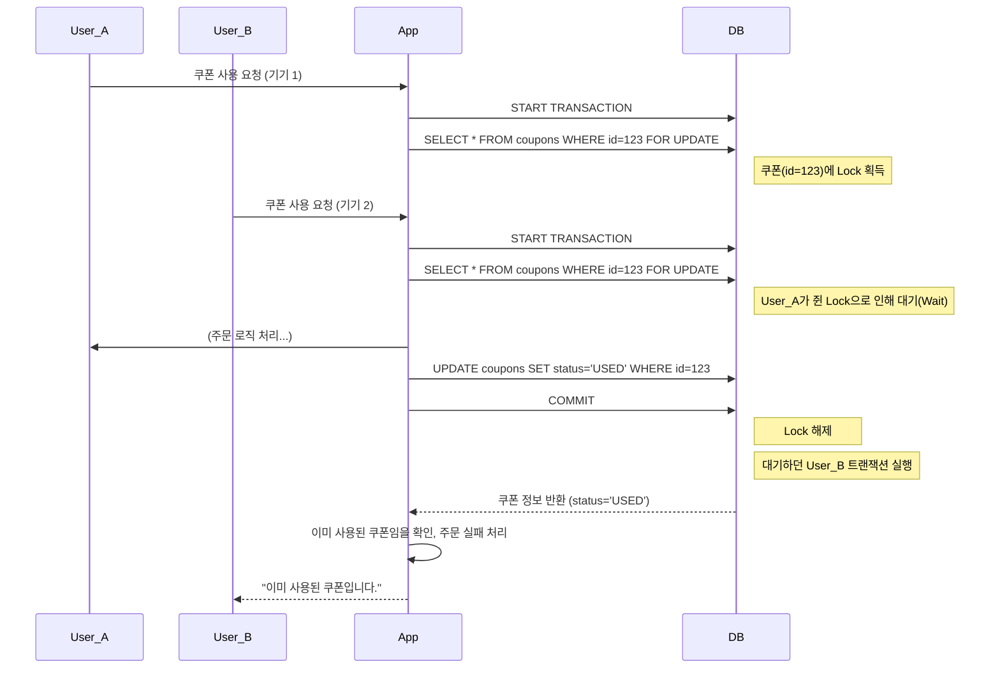
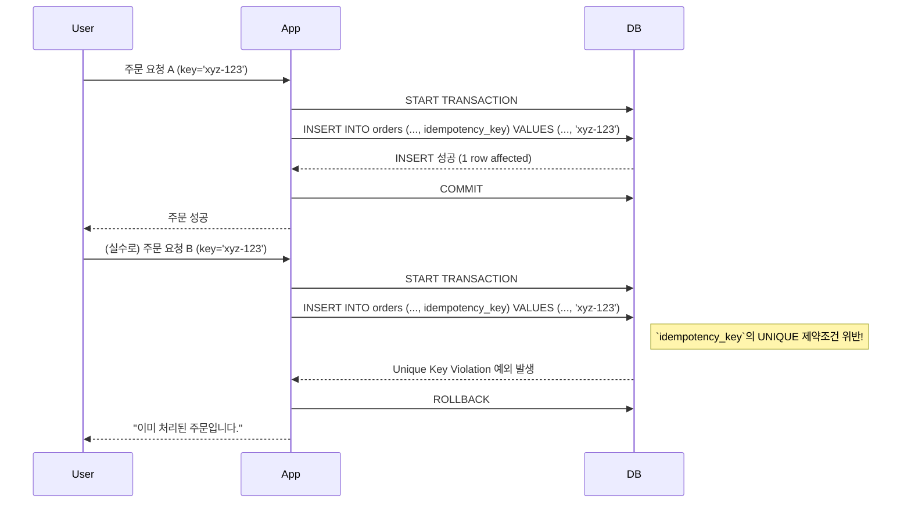

이커머스 서비스를 개발하다 보면 우리는 필연적으로 '돈'과 관련된 데이터를 다루게 됩니다. 재고, 포인트, 쿠폰처럼 단 하나의 오차도 허용할 수 없는 데이터들이죠. 이런 데이터의 정합성을 지키기 위해 우리는 '동시성 문제'라는 거대한 벽을 마주하게 됩니다.

이때 가장 먼저 떠오르는 해결책이 바로 **비관적 락(Pessimistic Lock)** 과 **낙관적 락(Optimistic Lock)** 입니다.

많은 자료에서 두 락을 이렇게 설명합니다. "충돌이 잦을 것 같으면 비관적 락, 드물 것 같으면 낙관적 락을 쓰세요." 

참 명쾌한 기준이지만, 이 한 문장만 믿고 가기엔 실제 서비스는 너무나 복잡합니다.

오픈 기념으로 배포한 쿠폰에 사용자가 얼마나 몰릴지, 어떤 사용자가 재고가 딱 하나 남은 상품을 여러 브라우저 탭에 띄워놓고 광클을 할지, 우리는 감히 예측할 수 없습니다.

 '충돌 빈도'라는 기준은 결국 개발자의 '추측'에 기댈 수밖에 없는데, 과연 내 추측이 맞을까요? 만약 틀렸다면, 그로 인해 발생한 데이터 오류의 책임은 누가 져야 할까요?

이 글에서는 단순한 정의를 넘어, 실제 시나리오 속에서 두 락이 어떻게 동작하고 어떤 장단점을 드러내는지, 그리고 궁극적으로 어떤 기준으로 기술을 선택해야 하는지에 대한 고민의 여정을 담아보고자 합니다.

## 비관적 락 vs 낙관적 락 

###  비관적 락 (Pessimistic Lock) :  "일단 막고 보자"

이름처럼, 동시에 접근하면 충돌이 날 것이라고 비관적으로 가정합니다. 그래서 데이터에 접근하는 순간부터 락을 걸어 다른 트랜잭션의 접근을 막아버립니다.


동작 원리: 실제 데이터베이스가 제공하는 락 기능을 사용합니다. 트랜잭션이 데이터를 읽을 때 SELECT ... FOR UPDATE 구문을 통해 해당 데이터에 배타적인 락(Exclusive Lock)을 겁니다. 이 락은 트랜잭션이 커밋되거나 롤백될 때까지 유지됩니다.

### 낙관적 락 (Optimistic Lock): "일단 하고, 마지막에 확인 하자"


반대로, 충돌이 거의 일어나지 않을 것이라고 낙관적으로 가정합니다. 그래서 락 없이 자유롭게 데이터를 읽고, 데이터를 수정하는 마지막 순간에 다른 트랜잭션이 먼저 데이터를 변경하지 않았는지 확인합니다.


동작 원리: 주로 데이터 테이블에 version과 같은 버저닝(Versioning) 컬럼을 추가하여 구현합니다. 데이터를 수정할 때, 내가 처음 읽었던 version 값과 현재 데이터베이스의 version 값이 일치하는 경우에만 수정을 허용합니다.

### Version 의 비밀

낙관적 락의 핵심은 version 컬럼입니다. 이 작은 숫자가 어떻게 충돌을 마법처럼 감지해낼까요? 그 원리는 생각보다 간단합니다.

1. 조회 (SELECT): 사용자 A가 상품(재고: 50개, version: 1) 정보를 읽어옵니다.
2. 수정 (UPDATE): 사용자 B가 먼저 이 상품의 재고를 45개로 수정합니다. 이때 version은 1 증가하여 2가 됩니다.
3. 충돌 발생: 사용자 A가 뒤늦게 재고를 60개로 수정하려고 UPDATE를 시도합니다. 하지만 WHERE 절에 version = 1 이라는 조건을 포함시키죠.


```sql
UPDATE product
SET quantity = 60, version = 2
WHERE id = 101 AND version = 1; -- 내가 읽었을 때의 버전(1)과 같은지 확인!
```

4. 실패 감지: DB에는 이미 version이 2인 데이터만 존재하므로, 이 UPDATE 쿼리에 의해 변경되는 행(row)은 0개가 됩니다.
5. 예외 처리: 애플리케이션 프레임워크(JPA 등)는 변경된 행이 0개인 것을 보고, "아, 충돌이 났구나!" 라고 판단하여 OptimisticLockException과 같은 예외를 발생시킵니다.

결국 version은 데이터를 수정하기 위한 일종의 '일회용 토큰'처럼 동작하는 셈입니다.


### 잠깐, Version을 시간(Timestamp)으로 쓰면 안 되나요?


."숫자 대신 마지막 수정 시간(Timestamp)을 version으로 사용하면 어떨까? 더 직관적이지 않나?"

매우 합리적인 생각입니다. 하지만 이 아이디어에는 치명적인 함정이 숨어 있습니다. 바로 '시간의 정밀도' 문제입니다.

Java 애플리케이션은 나노초 단위까지 시간을 다룰 수 있지만, 데이터베이스는 보통 마이크로초나 밀리초까지만 저장합니다. 이 과정에서 시간 정보에 손실이 발생할 수 있습니다. 더 위험한 것은, 시스템 성능이 워낙 좋아서 서로 다른 두 트랜잭션이 동일한 밀리초(ms) 안에 실행될 수 있다는 점입니다.

만약 트랜잭션 A가 12:00:00.123456 초에 데이터를 수정하고, 트랜잭션 B가 12:00:00.123789 초에 수정하려고 할 때, 두 시간이 DB에서 같은 12:00:00.123 초로 기록된다면 어떻게 될까요? 충돌을 감지하지 못하고 데이터가 덮어씌워지는 끔찍한 사태가 발생할 수 있습니다.

결론: 시간은 연속적이지 않고, 그 정밀도에 의존하기 때문에 충돌 감지를 100% 보장할 수 없습니다. 따라서 데이터 정합성이 중요하다면, 고민할 여지 없이 단순하고 명확하게 1씩 증가하는 정수형 version을 사용하는 것이 가장 안전하고 표준적인 방법입니다.


## 첫 번째 라운드: 쿠폰 동시 사용, 비관적 락은 최선일까?

가장 고전적인 시나리오, '쿠폰 동시 사용'을 생각해 봅시다. 한 사용자가 가진 단 한 장의 쿠폰을 여러 기기에서 동시에 사용하려는 상황입니다.

처음엔 "돈과 관련된 문제니 가장 안전한 비관적 락을 쓰자!"라고 생각하기 쉽습니다. 비관적 락이 어떻게 이 문제를 해결하는지 시퀀스 다이어그램으로 살펴보죠.



기능적으로 중복 사용은 완벽히 막았습니다. 하지만 이 과정이 과연 최선일까요? 요청 B는 이유도 모른 채 하염없이 기다리다 결국 실패 응답을 받습니다. 

시스템 전체적으로는 불필요한 대기 시간 때문에 처리량이 감소하죠.

이 시나리오의 본질은 **"기다렸다가 순서대로 처리해"** 가 아니라, **"먼저 쓴 사람이 임자고, 나머지는 즉시 실패해야 해"** 입니다. 

비관적 락은 이 요구사항에 적합하지 않은 선택이었습니다..

## 진짜 기준은 '충돌 빈도'가 아니었다: 그래서 충돌나면 어쩔 건데?

바로 이 지점에서 더 본질적인 질문을 던지게 됩니다.

"그래서, 충돌이 발생했을 때 시스템이 어떻게 행동하기를 원하는가?"

기다렸다가, 변경된 최신 데이터를 기반으로 내 작업을 이어서 처리해야 하는가?

(예: 계좌 이체. 입금이 완료될 때까지 기다렸다가, 늘어난 잔액에서 출금해야 한다)
이럴 땐 비관적 락이 적합합니다.


내 작업의 전제 조건이 깨졌으니, 기다릴 필요 없이 즉시 실패해야 하는가?
(예: 쿠폰 사용, 티켓 예매. 내가 쓰려던 쿠폰이 사라졌다면 내 주문은 의미가 없다)
이럴 땐 낙관적 락이 적합합니다.


## 두 번째 라운드: 주문 '따닥' 이슈와 Idempotency Key

이번엔 다른 시나리오입니다. 사용자가 '주문하기' 버튼을 빠르게 두 번 누르는, 일명 '따닥 이슈'입니다. 동일한 주문이 중복으로 생성되는 것을 막아야 합니다. 보통 프론트엔드에서 Idempotency Key(멱등성 키)를 만들어 요청과 함께 보냅니다.

이 문제는 비관적 락으로 해결하기 애매합니다. 아직 생성되지도 않은 주문 데이터를 락 걸 수는 없으니까요.

하지만 낙관적 락의 '철학'을 빌려온 멋진 방법이 있습니다. DB의 UNIQUE 제약조건을 활용하는 것이죠. "일단 시도하고, DB가 막으면 실패로 간주한다"는 점에서 낙관적 락과 똑 닮았습니다.



이 방식은 어떨까요? 락이나 대기 없이 중복 주문을 효과적으로 방지할 수 있습니다.

 DB의 기본 기능을 활용해 비즈니스 규칙(중복 주문 방지)을 깔끔하게 구현했습니다.


## 싸움을 피하는 게 상책: '락 없는 설계'를 향한 여정
만약 10,000명이 동시에 한정판 상품을 주문하려 한다면 어떨까요? 비관적 락은 시스템을 마비시키고, 낙관적 락은 9,999개의 재시도 폭풍을 일으킬 겁니다. 이쯤 되면 '어떤 락을 쓸까'라는 질문 자체가 무의미해집니다.

"최고의 락은, 락을 쓰지 않는 것이다."

동시성 문제의 본질은 여러 트랜잭션이 동시에 동일한 자원에 접근할 때 발생하는 충돌입니다.

 그렇다면 메시지 큐를 도입해 요청을 한 줄로 세워 순서대로 처리하면 어떨까요? 애초에 경합 자체가 발생하지 않습니다.

## 맺으며

단순한 규칙에서 시작된 고민은 '비즈니스 정책', '락의 주도권', 그리고 마침내 '락 없는 설계'라는 더 넓은 시야로 저를 이끌었습니다. 

동시성 문제는 단순히 락을 쓰느냐 마느냐의 문제가 아닙니다. 우리가 만드는 서비스의 비즈니스 맥락을 깊이 이해하고, 그에 맞는 기술적 선택을 고민하는 과정이야말로 개발자의 진짜 실력이라고 믿습니다.