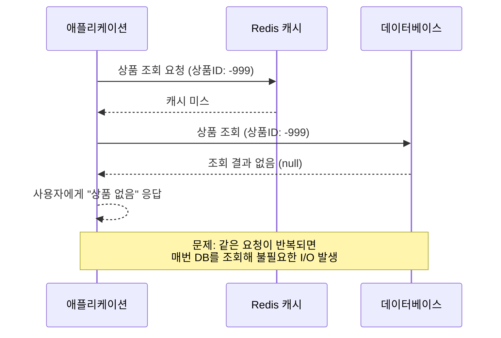

개발자로서 우리는 항상 더 빠른 응답 속도와 더 나은 사용자 경험을 고민합니다. 특히 조회가 많은 이커머스 시스템에서 성능 개선은 필수 과제 중 하나입니다. 가장 먼저 떠오르는 해결책은 단연 **`인덱스(Index)`** 입니다. 하지만 인덱스만으로 모든 것이 해결될까요?

## 인덱스의 한계

물론 인덱스는 가장 기본적이면서도 강력한 해결책입니다.

특정 조건의 데이터를 찾아내는 속도를 드라마틱하게 향상시켜 주니까요. 실제로 저 또한 인덱스만으로 조회 쿼리의 실행 계획을 개선하고 응답 속도를 N배 향상시킨 경험이 있습니다.

**[인덱스를 걸었는데, 왜 느리죠? (feat. 5초를 0.03초로 만든 쿼리 삽질기)](https://connieya.github.io/why-is-my-query-slow-after-indexing/)**

하지만 사용자가 여러 필터(카테고리, 가격대, 브랜드, 색상...)를 조합하기 시작하면 이야기는 달라집니다. 모든 필터 조합에 맞춰 인덱스를 거는 건 사실상 불가능하고, INSERT, UPDATE 시 인덱스 구조를 재정렬해야 하므로 쓰기(Write) 성능에 악영향을 줍니다.

자주 조회되는 데이터라는 것은 그만큼 요청이 많다는 의미입니다. 그런데 **이 데이터가 자주 변경되지 않는다면, 매번 요청이 올 때마다 데이터베이스까지 가서 I/O 작업을 수행하는 것은 비효율적입니다.**

이 불필요한 I/O를 없애려면, 데이터를 꼭 데이터베이스에만 둘 필요는 없다는 결론에 다다랐습니다. I/O 작업 자체가 없는 메모리처럼 훨씬 빠른 곳에 데이터를 저장해두고 꺼내 쓴다면 어떨까요?

## Redis를 선택한 이유

캐싱을 위한 도구는 많지만, 저의 선택은 레디스였습니다. 이유는 명확했습니다.

- **In-Memory 기반의 압도적인 속도** : 모든 데이터를 디스크가 아닌 메모리에 저장하기에, DB와는 비교할 수 없는 응답 속도를 자랑합니다.
- **다채로운 자료구조** : 단순한 Key-Value를 넘어 해시(Hashes), 정렬된 집합(Sorted Sets) 등 상황에 맞는 최적의 '그릇'을 제공합니다. 이는 데이터를 더 효율적으로 저장하고 관리할 수 있게 해줍니다.

레디스를 캐시 도구로 사용하기로 했으니 이제 어떤 데이터에 캐싱을 적용할지 구체적인 대상을 선정해보겠습니다.

## 상품 상세 페이지 캐싱

이커머스에서 사용자들이 반복적으로 많이 조회하는 대표적인 페이지 중 하나가 상품 상세 페이지입니다.

여기에는 상품명, 가격, 브랜드, 설명, 그리고 '좋아요' 수 같은 데이터가 있습니다.

- 상품명, 브랜드, 설명: 거의 바뀌지 않습니다.
- 가격: 가끔 프로모션으로 변경됩니다.
- 좋아요 수: 사용자의 행동에 따라 꽤 빈번하게 바뀝니다.

전반적으로 **읽기 요청이 쓰기 요청보다 압도적으로 많은 구조**였기에, 캐싱을 적용하기에 완벽한 대상이었습니다.

## Hash vs String

상품 상세 정보는 여러 필드로 구성된 객체입니다.  
저는 두 가지 방법을 고민했습니다.

- **JSON String**: 객체 전체를 직렬화해서 문자열로 저장
- **Hash**: 상품 ID를 Key로, 나머지 필드를 Field-Value 쌍으로 저장

문제는 **데이터가 바뀔 때**였습니다. JSON String으로 저장하면, 가격이나 좋아요 수처럼 작은 필드가 변경되어도 전체 JSON을 다시 읽고 덮어써야 합니다.

반면 해시(Hash) 자료구조는 `HINCRBY` 같은 명령어로 **'좋아요' 수만 원자적으로(atomic) 1 증가시키는 등 필드 단위의 부분 업데이트** 가 가능합니다. 이 유연함 때문에 저는 망설임 없이 해시를 선택했습니다.

예를 들어, 좋아요 수는 Redis Hash의 `HINCRBY`를 활용해 부분 업데이트 할 수 있습니다.

```java
@Override
public void updateLikeCount(Long productId , LikeUpdateType updateType) {
    objectRedisTemplate.opsForHash().increment(
        RedisKeyManager.PRODUCT_DETAIL_KEY + productId,
        "likeCount",
        updateType == LikeUpdateType.INCREMENT ? 1 : -1
    );
}
```

이렇게 하면 JSON 전체를 직렬화/역직렬화할 필요 없이, 특정 필드만 빠르게 수정할 수 있습니다.

## Cache-Aside 패턴: 캐시 미스 처리

저는 서비스 로직에서 RedisTemplate을 직접 쓰지 않고, `ProductCacheRepository`라는 별도의 레이어를 두어 역할을 분리했습니다.
조회 로직은 대표적인 **Cache-Aside 패턴**을 따릅니다.

- 캐시에 데이터가 있으면 그대로 반환
- 캐시에 없으면 DB에서 조회 후 캐시에 저장

```java
@Transactional
public ProductDetailInfo getProductDetail(Long productId) {
    Optional<ProductDetailInfo> cached = productCacheRepository.findProductDetailById(productId);
    if (cached.isPresent()) {
        return cached.get();
    }
    ProductDetailInfo productDetailInfo = productRepository.findProductDetail(productId)
        .orElseThrow(() -> new ProductException.ProductNotFoundException(ErrorType.PRODUCT_NOT_FOUND));
    productCacheRepository.saveProductDetail(productDetailInfo);
    return productDetailInfo;
}
```

덕분에 서비스 레이어는 단순히 “캐시에 있으면 쓰고, 없으면 DB에서 가져온다”라는 직관적인 흐름을 유지할 수 있습니다.
캐싱 로직은 모두 Repository 구현체에 숨겨져 있습니다.

## 그런데 존재하지 않는 상품이라면?

여기서 또 하나의 고민이 생깁니다.
만약 사용자가 존재하지 않는 상품 ID를 계속 조회한다면 어떻게 될까요?

Cache-Aside 패턴에 따라 캐시에서 데이터를 찾지 못하면 DB를 조회합니다.
그런데 DB에서도 null을 반환한다면?
캐시는 비어 있고, 요청이 들어올 때마다 DB를 계속 두드리게 됩니다.

사용자에게는 아무 결과도 주지 못하면서, 시스템은 불필요한 I/O 작업을 반복하게 되는 셈이죠.

이런 상황을 **캐시 관통(Cache Penetration)** 이라고 부릅니다.



### "없음"도 캐싱하기

해결책은 단순합니다.  
DB에서 데이터를 찾지 못했다면, **"없음(null)"이라는 사실 자체를 캐싱**하는 것입니다.  
짧은 TTL을 두고 특별한 값을 저장해두면, 이후 잘못된 요청은 DB까지 가지 않고 캐시에서 빠르게 차단할 수 있습니다.

저는 이를 구현할 때 **null object 패턴**을 적용했습니다.  
상품이 존재하지 않을 경우 캐시에 `"__null__"` 필드를 저장해두고, 조회 시 이를 감지해 `ProductDetailInfo.EMPTY`라는 객체를 반환하도록 했습니다.

간단히 표현하면 다음과 같습니다:

```java
// 저장 시: 존재하지 않는 데이터도 "__null__"로 캐싱
if (productDetailInfo == null) {
    objectRedisTemplate.opsForHash().putAll(key, Map.of("__null__", "null"));
    objectRedisTemplate.expire(key, Duration.ofHours(2)); // 짧은 TTL
    return;
}

// 조회 시: "__null__"이면 EMPTY 객체 반환
if (cache.containsKey("__null__")) {
    return Optional.of(ProductDetailInfo.EMPTY);
}
```

이렇게 하면 잘못된 상품 ID로 요청이 반복되더라도 DB에 부하를 주지 않고 캐시에서 바로 걸러낼 수 있습니다.

물론 짧은 TTL을 두는 것을 잊으면 안 됩니다. 나중에 해당 상품이 실제로 생길 수도 있기 때문입니다.

## 캐시를 언제 비울 것인가?

캐싱에서 가장 어려운 문제 중 하나는 **언제 데이터를 무효화할 것인가** 입니다.

저는 처음에 TTL을 두지 않기로 했습니다. 상품 상세 정보는 자주 바뀌지 않고, 좋아요 수 같은 데이터는 Redis Hash에서 바로 갱신할 수 있기 때문입니다. 즉, 데이터가 변경될 때마다 캐시를 직접 갱신해주면 TTL은 필요 없다고 본 것이죠.

하지만 운영을 해보니, 데이터의 성격에 따라 무효화 전략을 달리해야 했습니다.

### 좋아요: Cache-First

좋아요 수는 실시간 반영이 중요하지만, 정합성이 완벽할 필요는 없습니다.

그래서 사용자가 좋아요를 누르면 Redis Hash에 바로 반영하고(`HINCRBY`), Kafka 이벤트를 발행해 Consumer가 배치로 DB 집계를 처리하는 방식을 택했습니다.  
→ 캐시 무효화는 필요하지 않았습니다. 캐시 자체가 항상 최신을 유지하고 있었으니까요.

````java
```java
@TransactionalEventListener(phase = TransactionPhase.AFTER_COMMIT)
@Async
public void add(ProductLikeEvent.Add event) {
    // 1. 캐시에 즉시 반영
    productCacheRepository.updateLikeCount(event.productId(), LikeUpdateType.INCREMENT);

    // 2. Kafka 이벤트 발행 → 배치 집계 후 DB 저장
    likeEventPublisher.publishEvent(ProductLikeEvent.Update.of(event.productId(), INCREMENT));
}
````

좋아요 취소 이벤트도 같은 방식으로 동작합니다.

### 가격: DB-First, 키 삭제 + TTL

가격은 정합성이 가장 중요한 데이터입니다. 사실 DB 커밋 이후 캐시 해시(Hash)에서 가격 필드만 갱신해도 동작에는 문제가 없습니다. 하지만 가격은 단 1원의 차이도 허용되지 않는 민감한 값이기 때문에, 혹시라도 캐시에 잘못 반영된다면 큰 문제가 될 수 있습니다.

그래서 저는 부분 갱신 방식 대신 아예 상품 상세 캐시 키 전체를 삭제(DEL) 하기로 했습니다. 이후 요청이 들어오면 자연스럽게 캐시 미스(Cache Miss)가 발생하고, DB에서 최신 가격을 읽어 캐시에 다시 적재하는 방식입니다.
가격 변경은 빈번하지 않으므로, 이렇게 다소 과감하게 캐시를 통째로 지워도 충분히 합리적이라고 판단했습니다.

또한 캐시 재적재 시에는 키 단위로 TTL을 설정했습니다. TTL은 정합성을 보장하기 위한 1차 수단이 아니라, 혹시라도 캐시 갱신 로직이 누락되거나 이벤트가 유실되는 상황에서 오래된 데이터가 무한히 남지 않도록 하는 안전장치 역할을 합니다.

```java
@Override
public void saveProductDetail(ProductDetailInfo productDetailInfo) {
    String key = RedisKeyManager.PRODUCT_DETAIL_KEY + productDetailInfo.getProductId();
    Duration ttl = Duration.ofHours(3);

    Map<String, Object> cache = objectMapper.convertValue(productDetailInfo, new TypeReference<>() {});
    objectRedisTemplate.opsForHash().putAll(key, cache);
    objectRedisTemplate.expire(key, ttl); // 키 단위 TTL
}
```

TTL의 구체적인 값은 정답이 없습니다.
너무 짧게 잡으면 캐시 미스가 자주 발생해 오히려 DB 부하를 키울 수 있고, 너무 길면 장애 상황에서 잘못된 데이터가 오래 유지될 수 있습니다.

저는 3시간을 기준으로 잡았지만, 이 값에 정답은 없습니다. 서비스의 트래픽 패턴, 데이터의 중요도, 비즈니스 요구사항에 따라 팀(기획자, 운영자)과 함께 논의하여 최적의 값을 찾아가는 과정이 반드시 필요합니다.

## TTL이 끝나는 그 순간

TTL을 설정해두고 나니 또 다른 고민이 생겼습니다.  
만약 TTL이 만료되는 순간, 수많은 사용자가 동시에 상품 상세 페이지에 진입한다면 어떻게 될까요?  
캐시는 비어 있고, 모든 요청이 한꺼번에 DB로 향하게 됩니다.  
이 상황을 상상하니, 순식간에 DB I/O가 폭증할 것 같았습니다.

바로 이것이 **캐시 스탬피드(Cache Stampede)** 문제입니다.

캐시가 만료되는 그 짧은 순간, 사용자 입장에서는 단순히 캐시 미스일 뿐이지만, 시스템 입장에서는 수백 건의 요청이 동시에 DB에 몰리며 큰 부담을 주는 상황이 벌어집니다.

### TTL에 약간의 ‘랜덤함’을 더하기

이 문제를 어떻게 해결할 수 있을까 고민하다가, TTL을 일관되게 설정한 것이 바로 문제라는 사실을 깨달았습니다.

TTL을 모두 정확히 3시간으로 설정하면, 비슷한 시각에 만들어진 캐시들이 마치 약속이라도 한 듯 동시에 만료되니까요.

그래서 TTL에 **작은 랜덤 값(Jitter)** 을 더해 만료 시점을 분산시켰습니다.

```java
Duration ttl = RedisCacheConfig.jitter(Duration.ofHours(3));
objectRedisTemplate.expire(key, ttl);
```

예를 들어 3시간 ± 10% 범위에서 TTL을 주면, 캐시들이 동시에 터지지 않고 시간차를 두고 자연스럽게 재적재됩니다.
단순하지만 꽤 효과적인 방법이었습니다.

```java
public class RedisCacheConfig {

    public static Duration jitter(Duration ttl) {
        long ms = ttl.toMillis();
        long delta = ThreadLocalRandom.current().nextLong(-ms / 10, ms / 10 + 1); // ±10%
        return Duration.ofMillis(ms + delta);
    }
}
```

이 메서드를 쓰면 TTL을 지정할 때마다 자동으로 ±10% 범위의 난수를 적용할 수 있어, 스탬피드 위험을 손쉽게 줄일 수 있습니다.

## 특정 키로 몰리는 트래픽

스탬피드를 Jitter로 막아두니 한숨 돌린 것 같았지만, 또 다른 고민이 생겼습니다.

이번에는 캐시 만료 시점과 상관없이, 특정 상품 하나에만 트래픽이 몰리는 경우였습니다.

예를 들어 프로모션 상품이나 초인기 아이템이 있으면, 그 상품의 상세 페이지 캐시에만 수많은 요청이 집중됩니다.  
이런 경우 캐시가 존재하더라도, 캐시를 채우는 과정에서 순간적으로 병목이 생길 수 있습니다.

이 현상을 **핫키(Hot Key)** 라고 부릅니다.

### 한 번만 DB에 다녀오기

핫키 상황에서는 단순히 TTL 분산으로는 부족합니다.  
요청이 동시에 몰릴 때마다 모두 DB를 두드린다면 여전히 부하가 커지기 때문입니다.

그래서 이때는 **분산 락(Distributed Lock)** 을 사용합니다.  
캐시가 비어 있을 때 여러 요청이 동시에 들어와도, 오직 하나의 요청만 락을 획득해 DB를 조회하고 캐시를 채웁니다.  
나머지 요청들은 잠시 기다렸다가, 갱신된 캐시를 그대로 가져갑니다.

DB로 향하는 문을 단 하나로 줄여버리는 방식이죠.  
핫키가 발생할 수 있는 인기 상품이나 랭킹 페이지 같은 곳에서는 이 전략이 특히 유용했습니다.

## 맺으며

처음에는 단순히 조회 성능을 높이고 싶어서 캐시를 도입했습니다.

하지만 막상 적용해보니 단순히 “DB I/O를 줄인다”로는 설명할 수 없는 수많은 고민들이 따라왔습니다.

- 어떤 데이터를 캐싱할지 고민했고 (**`상품 상세 페이지`**)
- 어떻게 저장할지 선택했고 (`Hash`)
- 어떻게 읽을지 정리했고 (`Cache-Aside`)
- 언제 비울지 결정했고 (`DB-First + TTL`)
- 그리고 운영 중 발생할 수 있는 다양한 문제(**`스탬피드, 핫키, 관통`**)까지 대비했습니다.

이 과정을 거치며 깨달은 건, **캐시는 단순한 성능 최적화 도구가 아니라 아키텍처 전반을 건드리는 선택**이라는 점이었습니다.  
데이터의 성격과 정합성, 사용자 경험, 트래픽 패턴까지 모두 고려해야만 올바른 전략을 세울 수 있었습니다.

이 과정을 통해, Redis라는 기반 위에서 캐싱 전략은 결국 **“데이터의 성격에 따라 각기 다른 해답을 찾아가는 과정”** 이라는 것을 배울 수 있었습니다.
