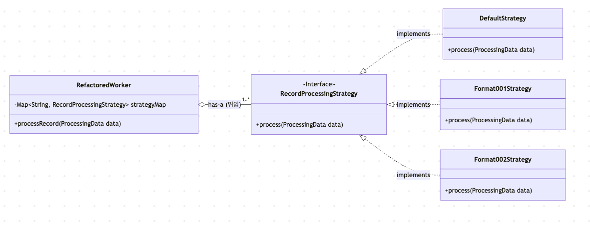

최근 10년이 넘은 레거시 인증 서버를 스프링 부트 환경으로 전환하는 고도화 프로젝트를 진행했습니다. 저는 단순히 기술을 바꾸는 것을 넘어 어떻게 하면 더 유연하고 유지보수하기 좋은 구조를 만들 수 있을지 고민했습니다.

리팩토링 과정에서 끝없이 늘어나는 if-else 분기문과 여러 클래스에 걸쳐 반복되는 중복 코드를 마주하게 되었습니다.

### 파일 규격에 따라 끝없이 늘어나는 if-else 지옥

리팩토링의 첫 번째 타겟은 파일의 각 레코드(거래 내역)를 처리하는 핵심 Worker 클래스였습니다. 이 Worker는 파일의 각 줄을 읽어 처리하는데, 문제는 파일 규격 ID나 기관 코드에 따라 데이터를 가공하고 검증하는 방식이 천차만별이라는 점이었습니다.

리팩토링 전 execute 메소드 내부의 일부 코드입니다.

의사코드(Pseudocode)

```java
// Legacy Worker 클래스의 execute() 메소드 내부 , 의사코드(Pseudocode)
while (파일에서_다음_레코드가_존재하는가) {
    // ... 레코드 읽기 ...
    데이터_객체 record = 파싱된_레코드;
    // ... (이하 의사코드) ...

    // (규칙 1) 특정 기관 코드에 대한 예외 처리
    if (record.get기관코드().equals("기관A") || record.get기관코드().equals("기관B")) {
        // ... 기관 A, B만의 특별한 스킵 로직 ...
        continue;
    }

    // (규칙 2) 특정 파일 규격 ID에 대한 데이터 가공
    if (record.get파일규격ID().equals("규격-001")) {
        // ... 랜덤 데이터를 생성해서 레코드에 추가 ...
    }

    // (규칙 3) 또 다른 파일 규격 ID에 대한 데이터 가공
    if (record.get파일규격ID().equals("규격-002")) {
        // ... 특정 필드를 조합해서 검증용 데이터를 생성 ...
    }

    // ... 수십 개의 if-else 분기문이 계속 이어짐 ...

}
```

이 코드는 몇 가지 명확한 문제점을 가지고 있었습니다.

- 하나의 메소드가 수백 줄에 달하며 너무 많은 책임을 지고 있었습니다. (SRP 위반)
- 새로운 파일 규격이 추가될 때마다 이 메소드에 if-else 블록을 계속 추가해야 했습니다. (OCP 위반)
- 로직의 복잡성으로 인해 코드를 파악하고 수정에 따른 영향을 예측하기가 어려웠습니다.

#### if-else를 어떻게 제거할 수 있을까?

가장 먼저 든 생각은 "어떻게 하면 이 if-else 문을 제거하고, 새로운 규격이 추가되어도 Worker 코드를 수정하지 않을 수 있을까?" 였습니다. 이를 위해서는 각 파일 규격에 따른 처리 로직을 Worker 클래스로부터 분리해야 했습니다

저는 각 if 블록의 내용이 '하나의 레코드를 처리하는 구체적인 방법(알고리즘)'이라는 점에 주목했습니다. 그렇다면 이 알고리즘들을 각각 별개의 객체로 만들고, 공통된 방식으로 다룰 수 있도록 추상화하면 어떨까 하는 생각에 이르렀습니다.

예를 들어, "레코드를 처리한다"는 공통 행위를 인터페이스로 정의하는 것입니다

```java
// "레코드를 처리한다"는 행위를 추상화한 인터페이스
public interface RecordProcessingStrategy {
    void process(ProcessingData context);
}
```

이렇게 하면 파일 규격별 처리 로직을 이 인터페이스를 구현한 독립적인 클래스로 각각 만들어낼 수 있습니다.

```java
// 파일 규격 "규격-001"을 처리하는 구체적인 로직
public class Format001Strategy implements RecordProcessingStrategy {
    @Override
    public void process(ProcessingContext context) {
        // "규격-001"에 해당하는 처리 로직만 여기에 존재
    }
}
```

이제 Worker는 전체적인 작업 흐름을 제어하는 **문맥(Context)** 의 역할만 맡게 됩니다. 그리고 실제 레코드 처리라는 핵심 알고리즘은 외부의 독립된 Strategy 객체에게 위임하는 구조가 됩니다.

이처럼 특정 Context에서 알고리즘을 별도로 분리하고, 런타임에 필요에 따라 교체할 수 있도록 설계하는 방법을 **전략 패턴(Strategy Pattern)** 이라고 합니다. 이 패턴을 적용하여, 파일 규격 ID에 따라 달라지는 처리 로직을 각각의 Strategy 클래스로 분리했습니다.

#### Provider 클래스를 이용한 전략 분리

if-else를 피하기 위해 처음부터 Map을 사용하기로 마음먹었습니다. 파일 규격 ID를 key로, 해당 전략 객체를 value로 가지는 Map을 만들고, 이 Map을 제공하는 StrategyProvider 클래스를 구현했습니다

```java
public class StrategyProvider {
    private final Map<String, RecordProcessingStrategy> strategyMap = new HashMap<>();

    // 생성자에서 모든 전략을 수동으로 등록
    public StrategyProvider() {
        strategyMap.put("규격-001", new Format001Strategy());
        strategyMap.put("규격-002", new Format002Strategy());
        strategyMap.put("규격-003", new Format003Strategy());
        // 새로운 전략이 추가될 때마다 여기에 put 코드를 추가해야 했다.
    }

    public RecordProcessingStrategy getStrategy(String formatId) {
        return strategyMap.getOrDefault(formatId, new DefaultStrategy());
    }
}
```

if-else 지옥에서는 벗어났지만, 이내 새로운 문제가 보였습니다.

새로운 Strategy 클래스를 만들 때마다, Provider의 생성자에 strategyMap.put(...) 코드를 추가하는 것을 잊으면 안 됐습니다.
결국 Provider 클래스도 변경에 닫혀 있어야 한다는 OCP 원칙을 위반하고 있었습니다.

### Spring의 자동 주입 기능으로 Provider 대체하기

Provider를 직접 관리하는 방식도 나쁘진 않았지만, '더 나은 방법은 없을까' 하는 고민이 들었습니다. 그때 마침 이전에 Spring의 의존성 주입(DI)에 대해 공부했던 내용이 떠올랐습니다. 바로 특정 타입의 모든 Bean을 List나 Map으로 한 번에 주입받을 수 있는 기능이었습니다.
이 기능을 활용하면, 제가 직접 Provider를 만들고 Map에 전략 객체들을 수동으로 등록하는 작업을 Spring에게 전부 맡길 수 있었습니다.

"모든 전략 클래스를 Spring Bean으로 등록하기만 하면, Spring 컨테이너가 알아서 이들을 모아 Map으로 만들어 주입해줄 것이다!"

새로운 접근 방식은 다음과 같았습니다. 먼저, 기존의 StrategyProvider 클래스를 삭제하고 각 전략 클래스에 @Component 어노테이션을 붙여주었습니다. 이때, Bean의 이름을 처리해야 할 파일 규격 ID로 지정하는 것이 핵심이었습니다.

```java
// 각 전략에 파일 규격 ID를 Bean 이름으로 부여하고 등록
public interface RecordProcessingStrategy {
    void process(ProcessingContext context);
}

@Component("규격-001") // Bean의 이름을 파일 규격 ID로 지정
public class Format001Strategy implements RecordProcessingStrategy { /* ... */ }

@Component("규격-002")
public class Format002Strategy implements RecordProcessingStrategy { /* ... */ }
```

그리고 Worker(Context 역할)에서 Map과 기본 전략을 주입받도록 구성했습니다

```java
@Component
@RequiredArgsConstructor
public class RefactoredWorker {

    private final Map<String, RecordProcessingStrategy> strategyMap;
    private final RecordProcessingStrategy defaultStrategy; // 기본 전략 Bean

    public void processRecord(ProcessingData data) {
        String formatId = data.getFileFormatId();

        // Spring이 주입해준 Map에서 바로 전략을 찾아 실행
        RecordProcessingStrategy strategy = strategyMap.getOrDefault(formatId, defaultStrategy);
        strategy.process(data);
    }
}
```

이제 새로운 파일 규격이 추가되어도 기존 코드는 전혀 수정할 필요가 없습니다. 그냥 새로운 Strategy 클래스를 만들고 @Component("새로운\_규격\_ID") 어노테이션만 붙이면, Spring 컨테이너가 마법처럼 Map에 담아주기 때문입니다. OCP 원칙을 완벽하게 지키는 유연하고 확장 가능한 구조가 완성된 것입니다.



### 전체적인 처리 흐름은 같고, 세부 구현만 다른 Worker들

전략 패턴으로 복잡한 레코드 처리 로직을 개선하고 나자, 이제는 더 큰 구조가 눈에 들어왔습니다. 애플리케이션에는 이미 공통 추상 클래스를 상속받는 다양한 종류의 Worker가 존재했는데, 그럼에도 불구하고 각 자식 클래스의 execute 메소드 내부 코드가 거의 복사-붙여넣기 수준으로 똑같았던 것입니다

세 종류의 Worker 모두 다음과 같은 동일한 처리 흐름을 가지고 있었습니다.

1. 초기 설정 및 캐시 데이터 로딩
2. 파일 리더(Reader) 초기화
3. while 루프를 돌며 파일 레코드 처리
4. 통계 처리 및 후처리

차이점은 단지 알고리즘의 일부 단계뿐이었습니다.

- 어떤 Worker는 다른 방식의 FileReader를 사용한다.
- 각 Worker의 핵심 레코드 처리 로직이 조금씩 다르다.

이 구조는 심각한 코드 중복 문제를 야기했고, 공통 로직을 수정하려면 여러 클래스를 모두 고쳐야 했습니다.

#### 공통된 처리 흐름을 재사용할 순 없을까?

"이 Worker들은 서로 완전히 다른 전략이라기보다는, 같은 처리 흐름을 공유하는 형제에 가깝다. 그렇다면, 공통된 흐름은 부모 클래스에서 정의하고, 각자 다른 부분만 자식이 구현하게 만들자."

처리 흐름의 공통된 부분은 부모 클래스에 두고, 달라지는 특정 단계만 자식 클래스가 각자 상황에 맞게 구현하도록 **상속과 재정의(Overriding)** 를 활용하는 아이디어를 떠올렸습니다.
이렇게 부모 클래스에서 처리 과정의 뼈대를 정의하고, 일부 단계를 하위 클래스에 위임하는 설계 방식을 **템플릿 메소드 패턴(Template Method Pattern)** 이라고 합니다.

#### 구조의 재설계: 상속과 추상화의 힘

여러 Worker의 공통 부모인 AbstractWorker를 리팩토링하여 템플릿 메소드 패턴의 '템플릿' 역할을 하도록 만들었습니다.

```java
// 리팩토링된 추상 Worker 클래스
public abstract class AbstractWorker implements WorkerInterface {

    // final 키워드로 알고리즘의 뼈대를 고정
    public final boolean execute(JobContext jobContext, CryptoService crypto) {
        // 1. 사전 준비 (공통)
        prepare(...);

        // 2. 파일 리더 초기화 (자식에게 위임)
        try (RecordReader reader = initializeReader(...)) {
            while (reader.isRecordNext()) {
                // ... 공통 레코드 읽기 로직 ...

                // 3. 핵심 레코드 처리 (자식에게 위임)
                ProcessingResult result = processRecord(...);

                // ... 공통 결과 처리 로직 ...
            }
        }
        // 4. 후처리 (공통)
        finalizeProcessing(...);
        return true;
    }

    // --- 자식 클래스가 반드시 구현해야 할 추상 메소드 ---
    protected abstract RecordReader initializeReader(...);
    protected abstract ProcessingResult processRecord(...);
}

```

이제 각 Worker 클래스는 자신만의 핵심 역할에 집중할 수 있게 되었습니다.

```java
@Component
public class SpecialFormatWorker extends AbstractWorker {
    @Override
    protected RecordReader initializeReader(...) {
        // 자신에게 맞는 특별한 파일 리더를 반환
        return new SpecialFileReader(...);
    }
    @Override
    protected ProcessingResult processRecord(...) {
        // 이 Worker만의 핵심 로직만 여기에!
    }
}
```

템플릿 메소드 패턴을 적용함으로써 수백 줄의 중복 코드를 제거하고, 각 Worker의 책임을 명확하게 분리할 수 있었습니다.

### 맺으며

프로젝트를 고도화 하면서 도서와 인터넷 강의로 공부했던 객체지향 설계 원칙과 디자인 패턴을 실제 복잡한 레거시 코드에 적용해볼 수 있었던 의미 있는 경험이었습니다. 특히 두 가지 패턴의 쓰임새를 명확히 구분하고 적용할 수 있었습니다.

- 전략 패턴은 if-else로 얽혀있던 알고리즘들을 독립적인 객체로 분리하여 교체 가능한 부품으로 만드는 데 효과적이었습니다. (has-a 관계, 위임)
- 템플릿 메소드 패턴은 여러 클래스에 걸쳐 중복되던 처리 흐름의 뼈대를 통일하고, 변경이 필요한 부분만 자식에게 맡기는 데 유용했습니다. (is-a 관계, 상속)

이 과정들을 통해 중복되고 복잡했던 Worker 관련 코드를 수백 라인 이상 줄이고, 더 명확한 구조로 개선할 수 있었습니다
