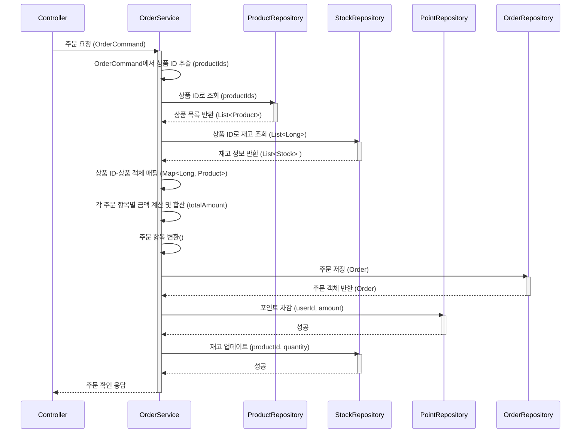
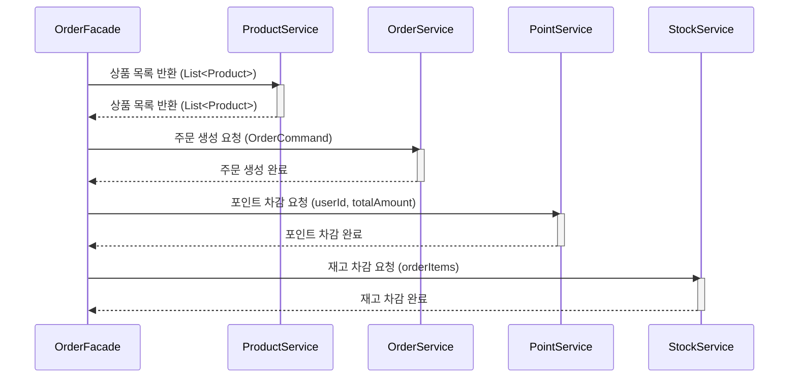

"파사드 패턴을 언제 도입하는 것이 좋을까?"

이커머스 시스템의 여러 기능을 구현하면서, 대부분의 로직은 서비스 레이어(Service Layer)만으로도 충분하다고 생각했습니다.

실제로 상품을 등록하고 조회하거나, '좋아요'를 누르고, 회원의 포인트를 확인하는 기능을 개발하면서 파사드의 필요성을 느끼지 못했습니다.

서비스가 각 도메인의 Repository에서 데이터를 조회하고, 로직에 맞게 조합하여 결과를 내보내는 것만으로도 충분히 간결하고 명확한 구조를 만들 수 있었습니다.

하지만 **"주문"** 도메인은 달랐습니다.

## 복잡한 주문 로직, 어떻게 관리할까?

'주문 생성' 로직 설계를 시작하며 머릿속으로 코드를 그려보았습니다.

클라이언트의 요청에는 상품 ID와 수량만 들어올 것이고, 실제 주문을 생성하려면 서버에서는 훨씬 더 많은 일을 해야 했습니다.

- 상품 ID로 각 Product의 최신 가격 정보를 조회해야 한다.
- 상품 ID로 현재 Stock(재고) 정보를 조회하고, 주문 가능 여부를 판단해야 한다.
- 조회된 데이터를 바탕으로 총 주문 금액을 계산해야 한다.

이 모든 정보가 준비되어야 비로소 Order 엔티티를 생성하고 저장할 수 있다.

### 서비스 레이어, 이대로 괜찮을까?

이 모든 '사전 준비'와 '핵심 로직'을 `OrderService`의 `place()` 메서드 하나에 담는다고 생각해보면,
테스트는 물론, 유지보수도 어려운 코드가 될 게 뻔했습니다.

데이터 조회, 가공, 검증, 생성 등 다양한 책임이 하나의 메서드에 뒤섞이기 때문이죠.

기능이 추가될수록 OrderService는 **_점점 더 비대해지고, 결국 관리하기 어려운 '뚱뚱한 서비스'_** 가 될 것입니다.



이 문제를 해결하려면 다음과 같은 역할을 해줄 하나의 진입점이 필요합니다.

- '주문 생성'의 단일 진입점 역할을 맡을 것
- 컨트롤러 입장에선 단순한 place() 메서드 하나만 호출하면 끝날 것
- 내부적으로는 상품 조회, 재고 확인, 주문 생성 등의 복잡한 흐름을 **조율(Orchestration)** 할 것

이 ‘조율자’의 역할은 파사드(Facade) 패턴이 가진 정의와 정확히 일치합니다.

## Facade와 DTO를 이용한 책임 분리

저는 애플리케이션 레이어(Application Layer) 를 새로 만들고,

그 안에 OrderFacade를 두어 이 복잡한 과정을 위임하기로 결정했습니다.



```java
@Service
@RequiredArgsConstructor
public class OrderFacade {

    private final ProductService productService;
    private final UserService userService;
    private final OrderService orderService;
    private final PointService pointService;
    private final StockService stockService;

    @Transactional
    public void place(OrderCriteria orderCriteria) {
        User user = userService.findByUserId(orderCriteria.getUserId());
        List<Product> products = productService.findAllById(orderCriteria.getProductIds());
        OrderCommand command = orderCriteria.toCommand(products, user.getId());
        OrderInfo orderInfo = orderService.place(command);
        pointService.deduct(user.getUserId(), orderInfo.getTotalAmount());
        stockService.deduct(orderCriteria.getProductIds(), command);
    }
}
```

그리고 파사드 자체의 비대화를 막기 위해, 데이터 변환의 책임을 요청 DTO인 OrderCriteria에 부여하는 아이디어를 적용했습니다.

위 코드에서 핵심은 criteria.toCommand(...) 부분입니다. 파사드는 단순히 흐름을 조율하고, 도메인 객체(Product)를 이용해 가격을 계산하고 데이터를 가공하는 복잡한 '변환'의 책임은 OrderCriteria DTO가 직접 수행하도록 역할을 위임한 것입니다.

```java
@Getter
@NoArgsConstructor(access = AccessLevel.PRIVATE)
public class OrderCriteria {

    private String userId;
    private List<OrderItem> orderItems;

    public OrderCriteria(String userId, List<OrderItem> orderItems) {
        this.userId = userId;
        this.orderItems = orderItems;
    }

    @Getter
    @Builder
    @RequiredArgsConstructor(access = AccessLevel.PRIVATE)
    public static class OrderItem {
        private final Long productId;
        private final Long quantity;
    }

    public List<Long> getProductIds() {
        return orderItems.stream().map(OrderItem::getProductId).collect(Collectors.toList());
    }

    public OrderCommand toCommand(List<Product> products , Long userId) {
        // 상품 ID를 키로 사용하여 Product 객체를 쉽게 찾을 수 있도록 Map으로 만듭니다.
        Map<Long, Product> productMap = products.stream()
                .collect(Collectors.toMap(Product::getId, product -> product));

        // 각 상품의 가격과 주문 수량을 곱하여 총 주문 금액을 계산합니다.
        Long totalAmount = orderItems.stream()
                .mapToLong(item -> {
                    Product product = productMap.get(item.getProductId());
                    return product.getPrice() * item.getQuantity();
                }).sum();


        // 요청된 주문 상품 목록(orderItems)을 OrderCommand에서 사용할 새로운 목록으로 변환합니다.
        //         이 과정에서 각 상품의 가격(price) 정보가 함께 담깁니다.
        List<OrderCommand.OrderItem> convertedItems = orderItems.stream()
                .map(item -> {
                    Product product = productMap.get(item.getProductId());
                    return OrderCommand.OrderItem.builder()
                            .productId(item.getProductId())
                            .quantity(item.getQuantity())
                            .price(product.getPrice())
                            .build();
                })
                .collect(Collectors.toList());

        // 위에서 준비된 모든 정보를 담아 최종 OrderCommand 객체를 생성하고 반환합니다.
        return OrderCommand.of(userId, convertedItems, totalAmount);
    }
}
```

<br/>

### 파사드 도입의 실질적인 효과

이 간단해 보이는 OrderFacade가 가져오는 효과는 강력합니다.

<br/>

#### 1. **외부 인터페이스 단순화**:

파사드의 가장 큰 장점입니다. 이제 `OrderController`와 같은 클라이언트는 `OrderFacade.place()` 메서드 하나만 호출하면 됩니다. <br/>
내부적으로 상품 정보를 조회하고, 가격을 계산하고, 재고를 확인하는 등 복잡한 과정이 어떻게 일어나는지 전혀 알 필요가 없습니다. 파사드가 없다면 클라이언트가 직접 `ProductService`, `StockService`, `OrderService` 등을 모두 호출하며 로직을 조율해야 했을 겁니다.
<br/>
파사드는 이 복잡한 의존성을 숨겨주는 단일 창구(Unified Interface) 역할을 완벽하게 수행합니다.

<br/>

#### 2. **일관된 예외 처리 및 트랜잭션 관리**:

주문 프로세스는 예외 상황이 자주 발생합니다. 재고가 부족하거나, 상품이 판매 중지되거나, 결제에 실패할 수 있습니다.
<br/>
이 모든 흐름을 지휘하는 파사드는 공통 관심사(cross-cutting concern)를 처리하기에 가장 자연스러운 경계입니다.
<br/>
`OrderFacade.place()` 메서드는 하나의 완전한 비즈니스 단위(Unit of Work)를 나타내므로, @Transactional을 선언하기에 가장 적합합니다.

<br/>

#### 3. **서비스 계층의 책임 명확화**:

`OrderService`는 이제 '사전 준비'라는 부가적인 책임에서 벗어나, **'주문 생성'** 이라는 자신의 **핵심 도메인 로직**에 만 집중할 수 있게 되었습니다.

### 이게 최선일까?

이 구조 덕분에 OrderService는 한결 가벼워졌습니다. 하지만 코드를 다시 보니, DTO의 역할에 의문이 생겼습니다.

'요청 데이터를 전달하는 객체가, 도메인 객체인 Product를 직접 참조하고 가격 계산 로직까지 품는 것이 과연 올바른 책임 분배일까?'

DTO는 순수한 데이터 운반 객체(Data Transfer Object)여야 한다는 원칙을 생각하면, 지금 OrderCriteria는 자신의 역할을 넘어 너무 많은 것을 알고 있는 셈이었습니다.

## Mapper의 도입으로 이룬 책임의 완벽한 분리

그래서 저는 이 '변환'이라는 책임을 온전히 담당할 별도의 Mapper 클래스를 추가로 도입하기로 결정했습니다.

```java
public class OrderCommandMapper {
    public static OrderCommand map(Long userId , OrderCriteria orderCriteria , List<Product> products) {
        Map<Long, Product> productMap = products.stream()
                .collect(Collectors.toMap(Product::getId, product -> product));

        List<OrderCriteria.OrderItem> orderItems = orderCriteria.getOrderItems();

        Long totalAmount = orderItems.stream()
                .mapToLong(item -> {
                    Product product = productMap.get(item.getProductId());
                    return product.getPrice() * item.getQuantity();
                }).sum();

        List<OrderCommand.OrderItem> convertedItems = orderItems.stream()
                .map(item -> {
                    Product product = productMap.get(item.getProductId());
                    return OrderCommand.OrderItem.builder()
                            .productId(item.getProductId())
                            .quantity(item.getQuantity())
                            .price(product.getPrice())
                            .build();
                })
                .toList();

        return OrderCommand.of(userId, convertedItems,totalAmount);

    }
}
```

Mapper의 등장으로 모든 객체는 자신의 책임에만 완벽하게 충실해졌습니다.

- OrderCriteria (DTO): 오직 데이터 전달.
- OrderCommandMapper: DTO와 도메인 객체를 Command 객체로 변환.
- OrderFacade: 전체 흐름(조회 → 변환 → 실행)을 지휘.
- OrderService: 핵심 비즈니스 로직만 처리.

```java
@Service
@RequiredArgsConstructor
public class OrderFacade {

    private final ProductService productService;
    private final UserService userService;
    private final OrderService orderService;
    private final PointService pointService;
    private final StockService stockService;

    @Transactional
    public void place(OrderCriteria orderCriteria) {
        User user = userService.findByUserId(orderCriteria.getUserId());
        List<Product> products = productService.findAllById(orderCriteria.getProductIds());
        OrderCommand command = OrderCommandMapper.map(user.getId(),orderCriteria,products);
        OrderInfo orderInfo = orderService.place(command);
        pointService.deduct(user.getUserId(), orderInfo.getTotalAmount());
        stockService.deduct(orderCriteria.getProductIds(), command);
    }
}
```

## 파사드 패턴의 함정: 주의할 점

하지만 파사드 패턴이 만병통치약은 결코 아닙니다. 잘못 사용하면 오히려 독이 될 수 있습니다.

### 1. 파사드 자체의 비대화 (Bloated Facade)

가장 경계해야 할 안티패턴입니다. OrderService가 비대해지는 것을 막으려다, 반대로 OrderFacade에 모든 책임을 몰아주면 어떻게 될까요?

결국 파사드가 여러 도메인의 서비스를 모두 호출하고, 복잡한 비즈니스 로직을 직접 처리하며 거대한 '몬스터 클래스'가 되어버립니다.

이는 문제를 해결한 것이 아니라, 그저 다른 곳으로 문제를 옮긴 것에 불과합니다.
사실 제가 Mapper를 추가로 도입하게 된 데에는 바로 이 고민이 있었습니다.

처음에는 OrderFacade가 직접 데이터 변환 로직까지 처리하도록 만들 수도 있었습니다. 하지만 그랬다면, 앞으로 주문 관련 로직이 추가될수록 OrderFacade는 점점 더 많은 책임을 떠안으며 비대해졌을 겁니다.

Mapper를 통해 '변환'이라는 책임을 명확히 분리함으로써, 파사드가 '흐름 제어'라는 자신의 본질적인 역할에만 충실하도록 지킬 수 있었습니다.

### 2. 불필요한 복잡성 증가

글의 서두에서 언급했듯, 간단한 로직에 굳이 파사드를 도입하는 것은 배보다 배꼽이 더 큰 격입니다.

단지 데이터를 조회해서 보여주는 기능에 파사드를 도입한다면, 클래스 개수만 늘어나고 코드의 흐름을 추적하기 더 어려워지는 부작용을 낳습니다.

파사드는 여러 서브 시스템의 협력이 필요하여 복잡성이 '실제로' 존재할 때 그 가치가 빛납니다.

## 맺으며

### 좋은 설계는 복잡성을 마주하는 용기에서 시작된다

이번 '주문' 도메인 설계 경험을 통해 얻은 교훈은 명확합니다.

1. **패턴은 필요할 때 비로소 빛을 발합니다.** '주문'처럼 여러 도메인이 얽힌 복잡한 프로세스를 마주했을 때, 파사드는 그 복잡성이 다른 곳으로 퍼지지 않도록 막아주는 훌륭한 방화벽 역할을 해주었습니다.

2. **좋은 설계는 '예측'과 '분리'에서 나옵니다.** Facade는 흐름 제어, Mapper는 데이터 변환, Service는 핵심 로직이라는 각자의 역할에만 충실할 때 시스템 전체가 안정되고 유연해진다는 것을 체감했습니다.

3. **항상 더 나은 설계를 질문해야 합니다.** 처음의 해결책에 만족하지 않고 'DTO의 책임이 과연 적절한가?'라는 작은 의심이 Mapper라는 더 나은 해결책으로 이끌었고, '파사드가 비대해지면 어떡하지?'라는 고민이 책임 분리의 중요성을 다시 한번 일깨워주었습니다
