항해 플러스 1주차는 Github Actions 와 Docker 를 활용하여
웹 어플리케이션의 CI/CD 를 구축해야 한다.

1주차의 과제를 완료하기 위한 3단계 과정

- STEP 01 웹서버 생성
- STEP 02 빌드 환경 구축
- STEP 03 배포 환경 구축

## STEP 01 웹서버 생성

간단한 서버 어플리케이션 프로젝트를 생성하고 Health-Check router 를 구현해야 한다.

스프링에서는 health-check 에 유용한 라이브러리인 actuator 가 있다.

[spring actuator 공식 문서](https://docs.spring.io/spring-boot/docs/current/reference/html/actuator.html)

actuator 를 사용하여 프로젝트를 생성해보자.

### spring actuator

#### Dependency 추가

build.gradle 예시

```groovy
dependencies {
	implementation 'org.springframework.boot:spring-boot-starter-actuator'
}
```

서버를 실행하고

localhost:8080/actuaor 를 입력하면

다음과 같이 애플리케이션의 헬스 상태를 볼 수 있는 URL을 제공해준다.
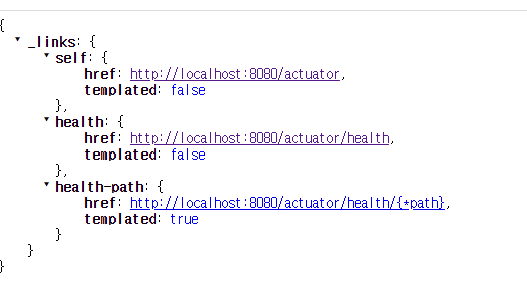

localhost:8080/actuator/health 에 링크에 들어가보면

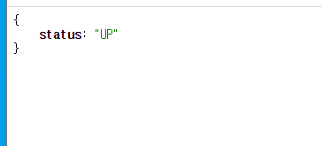

서버가 잘 동작하는 지 헬스 상태를 볼 수 있다.

여기서 잠깐 !

위와 같이 요청에 필요한 URI 를 응답에 포함시켜 반환하는 것을 Hateoas 라고 한다.

#### Hateaos

> Hypermedia As Engine Of Application State 의 약자로 서버가 클라이언트에게
> 하이퍼 미디어를 통해 정보를 동적으로 제공해주는 것

스프링 actuator 는 헬스 상태 뿐 아니라 수 많은 기능을 제공하는데,
이 기능들을 웹 환경에서 보이도록 노출할 수 있다.

application.yml 추가

```properties
management:
  endpoints:
   web:
    exposure:
      include: "*"
```

localhost:8080/actuator/health 입력하면

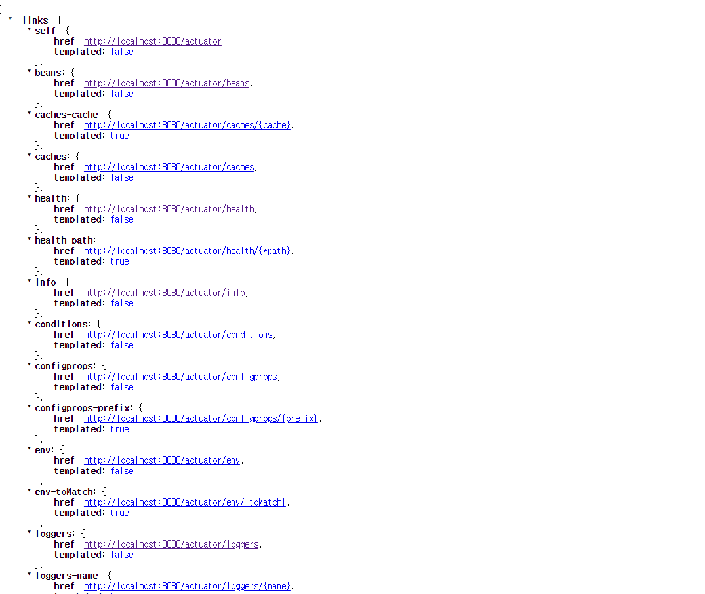

스프링 actuator 가 제공하는 수 많은 기능을 확인할 수 있다.

### 서버 phase 구성

#### Phase 란?

> 개발 환경(Phase) 은 Application 이 동작하는 환경을 의미한다.
> 대부분의 Framework 는 각각의 개발 환경마다 설정 값을 다르게
> 세팅할 수 있는 기능이 있다.

Spring Boot 의 경우 Profile 기능이 있다.

#### 개발 환경을 분리하는 이유?

제품을 개발할 때 Application 을 바로 운영 환경에 배포하지 않는다.
개발하고 있는 Local 에서 Application 을 실행해보면서 디버깅이나
테스트를 진행하고, 실제 운영 환경과 비슷한 시스템이 갖춰진
Develop 환경이나 Beta , RC 환경에 순차적으로 배포하면서 테스트 과정을 거친다.

개발 환경은 회사나 팀에 따라 레벨이 조금씩 달라 질 수 있지만
보통 `local` -`develop` - `beta` - `stage` - `production` 순으로 구성하는 것이 보통이다.

- local
  - 개인이 개발하는 PC 작업 환경
  - 직접 IDE 를 통해서 코드를 개발하고 이를 바로 실행시키면서 디버깅할 수 있는 환경이다.
- develop
  - 실제 운영환경과 동일하게 구축한 환경
  - application 에 필요한 서비스들을 최대한 구성하기 때문에 최대한 운영환경과 비슷하게 테스트나 동작 확인을 할 수 있다.
- beta
  - develop 과 마찬가지로 실제 운영환경과 동일하게 구축된 환경
  - develop 환경과의 다른 점은 보통 약속된 배포 주기, 배포 버전 관리 하에 운영된다.
  - 보통 서비스 출시 직전 Application 의 QA 를 Beta 환경에 배포하여 진행한다.
- stage
  - Database 와 같은 Persistent 계층이 Production 과 동일하게 구성된다.
  - Stage 환경에 Web Applicaiton 을 배포하면 실제 물리적인 서비스 Data를 접근하기 대문에 실제 재고에 대한 주문 테스트나 결제 테스트가 가능해진다.
- production
  - 실제 서비스의 운영 환경
  - Production 환경에 서비스를 배포하면 보통 Application 의 Release Notes 가 생성된다.

#### 환경 분리

개발 환경에 따라 설정 값을 다르게 하여 로딩한다.

spring 은 프로필이라는 개념을 지원하여

propeties , yml 파일에 설정 값을 넣으면 해당 프로필을 사용한다고 판단한다.

나는 yml 을 사용하였다.

프로필 작성 규칙

application-{profile}.yml

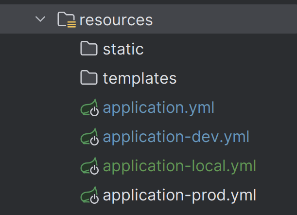

로컬에서 개발하고 테스트하는 환경인 local 과 배포 후 운영 환경 전에 테스트 해볼 dev , 그리고 운영 환경인 prod 로
분리 하였다.

application.yml

```yaml
spring:
  profiles:
    active: local
```

application-local.yml

로컬 개발은 In Memory DB 인 H2 데이터 베이스를 사용 할 것이고,
개발한 것을 바로 테스트 코드를 작성하여 테스트 할 수 있게
JPA ddl 속성을 create 로 하였다.

```yaml
management:
  endpoints:
    web:
      exposure:
        include: '*'
        exclude: 'cache'
  endpoint:
    health:
      show-details: always

spring:
  datasource:
    driver-class-name: org.h2.Driver
    url: jdbc:h2:~/test;
    username: sa
    password:

  jpa:
    hibernate:
      ddl-auto: create
    show-sql: true
    properties:
      hibernate:
        format_sql: true
```

그리고 개발 환경은 실제 운영환경과 동일한 환경이기 때문에 Mysql DB 를 사용할 것이고

DB 테이블이 날아가면 안되기 때문에 JPA ddl 속성은 validate 로 지정하였다.

```yaml
server:
  port: 8080

spring:
  application:
    name: hanghae-plus-dev

  datasource:
   driver-class-name: com.mysql.cj.jdbc.Driver
   url: jdbc:mysql://localhost:3306/hanghae-plus?serverTimezone=Asia/Seoul
    username: # 유저 네임
    password: # 비밀 번호

  jpa:
    hibernate:
      ddl-auto: validate
    show-sql: true
    properties:
      hibernate:
        format_sql: true

```

## STEP02 빌드 환경 구축

`docker` or `docker-compose` 등 컨테이너 기술을 활용해
이미지를 빌드, 배포해보자

### 빌드란?

> 소스코드 파일을 실행가능한 소프트웨어 산출물로 만드는 일련의 과정

빌드의 산출물

- jar
  - java 어플리케이션이 동작할 수 있도록 자바 프로젝트를 압축한 파일
  - Class (Java 리소스 , 속성 파일) , 라이브러리 파일을 포함함
  - JRE(Java Runtime Environment) 만 있어도 실행 가능함
- war
  - 웹 애플리케이션을 압축하고 배포하는 데 사용되는 파일 형태
  - 웹 관련 자원을 포함함 (JSP , Servlet , JAR , Class ,XML , HTML , Javascript)

### jar vs war

스프링부트 는 내장 톰캣을 포함하고 있기 때문에 간단하게 JAR 배포만으로 실행이 가능하다.

스프링 부트에서 JSP를 지양하는데 JAR 에서 JSP를 사용할 수 없다.

JSP 를 사용하여 화면을 구성해야 하거나 or 외장 WAS를 이용할 계획이 아니라면
jar 를 사용하면 된다.

jar 파일은 java -jar 프로젝트네임.jar 명령어로 실행 한다.

### 배포

> 빌드의 결과물을 사용자가 접근할 수 있는 환경에 배치하는 것

## 도커

> 컨테이너 기반의 오픈소스 가상화 플랫폼

- 플랫폼에 상관없이 Application 을 실행할 수 있는 기술
- 컨테이너 기술로 컨테이너를 생성하고 관리하기 위한 도구이다.
- 소프트웨어 개발 에서 컨테이너는 표준화된 소프트웨어 유닛이다.
- 기본적으로 코드 패키지로, 코드를 실행하는 데 필요한 종속성과 도구가 포함되어 있다.

### 도커를 사용하는 이유는?

애플리케이션을 환경에 구애 받지 않고 실행할 수 있다는 장점 때문에

※
docker -- help 를 사용하면 여러 가지 명령어를 볼 수 있다.

### 도커 이미지

> 서비스 운영에 필요한 서버 프로그램 , 소스코드 및 라이브러리, 컴파일된 실행 파일을 묶는 형태

- 하나의 이미지는 여러 컨테이너를 생성할 수 있고, 컨테이너가 삭제되더라도 이미지는 변하지 않고 그대로 남아 있다.
- Dockerfile 이라는 파일로 이미지를 만든다. Dockerfile 에는 소스와 함께 의존성 패키지 등 사용했던 설정 파일을 버전 관리하기 쉽도록 명시 된다.

### 도커 컨테이너

> 이미지를 실행한 상태로, 응용프로그램의 종속성과 함께 응용프로그램 자체를 패키징 or 캡슐화하여 격리된 공간에서
> 프로세스를 동작시키는 기술이다.

- docker ps : 실행 중인 모든 컨테이너를 보여준다.
- docker ps -a : 중지된 컨테이너를 포함하여 과거 모든 컨테이너틀 보여준다.
- docker ps --help : docker ps 에 사용 가능한 모든 구성 옵션을 볼 수 있다.
- docker run : 이미지를 기반으로 새 컨테이너를 만든다.

### Dockerfile

`docker build ` 명령어를 통해서 Docker 가 Dockerfile 을 읽어서 자동으로
도커 이미지를 빌드한다.

- Dockerfile 은 DockerImage 를 생성하기 위한 스크립트(설정 파일) 이다.
- Dockerfile 은 최상위 루트 프로젝트 경로에 위치한다. 파일 이름은 Dockerfile 이라고 저장해야 한다.
- Dockerfile 에 정의한 순서대로 읽어서 Docker 데몬에 해당 명령어를 실행한다.
- `FROM` 키워드로 시작해야 한다.

### 레이어 시스템

도커파일을 만들 때 레이어 시스템을 사용하는 데 명령어 당 한줄 씩 레이어라고 칭한다.
맨 처음 이미지 빌드하는 경우 모든 레이어가 다 호출되지만, 그 다음 부터는
변경된 것만 파악하여 빌드를 하게 되는데 이때 cache 메모리를 많이 잡아 먹게 된다.
이때 속도 개선을 하게 위해서는 변경되는 레이어를 아래에 두어야 한다.
변경된 것을 파악한 시점 부터 모두 재빌드 하게 된다.

예를 들어 1~5 레이어로 구성된 dockerfile 이 있다고 하고,
3번째 레이어에서 변경된 것이 파악이 되면 1~2 번째 까지는 다시 빌드하지 않고
Cache에 저장되어 있는 상태를 그대로 사용하고 3~끝까지는 다시 image 를 만든다.

### 명령어

#### `FROM`

https://docs.docker.com/engine/reference/builder/#from

베이스 도커 이미지를 지정한다.

어떤 이미지를 기반으로 새로운 이미지를 생성할 것인지를 나타낸다.

보통 OS 나 프로그래밍 언어 이미지를 지정한다.

#### `LABEL`

이미지에 레이블을 추가하여 프로젝트별 이미지 구성, 라이센스 정보 기록, 자동화 정보 등
기타 여러가지 정보를 기록할 수 있다. 각 레이블은 LABEL 로 시작하고,
하나 이상의 키-값 쌍으로 추가하면 된다.

```dockerfile
# Set one or more individual labels
LABEL com.example.version="0.0.1-beta"
LABEL vendor1="ACME Incorporated"
LABEL vendor2=ZENITH\ Incorporated
LABEL com.example.release-date="2023-12-05"
LABEL com.example.version.is-production=""
```

#### `WORKDIR`

현재 작업 폴더를 지정한다. 리눅스 cd 커맨드를 떠올리면 된다.

명확성 그리고 신뢰성을 위해 WORKDIR 은 항상 절대 경로를 사용해야 한다.

#### `ARG`

docker build 커맨드로 docker image 를 빌드할 때 설정할 수 있는 옵션들을
지정해 준다.

#### `RUN`

이미지 생성 시 특정 명령어를 실행한다.

길거나 복잡한 RUN 구문은 백슬래시를 활용하여 여러 줄로 분할하는 것이 Dockerfile 관리에 좋다.

RUN 에서 자주 사용되는 명령어는 `apt-get` 이다. `RUN apt-get` 은
패키지를 설치하는 명령어이기 때문에 몇가지를 고려 해야 한다.

```dockerfile
RUN apt-get update && apt-get install -y \
    package-bar \
    package-baz \
    package-foo  \
    && rm -rf /var/lib/apt/lists/*
```

#### `ENV`

환경 변수를 지정할 때 사용된다.

#### `ADD`

이미지에 호스트에 존재하는 파일을 더한다.
(build 명령 중간에 호스트의 파일 시스템으로부터 파일을 가져온다.)

파일과 디렉토리를 호스트에서 지정한 도커 이미지 디렉토리 안으로 복사 한다.
만약 디렉토리가 없다면 새로 생성해서 복사한다.

디렉토리를 ADD 하려면 끝이 "/"로 끝나야 한다.

#### `COPY`

ADD 와 기본적으로 동일하나 URL 지정이 불가하며 압축파일을 자동으로
풀어주지 않는다.

#### `CMD`

CMD 는 나열되어 있는 인수와 함께, 이미지에 포함되어 있는
소프트웨어를 실행하는 데 사용된다. CMD는 거의 대부분 항상

`["실행 파일", "param1" , "param2"]` 와 같은 형태로 사용되어야 한다.

#### `EXPOSE`

'EXPOSE' 는 컨테이너가 연결을 받는 포트를 나타낸다.
따라서 애플리케이션에서 공통으로 사용되는 기존 포트를 사용해야 한다.

### 실습

Dockerfile 생성

```dockerfile
FROM openjdk:17

RUN mkdir /app

COPY build/libs/hanghae-plus-0.0.1-SNAPSHOT.jar  /app/app.jar

WORKDIR /app


CMD ["java", "-jar", "app.jar"]
```

빌드 하기

gradle 을 사용하기 때문에

프로젝트 루트 경로에 ./gradle build 명령어 입력

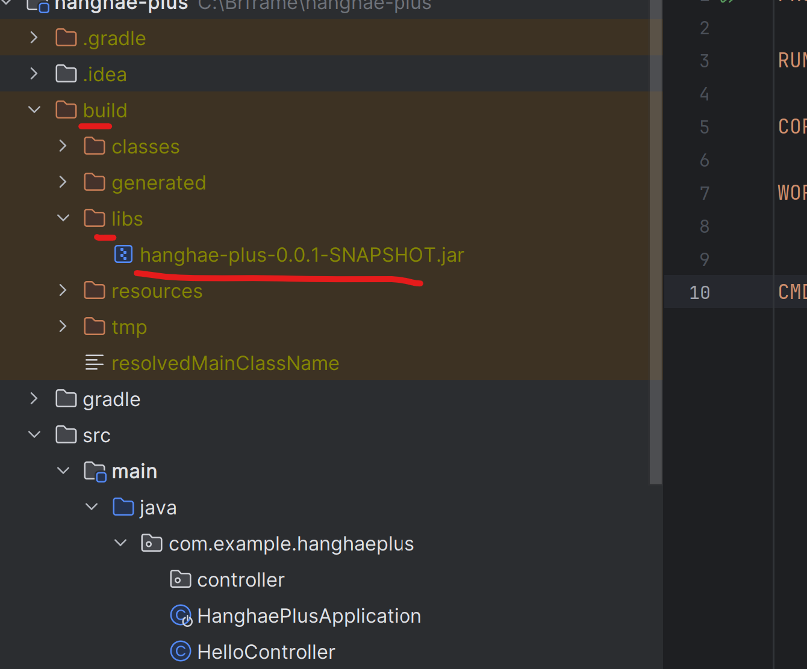

jar 파일이 build/libs 경로에 생성된다.

#### 도커 이미지 빌드

docker build -t [dockerHub ID]/[이미지명]:[태그명] [Dockerfile 위치]

- docker build -t hanghae-plus .
- hanghae-plus 라는 이름으로 도커 이미지를 생성한다.
- 마지막 . 은 현 위치라는 뜻이다.

#### 이미지 실행

이미지를 실행하는 명령어는 docker run - 이미지 이름이다.

docker run hanghae-plus

나중에 배포할 서버에서 도커 이미지를 가져오고 실행하면 될 것 같다.

### GitHub Actions

> 깃허브에서 제공하는 CI 와 CD 를 위한 서비스

#### CI (Continuous Integration)

> 지속적 통합이라는 뜻으로 개발을 진행하면서도 품질을 관리할 수 있도록
> 여러 명이 하나의 코드에 대해서 수정을 진행해도 지속적으로 통합하면서 관리할 수 있음을 의미한다.

마틴 파울러가 제시하는 CI의 4가지 규칙

- 모든 소스코드가 살아 있고 누구든 현재의 소스에 접근할 수 있는 단일 지점을 유지할 것
- 빌드 프로세스를 자동화해서 누구든 소스로부터 시스템을 빌드할 수 있게 할 것
- 테스팅을 자동화해서 언제든지 시스템에 대한 건전한 테스트 수트를 실행할 수 있게 할 것
- 누구든 현재 실행 파일을 얻으면 지금까지 가장 완전한 실행 파일을 얻었다는 확신을 하게 할 것

#### CD (Continuous Deployment)

> 지속적 배포라는 뜻으로 빌드의 결과물을 프로덕션으로 릴리스하는 작업을 자동화하는 것을
> 의미한다.

GitHub Actions 를 사용하면 자동으로 코드 저장소에서 어떤 이벤트를
발생했을 때 특정 작업이 일어나게 하거나 주기적으로 어떤 작업들을 반복해서
실행시킬 수도 있다.

#### 핵심 개념

`Workflows`

- 자동화 해놓은 작업 과정
- 워크플로우는 코드 저장소 내에서 .github/workflows 폴더 아래 yml 파일로 설정한다.
- 하나의 코드 저장소에 여러 개의 워크 플로우. 즉 여러 개의 yml 파일을 생성할 수 있다
- on 속성을 통해서 해당 워크플로우가 언제 실행 되는지를 정의한다,

예시 1) - main 브랜치에 push 이벤트가 발생할 때 마다 워크플로우 실행

```properties
on:
  push:
    branches: [main]

jobs:
  # ...(생략)...
```

예시 2) - 매일 자정에 워크플로우 실행

```properties
on:
  schedule:
    - cron: "0 0 * * *"

jobs:
  # ...(생략)...
```

`Jobs`

- GitHub Actions 에서 작업(Job) 이란 독립된 가상 머신 또는 컨테이너에서 돌아가는 하나의 처리 단위
- 하나의 워크플로우는 여러 개의 작업으로 구성되며 적어도 하나의 작업은 있어야 한다.
- 모든 작업은 기본적으로 동시에 실행되며 필요 시 작업 간에 의존 관계를 설정하여 작업이 실행되는 순서를 제어할 수도 있다.
- 작업은 워크프로우 yml 파일 내에서 jobs 속성을 사용하며 작업 식별자와 작업 세부 내용 간의 맵핑 형태로 명시가 된다.

예시 ) job1, job2, job3 이라는 작업 ID 를 가진 3개의 작업

```properties
jobs:
  job1:
    # job1에 대한 세부 내용
  job2:
    # job2에 대한 세부 내용
  job3:
    # job3에 대한 세부 내용
```

- 작업의 세부 내용으로 여러 가지 내용을 명시할 수 있다. runs-on 명령어는 필수로 들어가야 한다.
- runs-on 은 실행 환경을 지정하는 명령어다.

예시 ) 많이 사용되는 우분투의 최신 실행 환경에서 해당 작업 실행

```properties
jobs:
  job1:
    runs-on: ubuntu-latest
    steps:
      # ...(생략)...
```

`Steps`

- 단순한 작업이 아닌 이상 하나의 작업은 여러 단계의 명령을 순차적으로 실행한다.
- GitHub Actions 에서는 각 작업이 하나 이상의 단계로 모델링 된다.
- 작업 단계는 단순한 command 나 script 가 될 수도 있고 action 이라는 복접한 명령일 수도 있다.
- command 나 script 를 실행할 때는 run 속성을 사용하며, action 을 사용할 때는 uses 속성을 사용한다.
- 워크플로우 파일내에서 작업 단계를 명시해줄 때는 yml 문법에서 시퀀스 타입을 사용하기 때문에 각 단계 앞에서 반드시 '-' 를 붙여줘야 한다.

`Actions`

- GitHub Actions 에서 빈번하게 필요한 반복 단계를 재사용하기 용이하도록 제공되는 일종의 작업 공유 매커니즘

#### 실습

최상위 루트에 .github / workflow / [이름].yml 파일 생성 하면 된다.

근데 이 작업을 직접 안하고

github repository 에서 Actions 탭에 들어가서

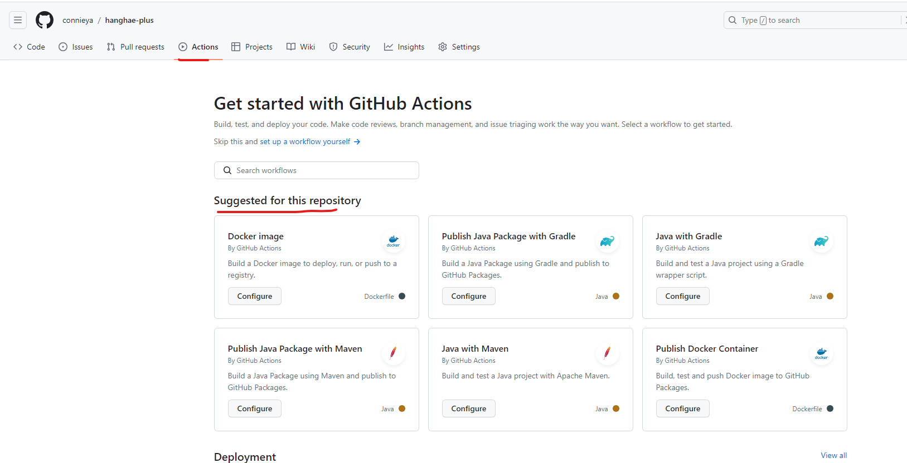

여기서 선택하여 생성할 수 있다.

Docker 를 사용하기 때문에 Docker Image 로 만들었다.

생성된 yml 파일은 다음과 같다

```properties
name: Docker Image CI

on:
  push:
    branches: [ "master" ]
  pull_request:
    branches: [ "master" ]

jobs:

  build:

    runs-on: ubuntu-latest

    steps:
    - uses: actions/checkout@v3
    - name: Build the Docker image
      run: docker build . --file Dockerfile --tag my-image-name:$(date +%s)

```

그리고 아래 과정을 겪으며 yml 최종 변경 하였다.

- build 과정 에서 경로 관련 에러가 발생 하여 ./gradlw build 명령어 추가
- access denied 에러가 발생 하여 chomd +x gralew 추가
- 버전 관련 에러가 발생 하여 actions/set-up java 명령어를 추가

```properties
name: hanghae-plus-actions

on:
  push:
    branches: [ "master" ]
  pull_request:
    branches: [ "master" ]

jobs:
  build:
    runs-on: ubuntu-latest

    steps:
    - uses: actions/checkout@v3
    - name: Set up JDK 17
      uses: actions/setup-java@v1
      with:
          java-version: 17
    - name: Grant execute permission for gradlew
      run: chmod +x gradlew
    - name: Build with Gradle
      run: ./gradlew build
    - name: Build the Docker image
      run: docker build -t hanghae-plus .
```

그리고 드디어 빌드에 성공 하였다!!

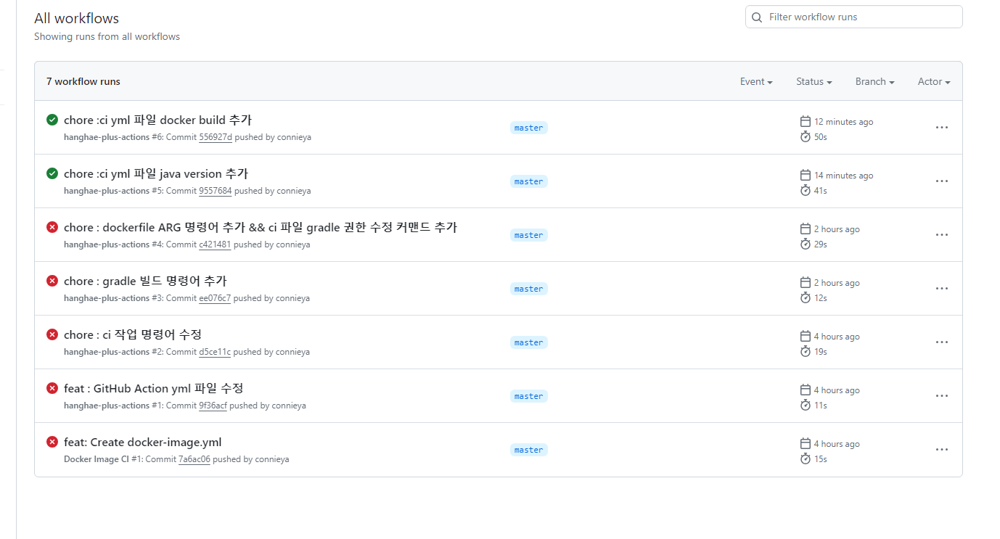

## STEP03 배포 환경 구축

### ECR

AWS ECR 이란?

> AWS 에서 제공하는 Docker Hub 와 비슷한 개념으로, Amazon Elastic Container
> Registry 의 약자로 안전하고 확장 가능한 신뢰할 수 있는 AWS 관리형 컨테이너
> 이미지 레지스트리 서비스

- ECR 은 이미지를 가용성과 확장성이 뛰어난 아키텍처에 호스팅하여 사용자는 애플리케이션을 위한 컨테이너를 안정적으로 배포할 수 있다.
- ECR를 사용함으로써 이미지 리포지토리를 직ㅈ버 구축하고 관리할 필요가 없습니다.

ECR 을 사용하기 전 IAM 계정을 만들자

### IAM

IAM (AWS Identity and Access Management) 이란?

> AWS 리소스에 대한 액세스를 안전하게 제어할 수 있는 웹 서비스이다.
> IAM을 사용하여 리소스를 사용하도록 인증 및 권한 부여된 대상을 제어한다.

IAM 의 기능을 정리하자면 누가 , 무엇을 , 어떻게 할 것인지에 대해 인증과 인가를
제어 하는 서비스이다.

어떤 유저가 어느 AWS 서비스에 어떠한 요청을 보내면서 인증알 위한 유저의 자격 증명도
함께 보낸다.
AWS 서비스에서는 해당 요청을 처리하기 전에 우선 자격 증명을 IAM 에 보낸다.
그리고 IAM 에서는 해당 자격 증명을 보고 해당 유저가 올바른 유저인지, 유저가
올바르다면 해당 서비스와 서비스의 기능을 이용해도 되는지 등을 판별한 뒤
문제가 없다면 서비스 이용을 허용한다.

사용자 IAM 생성하기

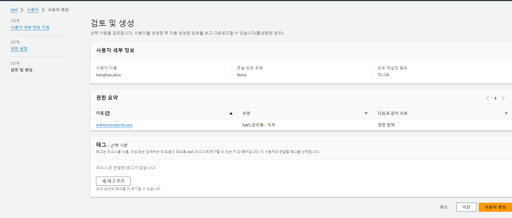

ACCESS_KEY , SECRET_KEY 발급

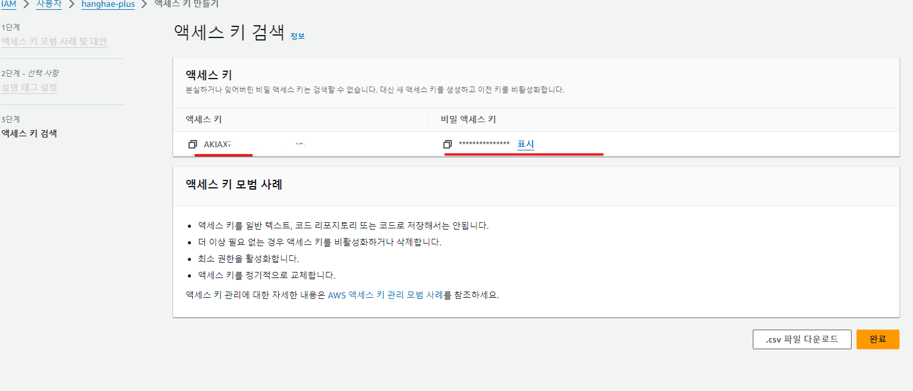

#### ECR 리포지토리 생성

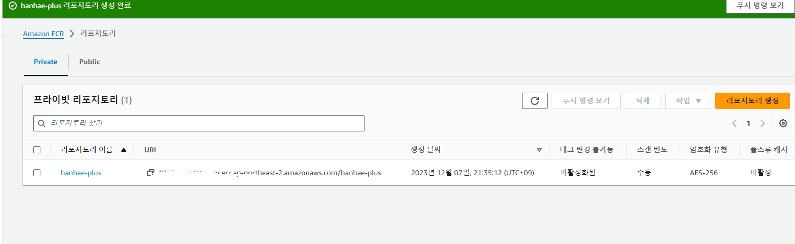

개발 환경과 운영 환경을 분리하기 위해 repository 각각 생성

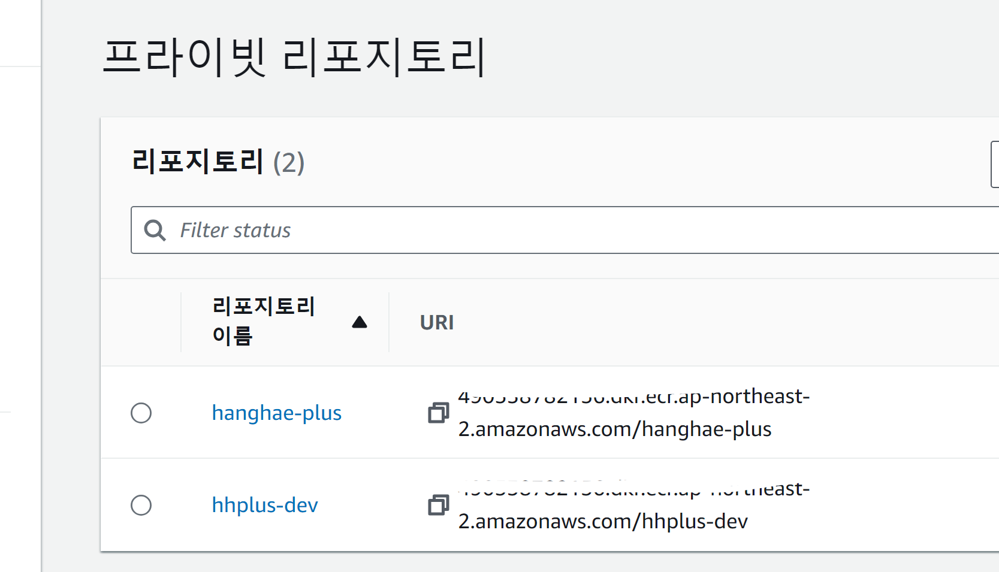

Github Repository 의 Secret 이용하기

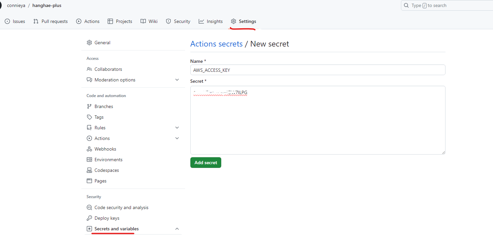

ACCESS_KEY 와 SECRET_KEY 를 감추고

이후 Github Action yml 파일을 작성할 때 사용하면 된다.

```properties
name: hanghae-plus-actions

on:
  push:
    branches: [ "master" ]
  pull_request:
    branches: [ "master" ]

jobs:
  build:
    runs-on: ubuntu-latest

    steps:
    - uses: actions/checkout@v3
    - name: Set up JDK 17
      uses: actions/setup-java@v1
      with:
          java-version: 17
    - name: Grant execute permission for gradlew
      run: chmod +x gradlew
    - name: Build with Gradle
      run: ./gradlew build
    - name: Configure AWS credentials
      uses: aws-actions/configure-aws-credentials@v1
      with:
        aws-access-key-id : ${{secrets.AWS_ACCESS_KEY}}
        aws-secret-access-key : ${{secrets.AWS_SECRET_KEY}}
        aws-region: ap-northeast-2
    - name: Login to AWS ECR
      run: aws ecr get-login-password --region ap-northeast-2 | docker login --username AWS --password-stdin ${{secrets.ECR_URL}}
    - name: Build the Docker image
      run: docker build -t hanghae-plus .
    - name : ADD Tag
      run : docker tag hanghae-plus:latest ${{secrets.ECR_URL}}/hanghae-plus:latest
    - name: Push Docker image to ECR
      run: docker push ${{secrets.ECR_URL}}/hanghae-plus:latest
      env:
          AWS_ACCESS_KEY_ID: ${{ secrets.AWS_ACCESS_KEY }}
          AWS_SECRET_ACCESS_KEY: ${{ secrets.AWS_SECRET_ACCESS }}

```

ECR 에 나와 있는 푸시 명령을 토대로 yml 파일을 완성 하였다.

#### EC2 실행하기

EC2 인스턴스를 생성하고 ec2 에 도커를 설치한다.

- sudo yum docker -y

도커 서비스를 실행 시키자

- sudo systemctl start docker

자격 증명을 활성화 하자.

- aws configure

ACCESS_KEY , SECRET_KEY 를 입력하여 자격 증명을 완료하자

docker image 다운 받기 위해 권한 설정을 하자

- sudo usermode -a -G docker $USER

ecr 에 올린 도커 이미지를 pull 받기 위해 ecr 에 로그인 하자

- aws ecr get-login-password --region ap-northeast-2 | docker login --username AWS --password-stdin [ECR URL ]

도커 이미지를 다운 받자

- docker pull [ECR URL]

docker image ls 명령어를 통해 이미지가 잘 다운 받아졌는지 확인 해보자

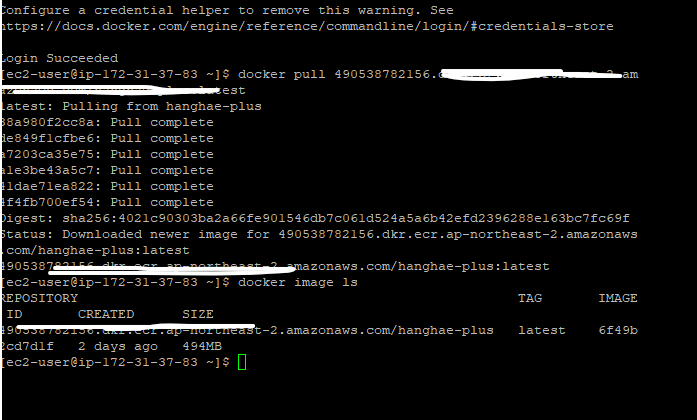

ECR에 올린 이미지가 잘 다운 받아졌고 이제 컨테이너를 실행하자

- docker run --name hanghae-plus-web -p 8000:8000 [이미지 ID]

컨테이너가 실행 되었다. 확인 해보자

퍼블릭 IP 주소를 입력 해보면

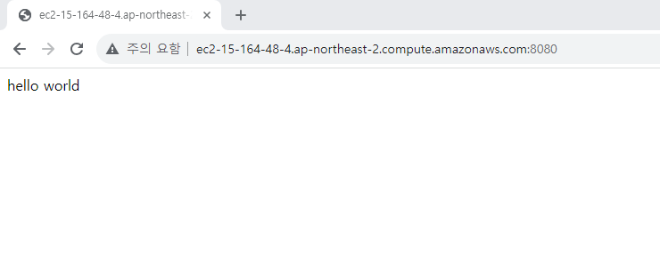

짠! 로컬에서 환경 설정하고 개발했던 것과 동일하게 잘 실행 된다.

### 단점

도커 덕분에 환경 구성을 위해 새로 설치 해야 할 것도 없이 쉽게 실행 할 수 있었지만

이 방식에 단점이 있다.

- 인스턴스를 수동으로 생성하고 구성해야 한다.
- 인스턴스를 수동으로 연결하고, 수동으로 도커를 설치한다.

조금 더 좋은 방법이 없을까? 위에 수동으로 하는 작업도 다 자동으로 할 수 없을까??

방법이 있다. !

### ECS

> Elastic Container Service 는 클러스트에서 컨테이너를 쉽게 실행, 중지 및 관리
> 할 수 있게 해주는 컨테이너 관리 서비스이다.

EC2 인스턴스를 실행하는 것 처럼 자체 머신을 실행하는 대신 관리형 서비스를 사용할 수 있다

#### 구성 요소

- Cluster : 작업 또는 서비스의 논리적 그룹이다. 클러스터를 실행하여 작업을 실행할 수 있다.
  - 클러스터 템플릿 선택 (Fargate | EC2 | External)
  - 클러스 이름 설정
- Service : 클러스터에서 지정된 수의 작업을 동시에 실행하고 관리할 수 있게 해주는 구성 서비스는 Task를 포함하며, Task 와 관련된 Auto Scaling 과
  Load Balancing 을 관리한다.
  - 시작 유형 선택 (Fargate | EC2 | External)
  - 작업 정의 선택
  - 클러스터 선택
  - 서비스 이름 설정
  - 작업 개수 설정
  - 배포 유형 설정
  - 네트워크 구성 (VPC , 서브넷 , 보안그룹)
  - Load Balancing 설정
  - Auto Scaling 설정
- Task : 작업 정의에서 정의된 설정으로 인스턴스화 하는 것이다. Task는 Cluster 에 속한 컨테이너 인스턴스나 Fargate 에 배포하게 된다.
- Task Definition : 작업 정의는 애플리케이션을 구성하는 컨테이너를 설명하는 텍스트(JSON) 이다.
  - 시작 유형 호환성 선택 (Fargate | EC2 | External)
  - 사용할 컨테이너 이미지 설정
  - 애플리케이션을 위해 개방할 포트 설정
  - CPU/메모리 리소스 할당 설정
  - 작업의 컨테이너에 사용할 데이터 볼륨 설정

#### VPC 생성

Amazon VPC

> Amazon Virtual Private Cloud 를 사용하면 정의한 논리적으로 격리된 가상 네트워크에서
> AWS 리소스를 시작할 수 있다.

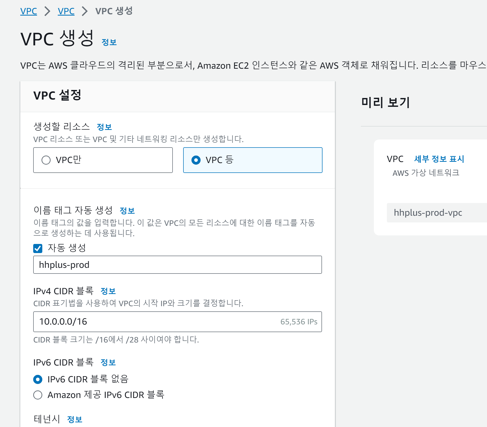

#### 대상 그룹 생성

ALB(Application Load Balancer)가 요청을 분배하는 기준에 대한 설정

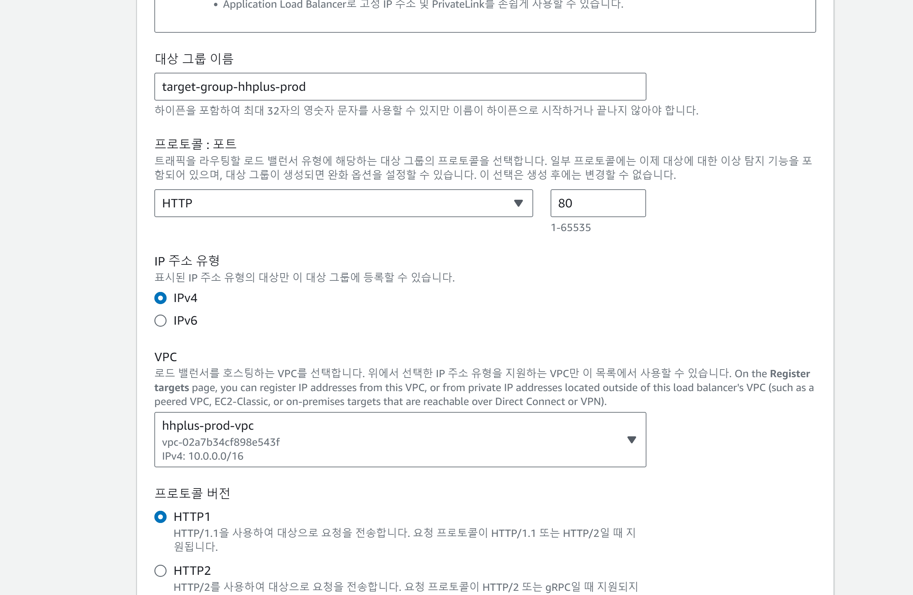

헬스 체크 routing point 입력

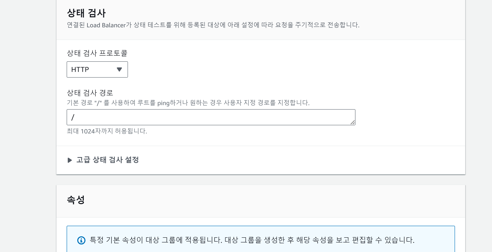

#### ALB 생성

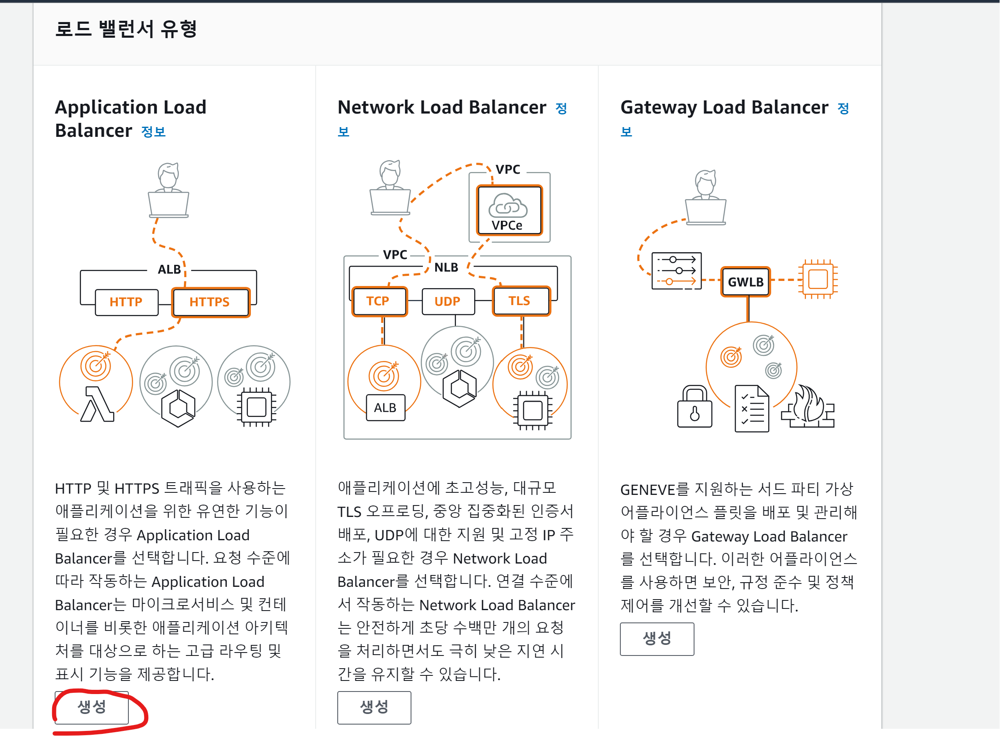

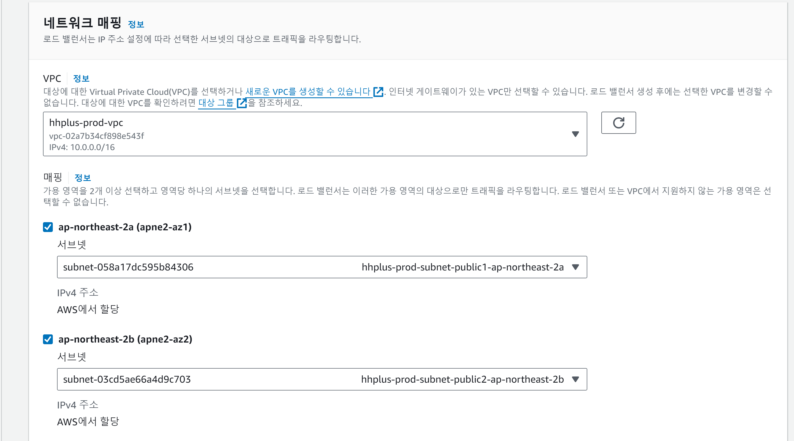

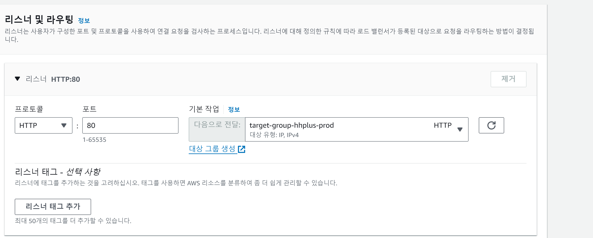

#### AWS Fargate

> AWS Fargate 는 Amazon EC2 인스턴스의 서버나 클러스터를 관리할 필요 없이
> 컨테이너를 실행하기 위해 Amazon ECS 에 사용할 수 있는 기술이다.
> Fargate 를 사용하면 더 이상 컨테이너를 실행하기 위해 가상 머신의
> 클러스터를 프로비저닝, 구성 또는 조정할 필요가 없습니다.

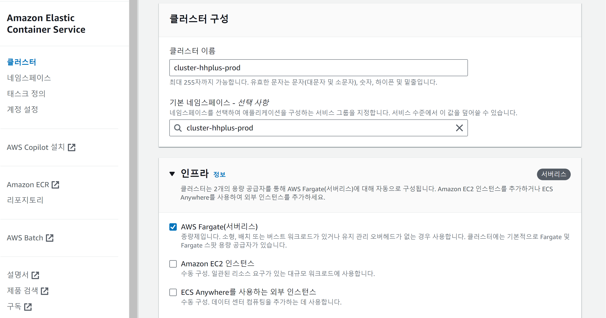

#### 태스크 정의

Fargate 를 선택! Fargate 는 컨테이너가 무한대로 확장되는 서버리스 실행 환경이다.

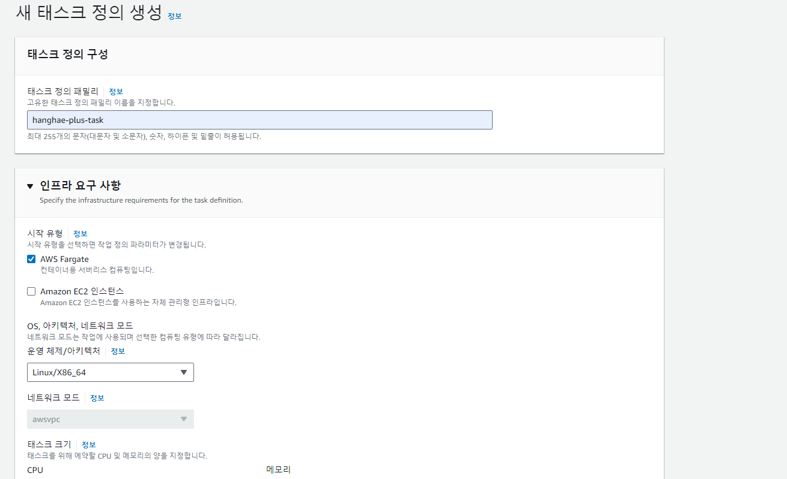

ECR 의 이미지 URI 를 등록한다.

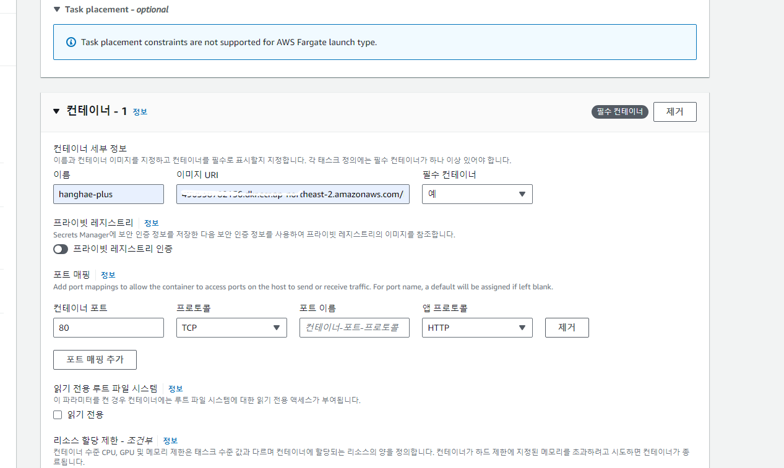

태스크 정의 생성 후 태스크 정의를 이용해 Service 생성

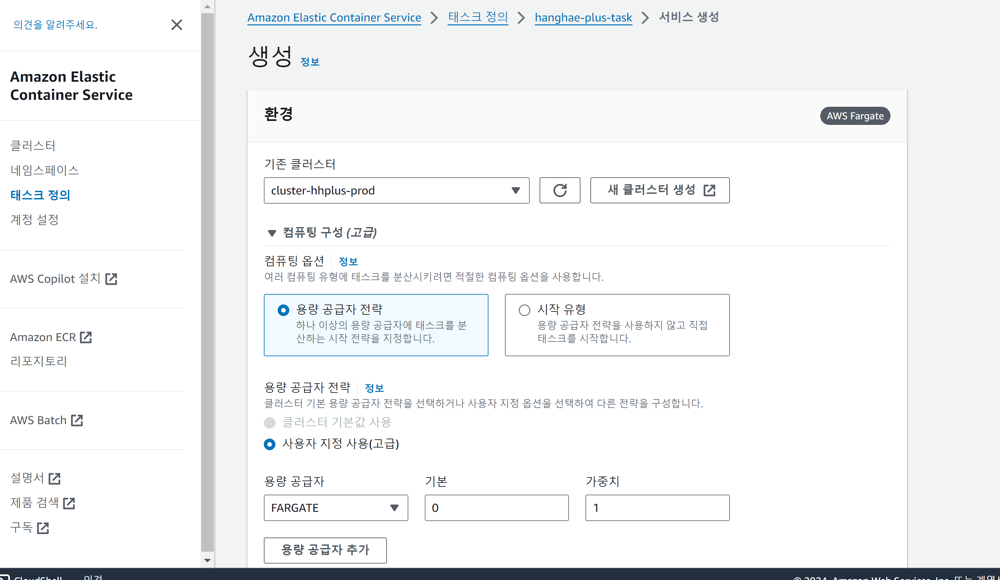

## 회고

CI CD 를 경험 한적도 없었고, Phase 를 구성한 적도 없어서
개념을 이해하고 적용하는 데 시간이 많이 걸려 과제를 수행 하는 것이 쉽지 않았다.

블로그와 문서 , 강의를 통해서 개념들을 익히고 현재 요구사항에 필요한 최소한의 조건으로 설정하였다.

완벽하게 이해한 것도 아니고 설정 파일도 수정할 것이 있지만 하나의 cycle 다 경험 할 수 있어서 좋았다.

회사에 이번에 배운 것을 차근차근 적용 해봐야 겠다.

Dockefile , Github Actions workflow 파일 , phase 설정 들은 개선할 것이 많아 보인다.
앞으로 과제를 진행 하면서 점차 개선해야 겠다.
