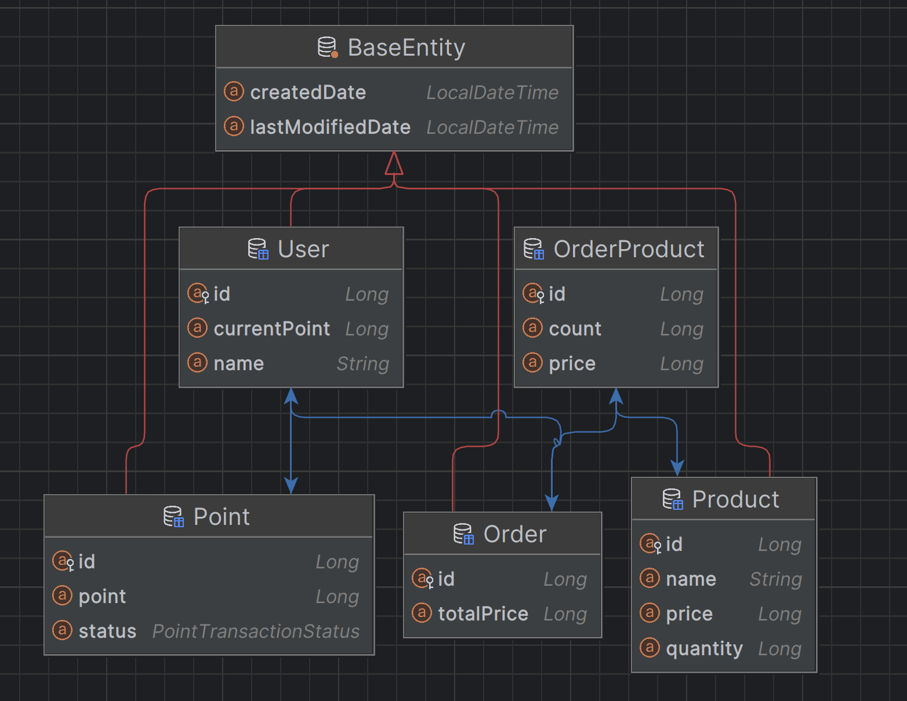

## 시나리오 선정 

### e-커머스 서비스

e-커머스 상품 주문 서비스를 TDD 기반으로 구현 

#### 요구사항

- 상품 주문에 필요한 메뉴 정보들을 구성하고 조회가 가능해야 한다.
- 사용자는 상품을 여러 개 선택해 주문할 수 있고, 미리 충전된 잔액을 이용한다.
- 상품 주문 내역을 통해 판매량이 가장 높은 상품을 추천합니다.

### 주요 API

- 잔액 충전 / 조회 API
- 상품 조회 API
- 주문 / 결제 API
- 인기 판매 상품 조회 API

### 개발 환경

- spring data jpa
- h2 database
- lombok
- junit 5 , mockito

### 엔티티 설계

요구 사항에 필요한 최소한의 엔티티만 설계

- User 엔티티 : 사용자 식별 ID , 이름, 잔액 (포인트)
- Product 엔티티 : 상품 고유 ID , 상품 이름, 상품 가격 , 상품 재고
- Order 엔티티 : 주문 고유 Id , 주문 한 상품 총 가격 
- OrderProduct 엔티티 
  - 주문한 상품에 대한 내역 엔티티
  - 주문 Id , 상품 Id, 주문한 상품 개수, 주문 당시 상품 가격 
- Point 엔티티 : 잔액(포인트) 고유 Id, 포인트 내역 (충전 , 차감) , 금액 

#### 재고 엔티티를 만들지 않은 이유

재고 Entity 를 따로 만들지 않고 Product 에서 재고 상태를 필드로 관리 하였다.
그 이유는 지금은 TDD 를 중점 으로 공부 하는 것이기 때문에 코드가 심플한 것이 좋다

재고를 Entity 로 관리 하면 비즈니스 로직 복잡도가 올라 가고 
테스트도 복잡해지기 때문에 재도 Entity 를 만들지 않았다.

### TDD (Test Driven Development)

> 프로덕션 코드보다 테스트 코드를 먼저 작성하여 테스트가 구현 과정을 주도하도록
> 하는 방법론

### 구현

#### 레드 - 그린 - 리팩토링

이미지 출처 https://mbauza.medium.com/red-green-refactor-1a3fb160e649

1. TDD는 프로덕션 코드 없이 테스트를 먼저 작성 하는 방법 이기 때문에 실패를 한다. (레드)
2. 빠른 시간 내에 최소한의 코드로 구현부를 작성 하여 테스트를 통과한다. (그린)
3. 테스트 통과를 유지하면서 구현 된 코드를 개선 한다. (리팩토링) 

### 상품 조회 테스트 

- 상품 정보 (ID , 이름 ,가격 ,잔여 수량) 을 조회 하는 API를 작성한다.
- 조회 시점의 상품별 잔여 수량이 정확 해야 한다.
