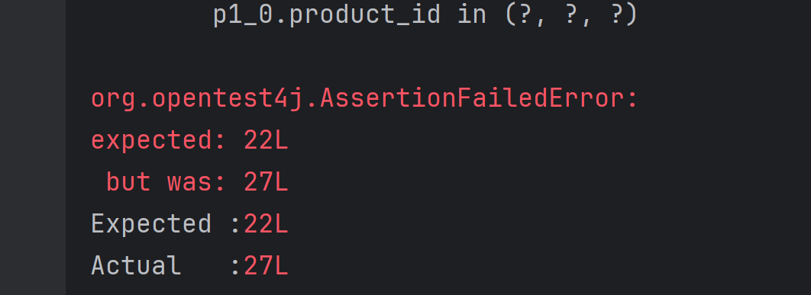
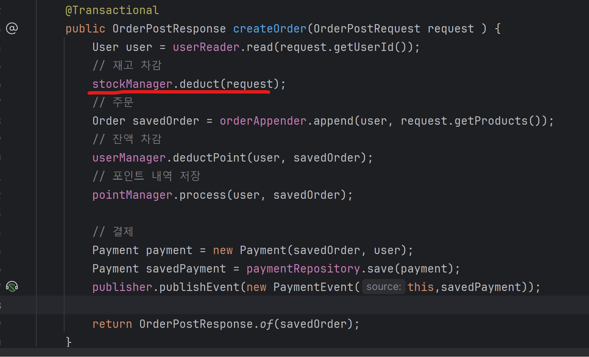
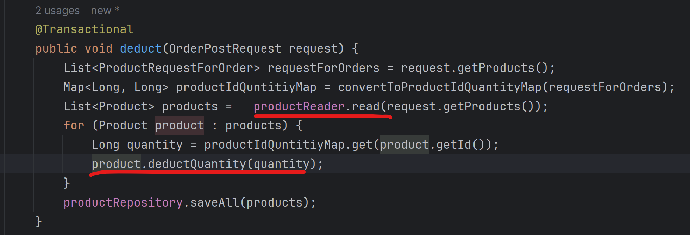
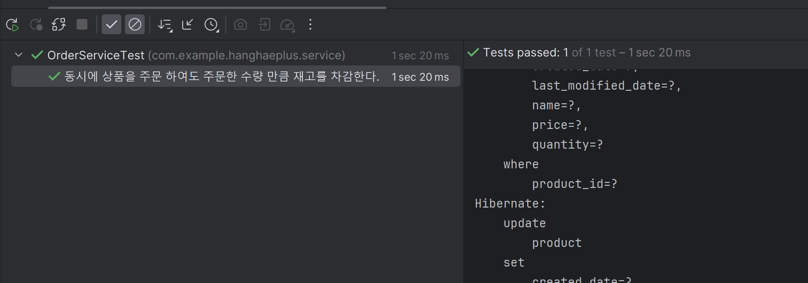
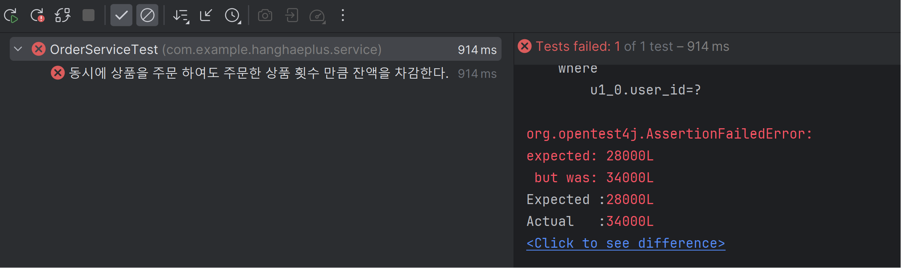
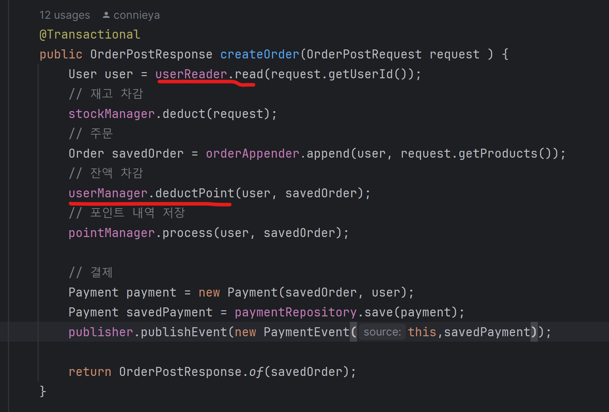
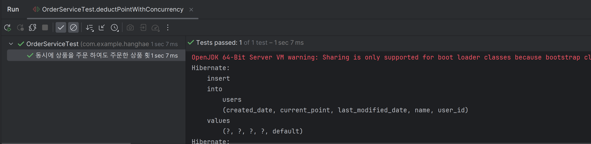

# TDD 기반 기능 구현 동시성 문제

e-커머스 상품 주문 서비스 기능에서 동시에 요청이 발생 했을 때 야기되는 문제를 생각해보고 테스트 코드를 작성 해본다.

## 재고 차감

여러 사용자가 동시에 주문을 요청할 때 , 상품의 재고 수량이 요청된 주문 만큼
잘 차감 되는지 확인을 해야 한다.

### 테스트 코드 작성

주문 요청을 동시에 처리하는 코드를 작성 하기 위해 `CompletableFuture` 클래스를 사용하였다.

https://docs.oracle.com/javase/8/docs/api/java/util/concurrent/CompletableFuture.html

`CompletableFuture` 클래스는 Java 에서 비동기적 및 동시성 작ㅇ버을 처리하기 위한 클래스로 Future 와 CompletionStage 인터페이스를 구현하여 미래에 완료될
작어블 나타낸다.

```java
    void deductQuantityWithConcurrency() {
        // given
        User user1 = User.create("건희", 100000000L);
        User user2 = User.create("거니", 100000000L);
        User savedUser1 = userRepository.save(user1);
        User savedUser2 = userRepository.save(user2);

        Product product1 = Product.create("양파", 1000L, 30L);
        Product product2 = Product.create("감자", 2000L, 30L);
        Product product3 = Product.create("당근", 3000L, 30L);


        productRepository.saveAll(List.of(product1, product2, product3));


        ProductRequestForOrder request1 = ProductRequestForOrder.of(product1.getId(), 5L, product1.getPrice());
        ProductRequestForOrder request2 = ProductRequestForOrder.of(product2.getId(), 10L, product2.getPrice());
        ProductRequestForOrder request3 = ProductRequestForOrder.of(product3.getId(), 5L, product3.getPrice());


        ProductRequestForOrder request4 = ProductRequestForOrder.of(product1.getId(), 3L, product3.getPrice());
        ProductRequestForOrder request5 = ProductRequestForOrder.of(product2.getId(), 5L, product3.getPrice());
        ProductRequestForOrder request6 = ProductRequestForOrder.of(product3.getId(), 5L, product3.getPrice());


        List<ProductRequestForOrder> requests1 = List.of(request1, request2, request3);
        List<ProductRequestForOrder> requests2 = List.of(request4, request5, request6);


        OrderPostRequest orderPostRequest1 = OrderPostRequest.builder()
                .userId(savedUser1.getId())
                .products(requests1)
                .build();

        OrderPostRequest orderPostRequest2 = OrderPostRequest.builder()
                .userId(savedUser2.getId())
                .products(requests2)
                .build();


        // when
        CompletableFuture.allOf(
             CompletableFuture.runAsync(()-> orderService.createOrder(orderPostRequest1)),
             CompletableFuture.runAsync(()-> orderService.createOrder(orderPostRequest2))
        ).join();

        List<Product> products = productRepository.findAllById(List.of(product1.getId(), product2.getId(), product3.getId()));
        Product findProduct1 = products.get(0);
        Product findProduct2 = products.get(1);
        Product findProduct3 = products.get(2);
        //then
        assertThat(findProduct1.getQuantity()).isEqualTo(30L-5L-3L);
        assertThat(findProduct2.getQuantity()).isEqualTo(30L-10L-5L);
        assertThat(findProduct3.getQuantity()).isEqualTo(30L-5L-5L);
    }
```

- CompletableFuture allOf 메서드 : 여러 작업을 동시에 실행하고, 모든 작업 결과에 콜백을 실행한다.
- CompletableFuture runAsync 메서드 : 결과를 반환하는 작업을 비동기적으로 실행

결과



### 실패 케이스

- 양파 , 감자, 당근 모두 30개 있다.
- "건희" , "거니" 2명의 유저가 동시에 주문을 요청하였다.
- "건희" 유저는 양파 5개, 감자 10개 , 당근 5개를 주문, "거니" 유저는 양파 3개 감자 5개 , 당근 5개를 주문하였다.
- 동시에 주문을 했기 때문에 하나의 주문을 통해 차감된 재고 수량을 가져오는 것이 아니라 2개의 주문 모두 주문이 들어오기 전 재고 수량인 30개를 DB에서 select 했다.
- "거니" 유저가 "건희" 유저가 주문을 완료 이후 차감된 재고 25개에서 Select 한 것이 아니라 주문 전 수량 30개에서 select 했기 때문에 양파의 재고가 30개에서 건희 5개 , 거니 3개를 뺀 22개 아닌 27개 결과로 테스트에 실패한다.

그러면 동시에 주문을 해도 주문 한 횟수만큼 재고를 차감하려면 어떻게 해야할까?
하나의 주문이 상품 정보를 읽고, 재고 차감 한 이후에 다른 주문이 상품 정보를 읽게 해야 한다.

그러기 위해서는 `Lock` 을 사용해야 한다.

### Lock

낙관적 락 (Optimistic Lock) vs 비관적 락 (Pessimistic Lock)

#### 낙관적 락 (Optimistic Lock)

=> Commit 시에 수정이 일어나 version 이 변경되었다면 fail

- 현실적으로 데이터 갱신 시 경합이 발생하지 않을 것이라고 보고 잠금을 거는 기법
- 낙관적 락은 데이터 베이스에서 제공하는 것이 아니라 어플리케이션 혹은 JPA 에서 제공을 해주는 기능이다.
- 낙관적은 충돌을 가정하지 않기 때문에 충돌에 대한 예외를 던져준다.

#### 비관적 락 (Pessimistic Lock)

=> 사용중 일 때 Lock 을 걸어 다른 Connection 이 사용 못하도록 함

- 동일한 데이터를 동시에 수정할 가능성이 높다는 관점으로 잠금을 거는 기법
- 비관적 락은 "데이터베이스 락 알고리즘" 을 통해 구현이 된다.

※ DB Lock 이란?

> 1. DB 에서 Lock 이란, 무결성을 보장하기 위한 방법이다.
> 2. 동시에 같은 데이터를 보고 있을 때 업데이트를 방지하기 위해 존재를 하며 락이 풀리기 전까지는 조작할 수 없다. commit 혹은 rollback 후에 풀리게 된다.
> 3. 종류 로는 공유락, 베타락이 있다. 공유락은 데이터를 읽을 때 사용하는 락이며 베타적인 락은 데이터를 변경 할 때 사용 한다.

#### PESSIMISTIC_READ

다른 트랜잭션에게 읽기만을 허용하는 `LockModeType` 이다. `Shared Lock` 을 이용해 락을 거는데 `Shared Lock` 을 DB가 제공하지 않으면 `PESSIMISTIC_WRITE` 와 동일하게 동작한다.

#### PESSIMISTIC_WRITE

DB 에서 제공하는 행배타잠금(Row Exclusive Lock)을 이용해 잠금을 획득한다.
다른 트랜잭션에서는 쓰지도 읽지도 못한다.

#### PESSIMISTIC_FORCE_INCREMENT

DB 에서 제공하는 행 배타잠금(Row Exclusive Lock)을 이용해 잠금을 걸고 동시에
버전을 증가시킨다. 해당하는 엔티티에 변경은 없지만 하위 엔티티 갱신을 위해 잠금이 필요한 경우 사용할 수 있다.

### 성공 케이스

동시에 주문을 했을 때 재고 차감하는 부분에서 충돌이 발생할 수 있기 때문에
비관적 락을 사용하였다.

재고 차감에 동시성 문제를 해결하려면 Lock 을 어디서 걸어줘야 할까?



재고 차감하는 코드를 보자



재고 차감을 하기 전 상품 정보를 읽은 뒤 재고를 차감한다.
상품 정보를 읽는 부분에 락을 걸어주면 된다.

실제로 데이터에 엑세스 하기 전에 먼저 락을 걸어 충돌을 예방하기 위해 비관적 락을 사용하였다.

```java
 @Component
@RequiredArgsConstructor
public class ProductReader {

    private final ProductRepository productRepository;
    @Transactional
    public List<Product> read(List<ProductRequestForOrder> productRequest) {
        return productRepository.findAllById(productRequest.stream().map(ProductRequestForOrder::getProductId).collect(Collectors.toList()));

    }
}
```

기존 findAllById 메서드 대신

```java
@Repository
public interface ProductRepository extends JpaRepository<Product, Long> {

    @Lock(value = LockModeType.PESSIMISTIC_WRITE)
    @Query("SELECT p FROM Product p WHERE p.id IN :productIds")
    List<Product> findAllByPessimisticLock(@Param("productIds") List<Long> productIds);

}
```

비관적 락을 사용하기 위해 @Query 에 직접 sql 문을 작성하고

@Lock(value = LockModeType.PESSIMISTIC_WRITE) 어노테이션을 설정하였다.

결과



## 잔액 차감

한 사용자가 동시에 여러 주문을 할 때
(하나의 아이디를 A와 B가 같이 사용하고 동시에 주문을 함)

### 테스트 코드 작성

```java
 @DisplayName("동시에 상품을 주문 하여도 주문한 상품 횟수 만큼 잔액을 차감한다.")
    @Test
    void deductPointWithConcurrency() {
        // given
        User user = User.create("건희", 50000L);
        User savedUser = userRepository.save(user);

        Product productOnion = Product.create("양파", 1000L, 30L);
        Product productPotato = Product.create("감자", 2000L, 30L);
        Product productCarrot = Product.create("당근", 3000L, 30L);
        Product productMushroom = Product.create("버섯", 5000L, 30L);


        productRepository.saveAll(List.of(productOnion, productPotato, productCarrot ,productMushroom));


        ProductRequestForOrder request1_1 = ProductRequestForOrder.of(productOnion.getId(), 2L, productOnion.getPrice());
        ProductRequestForOrder request1_2 = ProductRequestForOrder.of(productPotato.getId(), 2L, productPotato.getPrice());


        ProductRequestForOrder request2_1 = ProductRequestForOrder.of(productCarrot.getId(), 2L, productCarrot.getPrice());
        ProductRequestForOrder request2_2 = ProductRequestForOrder.of(productMushroom.getId(), 2L, productMushroom.getPrice());


        List<ProductRequestForOrder> requests1 = List.of(request1_1, request1_2);
        List<ProductRequestForOrder> requests2 = List.of(request2_1, request2_2);


        OrderPostRequest orderPostRequest1 = OrderPostRequest.builder()
                .userId(savedUser.getId())
                .products(requests1)
                .build();

        OrderPostRequest orderPostRequest2 = OrderPostRequest.builder()
                .userId(savedUser.getId())
                .products(requests2)
                .build();

        // when
        CompletableFuture.allOf(
                CompletableFuture.runAsync(()-> orderService.createOrder(orderPostRequest1)),
                CompletableFuture.runAsync(()-> orderService.createOrder(orderPostRequest2))
        ).join();

        User findUser = userRepository.findById(savedUser.getId()).get();


        //then                현재 잔액 5000L  - (양파 2개 , 감자 2개)  / ( 당근 2개 , 버섯 2개)
        assertThat(findUser.getCurrentPoint()).isEqualTo(50000L-6000L-16000L);
    }
```

### 실패 케이스

"건희" 유저가 (양파 2개 , 감자 2개) , (당근 2개, 버섯 2개) 를 주문했는데

두 개의 주문 요청 모드 현재 잔액 50000L 포인트를 읽어서



잔액은 1번만 차감되었기 때문에 실패 하였다.

### 성공 케이스

재고 차감과 마찬 가지로 비관적 락을 사용하자



유저의 잔액 정보를 읽는 로직을

```java
    @Transactional(readOnly = true)
    public User read(Long userid) {
        return userRepository.findById(userid).orElseThrow(()->new EntityNotFoundException(USER_NOT_FOUND));
    }
```

비관적 락이 설정된 메서드로 변경하였다.

```java
public interface UserRepository extends JpaRepository<User, Long> {

    Optional<User> findByName(String  name);

    @Lock(value = LockModeType.PESSIMISTIC_WRITE)
    @Query("select u from User u where u.id = :userId")
    Optional<User> findByIdPessimisticLock(@Param("userId") Long userId);
}

```

```java
   @Transactional(readOnly = true)
    public User read(Long userid) {
        return userRepository.findByIdPessimisticLock(userid).orElseThrow(()->new EntityNotFoundException(USER_NOT_FOUND));
    }
```

결과



### 문제

#### 락의 설정 범위

```java
@Repository
public interface ProductRepository extends JpaRepository<Product, Long> {

    @Lock(value = LockModeType.PESSIMISTIC_WRITE)
    @Query("SELECT p FROM Product p WHERE p.id IN :productIds ")
    List<Product> findAllByPessimisticLock(@Param("productIds") List<Long> productIds);

}
```
