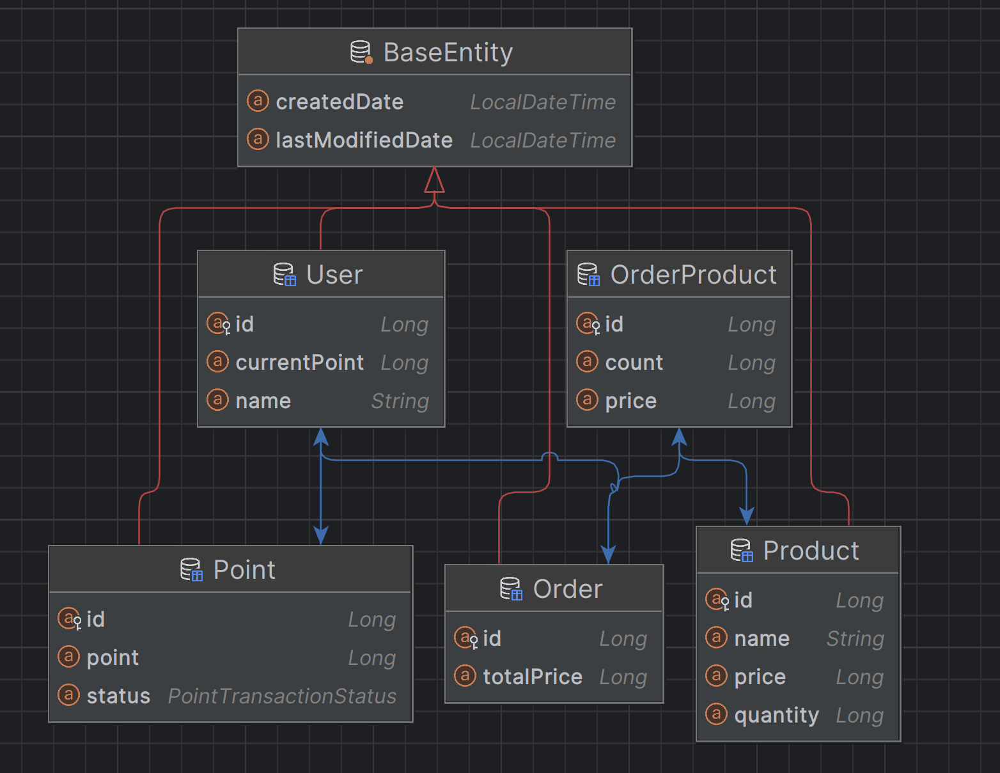
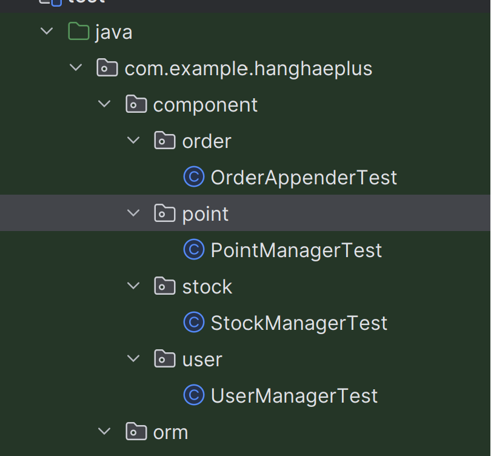

# 시나리오 선정

## e-커머스 서비스

e-커머스 상품 주문 서비스를 TDD 기반으로 구현

## 요구사항

- 상품 주문에 필요한 메뉴 정보들을 구성하고 조회가 가능해야 한다.
- 사용자는 상품을 여러 개 선택해 주문할 수 있고, 미리 충전된 잔액을 이용한다.
- 상품 주문 내역을 통해 판매량이 가장 높은 상품을 추천합니다.

### 주요 API

- 잔액 충전 / 조회 API
- 상품 조회 API
- 주문 / 결제 API
- 인기 판매 상품 조회 API

### 개발 환경

- spring data jpa
- h2 database
- lombok
- junit 5 , mockito

### 엔티티 설계

요구 사항에 필요한 최소한의 엔티티만 설계



- User 엔티티 : 사용자 식별 ID , 이름, 잔액 (포인트)
- Product 엔티티 : 상품 고유 ID , 상품 이름, 상품 가격 , 상품 재고
- Order 엔티티 : 주문 고유 Id , 주문 한 상품 총 가격
- OrderProduct 엔티티
  - 주문한 상품에 대한 내역 엔티티
  - 주문 Id , 상품 Id, 주문한 상품 개수, 주문 당시 상품 가격
- Point 엔티티 : 잔액(포인트) 고유 Id, 포인트 내역 (충전 , 차감) , 금액

#### 재고 엔티티를 만들지 않은 이유

재고 Entity 를 따로 만들지 않고 Product 에서 재고 상태를 필드로 관리 하였다.
그 이유는 지금은 TDD 를 중점 으로 공부 하는 것이기 때문에 코드가 심플한 것이 좋다

재고를 Entity 로 관리 하면 비즈니스 로직 복잡도가 올라 가고
테스트도 복잡해지기 때문에 재도 Entity 를 만들지 않았다.

## TDD (Test Driven Development)

> 프로덕션 코드보다 테스트 코드를 먼저 작성하여 테스트가 구현 과정을 주도하도록
> 하는 방법론

## 구현

### 레드 - 그린 - 리팩토링


이미지 출처 https://mbauza.medium.com/red-green-refactor-1a3fb160e649

1. TDD는 프로덕션 코드 없이 테스트를 먼저 작성 하는 방법 이기 때문에 실패를 한다. (레드)
2. 빠른 시간 내에 최소한의 코드로 구현부를 작성 하여 테스트를 통과한다. (그린)
3. 테스트 통과를 유지하면서 구현 된 코드를 개선 한다. (리팩토링)

### 주문 테스트

- 사용자 식별자와 상품 ID, 수량 목록을 입력 받아 주문한다.

```java
  @DisplayName("사용자 식별자와 상품 ID, 수량 목록을 받아 주문을 수행한다.")
    @Test
    void createOrder(){
        // given

        // when


        //then
    }
```

주문에 대한 테스트를 작성하기 전에 어떤 기능을 만들어야 하는지 생각 해보자

- 사용자 식별 Id , 상품 목록 (상품 식별 Id , 수량) 을 받는다.
- 각 상품에 재고가 있는지 확인 후 차감한다.
- 재고 차감 후 주문 한 상품들의 총 가격을 구한다.
- 사용자의 현재 잔액 과 총 가격을 비교 한 뒤 잔액이 부족하면 예외 처리, 그렇지 않으면 잔액을 차감한다.
- 주문을 생성하고, 결제를 진행한다.

테스트 코드를 먼저 작성해야 하는데,

어떻게 작성해야 할지 감이 오지 않아

테스트 메소드만 만들고 바로 구현에 들어갔다.

```java
@Service
@RequiredArgsConstructor
public class OrderService {

    private final ProductRepository productRepository;
    private final OrderRepository orderRepository;
    private final UserRepository userRepository;
    private final PointService pointService;

    // 주문 전에 재고 차감
    public void createOrder(OrderPostRequest request) {
        User user = userRepository.findById(request.getUserId()).get();
        List<ProductRequestForOrder> productRequest = request.getProducts();
        Map<Long, Long> productIdQuntitiyMap = productRequest.stream()
                .collect(Collectors.toMap(ProductRequestForOrder::getProductId, ProductRequestForOrder::getQuantity));
        // product id 추출
        List<Product> products = productRepository.findAllById(productRequest.stream().map(ProductRequestForOrder::getProductId).collect(Collectors.toList()));

         // 재고 차감
        deductQuantity(products, stockMap);


        // 주문
        Order order = Order.create(user, products);
        orderRepository.save(order);

        // 결제
        pointService.processPayment(savedOrder);
    }


    private static void deductQuantity(List<Product> products, Map<Long, Long> productIdQuntitiyMap) {
        for (Product product : products) {
            Long quantity = productIdQuntitiyMap.get(product.getId());
            if (product.isLessThanQuantity(quantity)){
                throw new InsufficientStockException(INSUFFICIENT_STOCK);
            }
            product.deductQuantity(quantity);
        }
    }

}
```

주문 객체에서

```java
   @Builder
    private Order(User user, List<Product> products) {
        this.user = user;
        this.product = getOrderProducts(products);
        this.totalPrice = calculateTotalPrice(products);
    }

    private List<OrderProduct> getOrderProducts(List<Product> products) {
        return products.stream()
               .map(product -> new OrderProduct(this, product, product.getQuantity(), product.getPrice()))
                .collect(Collectors.toList());
    }

    private static long calculateTotalPrice(List<Product> products) {
        return products.stream()
                .mapToLong(Product::getPrice)
                .sum();
    }

     public static Order create(User user, List<Product> products) {
        return new Order(user, products);
    }

```

해당 상품을 주문했을 때 총 가격과 OrdurProduct 엔티티 (주문 과 상품 엔티티를 연결해주는 엔티티) 에 주문한 상품에 대한 정보를 저장한다.

- OrderPostRequest 에는 사용자의 식별 ID 와 상품 식별 Id 와 재고의 목록을 담고 있는 List Dto 객체가 있다.
- 주문을 하기 전 각 상품의 재고를 확인 하기 위해서 List Dto 객체에서 상품 아이디 리스트를 추출한다.
- 해당 상품 아이디에 해당하는 재고를 알기 위해 List Dto 안에 있는 상품 id 와 상품 재고를 key ,value 형태의 Map 을 추출한다.
- 이때 key 는 상품 식별 Id, value 는 해당 상품에 대한 재고 수량이다.
- 상품 id 리스트와 재고 수량 Map 을 통해 재고를 차감하는 메서드를 실행한다. 이때 재고 보다 주문 수량이 많으면 예외를 발생시킨다.
- 재고 차감 이후 사용자 정보와 상품 id 리스트로 주문을 생성한다.
- 주문이 성공하면 해당 주문에 대한 결제를 수행한다.

이렇게 주문에 대한 메소드를 작성했다.

하지만 위의 코드에는 여러가지 문제점이 있었다.

### 문제 1. 상세한 구현 로직

위의 메소드는 주문을 생성하는 메소드이다.
하지만 메소드는 주문을 생성하는 것 외에도 많은 것을 하고 있다.

유저를 가져와서 사용자 검증을 하고 , 재고 차감을 위해서 DTO에서
상품 목록과 재고 수량 map 을 만든 뒤에... 재고를 차감..
등등...

비즈니스 로직보다는 상세한 구현 로직에 가깝다.

위의 코드를 다른 사람이 보면 빠르고 명확하게 해석하기 힘들 것 같다.

올바른 비즈니스 로직은 상세 구현 로직을 잘 모르더라도 비즈니스의 흐름은 이해 가능한 로직이어야 한다.

### 해결 1. 책임을 분리

책임을 분리한다. 즉 클래스를 분리하자

OrderService 에서 주문을 하는 행위에만 집중할 수 있게
각 역할을 갖는 클래스를 생성하여 협력할 수 있게 만들자.

#### 유저 가져오기

```java
@Component
@RequiredArgsConstructor
public class UserReader {

    private final UserRepository userRepository;

    public User read(Long userid) {
        return userRepository.findById(userid).orElseThrow(()  ->new EntityNotFoundException(USER_NOT_FOUND));
    }
}

```

UserReader read 메서드를 통해 목적이 더욱 뚜렷해졌다.

또한 OrderService 에서는 UserRepository 에 의존하지 않기 때문에

유지 보수하기 편해진다. (Spring Data JPA 에서 다른 것으로 변경하려고 할 때 의존성이 강하게 되면 변경해야 할 코드가 많아진다.)

#### 주문

```java
@Component
@RequiredArgsConstructor
public class OrderAppender {

    private final OrderRepository orderRepository;

    public Order append(User user, List<Product> products) {
        Order order = Order.create(user, products);
        return orderRepository.save(order);

    }
}

```

마찬가지로 OrderAppender 라는 클래스를 통해 목적이 뚜렷한 클래스를 만들었고 비즈니스 서비스 계층과 레포지토리 계층 사이에
하나의 계층을 두어 강한 결합의 의존성을 완화시켰다.

```java
@Component
@RequiredArgsConstructor
public class PointManager {

    private final PointRepository pointRepository;


    public void process(User user, Order order) {
        Long totalPrice = order.getTotalPrice();
        if (user.getCurrentPoint() < totalPrice){
            throw new InsufficientPointsException(INSUFFICIENT_POINT);
        }
        Point point = Point.create(user, totalPrice);
        pointRepository.save(point);

    }
}

```

위의 코드 역시 PointService 에서 수행한 구현 로직을
PointManager 클래스로 옮겨 목표를 뚜렷하게 하였다.

재고 차감과 관련된 로직은 문제가 한 개 더 있기 때문에

밑에서 이어서 설명 하겠다.

### 문제 2. 테스트 하기 힘든 코드

주문이 잘 되는지 테스트를 위해서는 주문 뿐만 아니라 주문과 관련된 모든 로직에 대한 테스트가 필요하다.

그렇기 때문에 재고 차감에 대한 테스트도 있어야 한다.

문제는

재고 차감과 관련된 메소드는
OrderSerivce 안에 private 메서드로 되어 있다.

```java
private static void deductQuantity(List<Product> products, Map<Long, Long> stockMap) {
        for (Product product : products) {
            Long quantity = stockMap.get(product.getId());
            if (product.isLessThanQuantity(quantity)){
                throw new InsufficientStockException(INSUFFICIENT_STOCK);
            }
            product.deductQuantity(quantity);
        }
    }
```

그럼 어떻게 테스트 할 것인가???

이때 관심사를 분리해야 한다.

이 부분은 문제 1. 해결 1과 같은 맥락으로 이해하면 된다.

사실 재고 차감에 대한 테스트를 어떻게 해야 할까 고민을 하는 순간에
문제 1번이 보이기 시작했고, 문제 1번에 대한 해결책이
문제 2번에 대한 해결책으로 이어졌다.

### 해결 2 관심사 분리

OrderService 에서 재고를 조회하고 차감을 하는 행위까지 하고 있다.

재고 차감이라는 메서드는 어디서든 재사용 될 수 있는 행위이고
재고 차감 뿐 아니라 재고 증가라는 행위도 있기 때문에
재고 조회와 차감은 재고와 관련된 객체로 독립적으로 분리되어야 한다.

StockManager 라는 객체를 생성하여 관심사를 분리하였다.

```java
@Component
@RequiredArgsConstructor
public class StockManager {

    private final ProductRepository productRepository;

    public void deduct(OrderPostRequest request) {
        // key : productId , value : quantity
        List<ProductRequestForOrder> productRequest = request.getProducts();
        Map<Long, Long> productIdQuntitiyMap = convertToProductIdQuantityMap(productRequest);
        // product id 추출
        List<Product> products = getProducts(productRequest);
        deductQuantity(products,stockMap);

    }

    public Map<Long, Long> convertToProductIdQuantityMap(List<ProductRequestForOrder> products) {
        return products.stream()
                .collect(Collectors.toMap(ProductRequestForOrder::getProductId, ProductRequestForOrder::getQuantity));
    }

    private List<Product> getProducts(List<ProductRequestForOrder> productRequest) {
        return productRepository.findAllById(productRequest.stream().map(ProductRequestForOrder::getProductId).collect(Collectors.toList()));
    }

    private void deductQuantity(List<Product> products, Map<Long, Long> productIdQuntitiyMap) {
        for (Product product : products) {
            Long quantity = productIdQuntitiyMap.get(product.getId());
            if (product.isLessThanQuantity(quantity)){
                throw new InsufficientStockException(INSUFFICIENT_STOCK);
            }
            product.deductQuantity(quantity);
        }
    }
}
```

StockManager 로 관심사를 분리했지만

여전히 문제가 남아있었다.

아직까지 deductQuantity 메서드는 private 작성되어 있다.

그 이유는

StockManager 에 재고 차감 행위 외에도 상품 고유 id를 가져오는 행위 , 상품 id와 재고 수량을 매핑하는 행위가 있기 때문이다.

상품 목록을 가져오는 것은 아래 코드에서 볼 수 있듯이
주문을 위해 사용하고 재사용 될 여지가 많기 때문에

관심사를 분리해야 할 것 같다.

```java
Order savedOrder = orderAppender.append(user, products);
```

따라서 상품 목록을 행위는
재고 클래스가 아닌 상품 클래스에서
하는 것이 맞는 것 같다.

ProductReader 클래스를 생성한 뒤 상품 목록을
가져오는 행위를 수행한다.

```java
@Component
@RequiredArgsConstructor
public class ProductReader {

    private final ProductRepository productRepository;

    public List<Product> read(List<ProductRequestForOrder> productRequest) {
        return productRepository.findAllById(productRequest.stream().map(ProductRequestForOrder::getProductId).collect(Collectors.toList()));
    }
}
```

그리고 ProductReader 클래스에서 상품 id 와 재고 수량을 매핑하는
행위 까지 추가 하였다.

```java
@Component
@RequiredArgsConstructor
public class ProductReader {

    private final ProductRepository productRepository;

    public List<Product> read(List<ProductRequestForOrder> productRequest) {
        return productRepository.findAllById(productRequest.stream().map(ProductRequestForOrder::getProductId).collect(Collectors.toList()));
    }

    public Map<Long, Long> convertToProductIdQuantityMap(List<ProductRequestForOrder> products) {
        return products.stream()
                .collect(Collectors.toMap(ProductRequestForOrder::getProductId, ProductRequestForOrder::getQuantity));
    }
}

```

이제 StockManager 는 재고을 차감하는 행위만 하면 된다.

```java
public class StockManager {

    public void deduct(List<Product> products ,  Map<Long, Long> productIdQuntitiyMap) {
        for (Product product : products) {
            Long quantity = productIdQuntitiyMap.get(product.getId());
            if (product.isLessThanQuantity(quantity)){
                throw new InsufficientStockException(INSUFFICIENT_STOCK);
            }
            product.deductQuantity(quantity);
        }
    }

}
```

재고를 차감하는 행위와 상품 목록을 가져오는 행위는
분리되었고 다른 클래스에서도 재사용할 수 있게 되었다.

내가 작성한 기능들을 테스트하기 위해 ,

테스트 하기 좋은 코드로 변경하였고

테스트 하기 좋은 코드를 생각하다 보니 현재 비즈니스 로직의 문제점이
보이기 시작하였고,

아래와 같이 비즈니스 로직 코드를 전체 수정하였다.

```java
@Service
@RequiredArgsConstructor
public class OrderService {

    private final UserReader userReader;
    private final ProductReader productReader;
    private final OrderAppender orderAppender;
    private final PointManager pointManager;
    private final StockManager stockManager;

    // 주문 전에 재고 차감
    @Transactional
    public void createOrder(OrderPostRequest request) {
        User user = userReader.read(request.getUserId());
        // 상품 목록 가져 오기
        List<Product> products = productReader.read(request.getProducts());
       // key : 상품 id , value : 주문 수량
        Map<Long, Long> productIdQuntitiyMap = productReader.convertToProductIdQuantityMap(request.getProducts());
        // 재고 차감
        stockManager.deduct(products,stockMap);
        // 주문
        Order savedOrder = orderAppender.append(user, products);

        // 결제
        pointManager.process(user,savedOrder);
    }

}

```

이제 각 기능 단위로 테스트를 시작할 수 있게 되었다.

테스트에는 여러 종류가 있는데, 위에서 언급 한대로 기능 단위로
테스트 하는 것은 유닛 테스트이다.

테스트에는 유닛 테스트 외에 통합 테스트도 존재한다.

주문을 하는 행위에 대해서 단위 테스트와 유닛 테스트 모두 작성 해보자

## 단위테스트 vs 유닛테스트

### 유닛 테스트

- 하나의 모듈을 기준으로 독립적으로 진행되는 가장 작은 단위의 테스트이다.
- => 내가 작성한 함수, 혹은 코드가 정상적으로 의도한 대로 동작하는 기 검증

#### F.I.R.S.T 원칙

- Fast : 테스트 코드의 실행은 빠르게 진행되어야 한다.
- Independent : 독립적인 테스트가 가능해야 한다.
- Repeatable : 테스트는 매번 같은 결과를 만들어야 한다.
- Self-Validating : 테스트는 그 자체로 실행하여 결과를 확인할 수 있어야 한다.
- Timely : 단위 테스트는 비즈니스 코드가 완성되기 전에 구성하고 테스트가 가능해야 한다.
  - => 코드가 완성되기 전부터 테스트가 따라와야 한다는 TDD 원칙을 담고 있다.

나는 여기서 5번째 Timely 는 지키지 못했다. 테스트 코드를 작성하기 전 비즈니스 코드가 이미 완성되었다...

앞으로 TDD를 하기 위해서는 요구 사항을 기능 단위로 쪼갠 다음, 테스트 코드를 작성해야 겠다. 테스트 하기 좋은 코드를 생각하다 보면
클린 코드는 따라오게 되어 있을 것이다.

### 잔액 차감 단위 테스트

```java
public class PointManager {

    private final PointRepository pointRepository;


    public void process(User user, Order order) {
        Long totalPrice = order.getTotalPrice();
        if (user.getCurrentPoint() < totalPrice){
            throw new InsufficientPointsException(INSUFFICIENT_POINT);
        }
        user.deductPoints(totalPrice);

        Point point = Point.create(user, totalPrice);
        pointRepository.save(point);

    }
}
```

잔액 차감에 대한 단위 테스트를 진행 하려고 보니

잔액 차감은 user 가 하는 행위인데 PointManager에서 진행하고 있다는 것이
보이기 시작했다.

잔액 차감이라는 행위 역시 재사용을 충분히 할 수 있는데, PointManager 클래스 안에
숨겨져 있다.

관심사를 분리해야 할 것 같다.

UserManager 클래스를 만들어서 잔액을 차감하는 역할을 위임하자

UserManager 클래스에서 잔액 차감 뿐만 아니라 잔액 충전도 할 수 있을 것 같다.

이렇게 기능 단위로 관심사를 분리하니 유닛 테스트 하기 수월해졌다.

#### 테스트 코드

```java
@ExtendWith(MockitoExtension.class)
class UserManagerTest {

    @InjectMocks
    private UserManager userManager;


    @DisplayName("주문 한 상품 들의 총 가격 만큼 잔액을 차감한다.")
    @Test
    void deductPoint(){
        // given
        User user = User.create("건희", 20000L);
        Product product1 = Product.create("양파", 1000L, 3L);
        Product product2 = Product.create("당근", 2000L, 4L);
        Order order = Order.create(user, List.of(product1, product2));

        // when
        userManager.deductPoint(user,order);
        Long totalPrice = order.getTotalPrice();

        //then
        Assertions.assertThat(user.getCurrentPoint()).isEqualTo(20000L-totalPrice);
    }


    @DisplayName("주문 한 상품 들의 총 가격이 현재 잔액 보다 많을 때 예외를 발생시킨다.")
    @Test
    void deductInSufficientPoint(){
        // given
        User user = User.create("건희", 10000L);
        Product product1 = Product.create("양파", 1000L, 3L);
        Product product2 = Product.create("당근", 2000L, 4L);
        Order order = Order.create(user, List.of(product1, product2));

        // when  //then
        Assertions.assertThatThrownBy(()-> userManager.deductPoint(user,order))
                .isInstanceOf(InsufficientPointsException.class);
    }

}
```

테스트는 Mockito 라는 Mocking 프레임워크를 사용하였다.

Mockito 는 JUnit 에서 가짜 객체인 Mock 을 생성해주고
관리하고 검증할 수 있도록 지원해주는 프레임워크이다.

유닛 테스트는 스프링 빈을 로드할 필요 없이 테스트를 수행할 모듈과
연결되는 외부의 다른 모듈을 흉내 내는 가짜 모듈을 생성하여 테스트를 진행하면 된다.

#### Test Double

- Dummy : 아무 것도 하지 않는 깡통 객체
- Fake : 단순한 형태로 동일한 기능을 수행하나, 프로덕션에서 쓰기에는 부족한 객체
- Stub : 테스트에서 요청한 것에 대해 미리 준비한 결과를 제공하는 객체 그 외에는 응답하지 않는다.
- Spy : Stub 이면서 호출된 내용을 기록하여 보여줄 수 이쓴 객체 일부는 실제 객체처럼 동작시키고 일부만 Stubbing 할 수 있다.
- Mock : 행위에 대한 기대를 명세하고, 그에 따라 동작하도록 만들어진 객체

관심사를 분리하여 기능 별로 테스트를 하기 쉽게 설계를 변경하여



재고 , 주문 , 포인트 내역 ,잔액 차감 테스트를 진행할 수 있었다.

### 통합 테스트

- 모듈을 통합하는 과정에서 모듈 간의 호환성을 확인하기 위해 수행되는 테스트
- 여러 기능을 조합하여 전체 비즈니스 로직이 제대로 동작하는 지 확인한다.
- => DB 혹은 외부에서 의존하는 코드, 내 코드의 의존성과 맞물려 있는 코드들이 맞물려 정상적으로 동작하여 하나의 플로우들 제 기능을 하는 지 검증
- @SpringBootTest 를 사용하여 진행
- @SpringBootTest 는 @SpringBootApplication 을 찾아가서 모든 Bean 을 로드하게 된다.
- 대규모 프로젝트에서 사용할 경우, 테스트를 실행할 때 마다 모든 빈을 스캔하고 로드하는 작업이 반복되어 매번 무거운 작업을 수행해야 한다.

##### 테스트 코드

```java
@SpringBootTest
public class OrderServiceTest {

    @Autowired
    private OrderService orderService;


    @Autowired
    private UserRepository userRepository;

    @Autowired
    private ProductRepository productRepository;


    @DisplayName("주문 한 상품 수량 만큼 재고를 차감한다.")
    @Test
    void deductQuantity() {
        // given
        User user = User.create("건희", 1000000L);
        User savedUser = userRepository.save(user);

        Product product1 = Product.create("양파", 1000L, 5L);
        Product product2 = Product.create("감자", 2000L, 15L);
        Product product3 = Product.create("당금", 3000L, 20L);


        productRepository.saveAll(List.of(product1, product2, product3));


        ProductRequestForOrder request1 = ProductRequestForOrder.of(product1.getId(), 5L,product1.getPrice());
        ProductRequestForOrder request2 = ProductRequestForOrder.of(product2.getId(), 8L,product2.getPrice());
        ProductRequestForOrder request3 = ProductRequestForOrder.of(product3.getId(), 15L,product3.getPrice());


        List<ProductRequestForOrder> requests = List.of(request1, request2, request3);


        OrderPostRequest orderPostRequest = OrderPostRequest.builder()
                .userId(savedUser.getId())
                .products(requests)
                .build();

        // when
        orderService.createOrder(orderPostRequest);

        List<Product> products = productRepository.findAllById(List.of(product1.getId(), product2.getId(), product3.getId()));
        Product findProduct1 = products.get(0);
        Product findProduct2 = products.get(1);
        Product findProduct3 = products.get(2);
        //then
        assertThat(findProduct1.getQuantity()).isZero();
        assertThat(findProduct2.getQuantity()).isEqualTo(7L);
        assertThat(findProduct3.getQuantity()).isEqualTo(5L);
    }

   /// ... ...

}

```

일반적으로 단위 테스트와 통합 테스트의 정의가 모호해서 사람 마다 분류하는 기준이 다르다고 한다.

우선 스프링 빈을 로드하거나 h2 같은 테스트 DB를 사용하면 통합 테스트

그 외에 단일 스레드 ,단일 프로세스 , 디스크 I/O 를 사용하지 않으면 단위 테스트로 분류하였다.

테스트를 분류하는 기준은 모호하지만, 단위 테스트가 프로젝트에서 가장 많은 비중을 차지 해야하고
개발자가 집중해야 하는 테스트임에는 틀림 없는 것 같다.

### 느낀점

이번에 TDD를 접하고 테스트 코드를 작성 하면서 테스트 코드를 왜 작성해야 하는지
느낄 수 있었다.

그 동안은 코드가 잘 동작하는 지 확인하기 위해 Postmand 을 사용했었는데
테스트 코드와 비교하면 상당히 수동적이고 불편한 방법이었다.

내가 작성한 기능 하나를 테스트 하기 위해 api 를 만들고 DB 까지 연결해야 했다.
하지만 유닛 테스트로 api 나 db 연결 할 필요없이 가짜 객체를 통해 내가 만든 기능이 잘 동작하는 지 확인할 수 있었다.

만약 요구 사항이 변경되어 코드를 수정해야 하는 경우, 테스트 코드를
실행 함으로써 코드 변경이 예상대로 이루어지고 기존 기능에 문제가 없는지
빠르게 확인할 수 있었다.

수작업으로 진행되던 Postman 방식 보다 훨씬 효율적이다.

요구 사항이 변경되어 코드를 수정할 때 마다 동작이 잘 안되지 않을까
불안감이 많았는데, 기능이을 추가하거나 수정할 때마다 해당 기능의 동작을 보장하기 위한 테스트 코드를 테스트 코드를 잘 작성하여 실행 하면 앞으로 불안감이 없이 코드를 수정할 수 있을 것 같다.

그리고 항상 클린 코드와 객체지향적인 코드를 작성하기 위해 고민을 많이 했지만 ,실제로 어떻게 적용해야 할지 몰라 답답함을 느낄 때가 많았다.

테스트 코드를 작성하다보면 테스트 코드하기 좋은 코드가 뭔지 고민하게 되었고,
이로 인해 클린 코드와 객체지향적인 코드에 대한 원칙들이 실제로 어떻게 구현되어야 하는지에 대한 통찰을 얻을 수 있었습니다.

테스트 코드를 작성하면서 코드의 모듈화 ,응집도 향상 ,결합도 감소 등에 대해서 고민 하면서 클린 코드와 객체지향적인 설계를 자연스럽게 향상시킬 수 있었습니다.

앞으로 실무에서도 테스트 코드 작성을 생활화하고 팀원들에게도 전파할 생각입니다.
