# 통합 모니터링 시스템 구축

서버에서 발생하는 로그를 통합 모니터링 시스템을 구축하여 조회한다.

## 서버 모니터링을 해야 하는 이유

- 사전 분석을 통해 장애를 방지할 수 있다.
  - 시스템을 지속적으로 모니터링하고 있다면 자동 또는 수동으로 설정된 경고 신호를 통해 문제가 발생하기 전에 조치를 취할 수 있다.
- 다운타임을 줄이고 비즈니스 손실을 방지할 수 있다.
  - 다운타임은 비즈니스에 있어 매우 중요한 요소이다.
  - 장애를 발견하고 10분만에 문제가 해결되었다 해도 5시간 동안 장애를 인지 못하고 있었으면 다운타임은 5시간 10분이 된다.
  - 서버 모니터링은 문제의 범위를 줄여줄 수 있기 때문에 다운타임을 줄이는 데 도움이 된다.
- 생산성과 성능을 향상시킬 수 있다.
  - 서버 모니터링을 통해 서버 자원과 네트워크의 상관관계를 분석할 수 있다.
  - 클라우드 서비스를 사용하는 경우 모니터링 분석 결과를 기반으로 서버와 네트워크를 조정해 보는 것도 좋은 방법이다.
- 모니터링을 통해 IT 업그레이드 계획 및 예산을 정한다.
  - 모든 서버는 생명 주기를 가지고 있다. 매년 필요한 서버의 규모는 다르다.
  - 모니터링으로 예측하고 전략을 변경하는 것은 효과적인 서버의 운영방법이다.
- 데이터 기반의 통찰력과 의사결정을 가능하게 한다.
  - 클라우드로 IT 환경에서 성능과 비용이 실시간으로 교환 가능하기 때문에 서버 모니터링의 비즈니스적 요소는 더 중요해진다.

## 로그

### 로그란?

> 컴퓨터가 개별적인 작업이나 이벤트에 대해 생성하는 기록으로 타임 스탬프가 찍혀있다.

로그가 일반적으로 기록하는 데이터는 함수 호출, 오류, HTTP 요청 , 데이터베이스 트랜잭션 등이며, 로그는 발생하는 상황에 대한 단계별 상세 정보를 제공한다.

### 로그 관리

> 로그의 생성에서 집계, 저장, 분석, 보관 및 폐기까지 로그 데이터의 처리와 관련된 모든 프로세스를 의미한다.

로그 관리 시스템은 애플리케이션, 네트워크 또는 서버에서 이뤄지는 모든 것을 기록해야 한다. 이렇게 기록된 로그 데이터는 문제 해결과 분석에 사용할 수 있다.

모니터링을 왜 해야하는 지, 로그가 무엇인지 알아보았으니
직접 로그를 남겨 보자.

SpringBoot 로 개발하고 있는 서버에 로그를 남기기 위해

## Logback

> Log4J 를 기반으로 개발된 로깅(Logging) 라이브러리
> log4j에 비해 약 10배 정도 빠른 퍼포먼스, 메모리 효율성 증대

스프링부트의 경우 기본적으로 지원하고 있기 때문에 별도의 dependency 를 설정해줄 필요가 없다.

### 특징

- 로그에 특정 레벨을 설정할 수 있다. (Trace -> Debug -> Info -> Warn -> Error)
- 실운영과 테스트 상황에서 각각 다른 출력 레벨을 설정하여 로그를 확인할 수 있다.
- 출력 방식에 대해 설정할 수 있다.
- 설정 파일을 일정 시간마다 스캔하여 어플리케이션 중단 없이 설정 변경 가능
- 별도의 프로그램 없이 자체적으로 로그 압축을 지원
- 로그 보관 기간 설정 가능

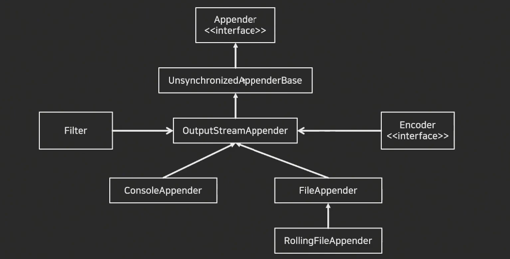

### 설정

일반적으로 Classpath에 있는 logback 설정 파일을 참조하게 된다

- Java Legacy , Spring 의 경우에는 logback.xml 파일을 참조
- Spring Boot 의 경우에 logback-spring.xml 파일을 참조

application.yml 에 설정할 수 있지만, 세부적인 설정이 불편하기 때문에
logback-spring.xml 로 설정하였다.

#### appender

Log의 형태 및 어디에 출력 할지 설정 하기 위한 영역

- ConsoleAppender : 콘솔에 로그를 출력
- FileAppender : 파일에 로그를 저장
- RollingFileAppender : 여러 개의 파일을 순회하면서 로그를 저장
- SMTPAppender : 로그를 메일로 보냄
- DBAppender : 데이터베이스에 로그를 저장

```xml
<?xml version="1.0" encoding="UTF-8"?>
<configuration>
    <appender name="console" class="ch.qos.logback.core.ConsoleAppender">
        <filter class="ch.qos.logback.classic.filter.ThresholdFilter">
            <level>DEBUG</level>
        </filter>
        <encoder>
            <pattern>[%d{yyyy-MM-dd HH:mm:ss.SSS}] [%-5level] [%thread] %highlight(%level) %M %logger %msg%n</pattern>
        </encoder>
    </appender>

    <root level="INFO">
        <appender-ref ref="console"/>
    </root>

</configuration>
```

#### encoder

Appender 내에 포함되는 항목이며, pattern 을 사용하여 원하는 형식으로 로그를 표현할 수 있다.

```xml
<encoder>
    <pattern>%green(%d{yyyy-MM-dd'T'HH:mm:ss}) %magenta([%thread]) %highlight(%level) %cyan(%logger{15})%msg%n</pattern>
</encoder>
```

#### pattern

- %Logger{length} : Logger Name
- %-5level : 로그 레벨, -5는 출력의 고정폭 값
- %msg : 로그 메시지 영역 (==%message)
- ${PID:-} : 프로세스 id
- %d : 로그 기록 시간
- %p : 로깅 레벨
- %F : 로깅일 발생한 프로그램 파일명
- %M : 로깅이 발생한 메소드의 이름
- %I : 로깅이 발생한 호출지의 정보
- %L : 로깅이 발생한 호출지의 라인 수
- %thread : 현재 Thread 명
- %t : 로깅이 발생한 Thread 명
- %c : 로깅이 발생한 카테고리
- %C : 로깅이 발생한 클래스 명
- %m : 로그 메시지
- %n : 줄바꿈
- %% : %출력
- %r : 어플리케이션 실행 후 로깅이 발생한 시점까지의 시간

#### root

설정한 Appender를 참조하여 로그의 레벨을 설정할 수 있다.

```xml
<root level="INFO">
    <appender-ref ref="CONSOLE"/>
</root>
```

### 로그 레벨

TRACE -> DEBUG -> INFO -> WARN -> ERROR

- ERROR : 로직 수행 숭에 오류가 발생한 경우, 시스템적으로 심각한 문제가 발생하여 작동이 불가한 경우
- WARN : 시스템 에러의 원인이 될 수 있는 경고 레벨, 처리 가능한 사항
- INFO : 상태 변경과 같은 정보성 메시지
- DEBUG : 어플리케이션의 디버깅을 위한 메시지 레벨
- TRACE : DEBUG 레벨보다 더 디테일한 메시지를 표현하기 위한 레벨

※ 예를 들어, 로그 레벨을 'INFO'라고 설정했을 경우 'TRACE' ,'DEBUG' 레벨은 출력되지 않음

## CloudWatch 를 활용한 모니터링 환경

Amazon CloudWatch

> AWS 리소스와 AWS 에서 실시간으로 실행 중인 애플리케이션을 모니터링 하는 서비스

지표를 감시해 알림을 보내거나 임계값을 위반한 경우 모니터링 리소스를 자동으로 변경하는 경보를 생성할 수 있다.

예를 들어 경보는 인스턴스 중지, auto scaling 및 Amazon SNS 작업 시작, 종료 등으로 구성할 수 있다.

### 로그 그룹 생성

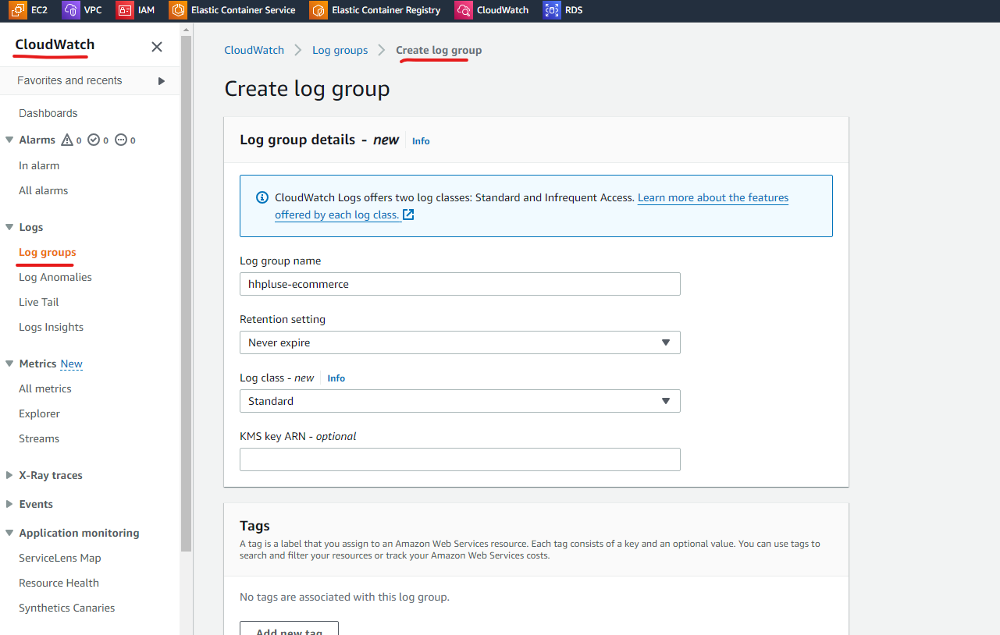

### 의존성 설정

```groovy
implementation "ca.pjer:logback-awslogs-appender:1.6.0"
implementation 'org.codehaus.janino:janino:3.1.9'
```

위의 ca.pjer:logback-awslogs-appender 는 Spring 에서 CloudWatch 로 log 를 전송할 수 있도록 해주는 라이브러리이고

밑에 org.codehaus.janino 는 logback 의 조건부 처리 기능을 위한 라이브러리이다.
spring profile 에 따른 로그 레벨을 설정할 때 사용할 것 같다.

logback-spring.xml 파일 작성

```xml
<?xml version="1.0" encoding="UTF-8"?>
<configuration>
    <appender name="console" class="ch.qos.logback.core.ConsoleAppender">
        <filter class="ch.qos.logback.classic.filter.ThresholdFilter">
            <level>TRACE</level>
        </filter>
        <encoder>
            <pattern>[%d{yyyy-MM-dd HH:mm:ss.SSS}] [%-5level] [%thread] %highlight(%level) %M %logger %msg%n</pattern>
        </encoder>
    </appender>
    <appender name="ASYNC_AWS_LOGS" class="ca.pjer.logback.AwsLogsAppender">
        <filter class="ch.qos.logback.classic.filter.ThresholdFilter">
            <level>INFO</level>
        </filter>
        <layout>
            <pattern>%d{yyyyMMdd'T'HHmmss} %thread %level %logger{15} %msg%n</pattern>
        </layout>
        <logGroupName>hhplus-ecommerce</logGroupName>
        <logStreamUuidPrefix>error-</logStreamUuidPrefix>
        <logRegion>ap-northeast-2</logRegion>
        <maxBatchLogEvents>50</maxBatchLogEvents>
        <maxFlushTimeMillis>30000</maxFlushTimeMillis>
        <maxBlockTimeMillis>5000</maxBlockTimeMillis>
        <retentionTimeDays>0</retentionTimeDays>
    </appender>

    <springProfile name="dev">
        <logger name="org.springframework" level="INFO" />
        <root level="INFO">
            <appender-ref ref="ASYNC_AWS_LOGS" />
        </root>
    </springProfile>

    <root level="INFO">
        <appender-ref ref="console"/>
        <appender-ref ref="ASYNC_AWS_LOGS" />
    </root>

</configuration>
```

aws cloudwatch 로 log 를 전송하기 위해 aws appender 를 추가하고

위에서 생성한 로그 그룹을 지정해주었다.
로그 레벨은 INFO 이기 때문에 INFO , WARN ,ERROR 로 설정한 것은 모두 CloudWatch에 전송된다.

내가 남긴 로그가 CloudWath 로 잘 전송되는지 확인하기 위해

로그를 위한 Filter 를 생성하였다.

```java
public class LogFilter implements Filter {

    private final Logger LOGGER = LoggerFactory.getLogger(LogFilter.class);

    @Override
    public void doFilter(ServletRequest request, ServletResponse response, FilterChain chain) throws IOException, ServletException {

        HttpServletRequest httpRequest = (HttpServletRequest) request;
        String requestURI = httpRequest.getRequestURI();
        String method = httpRequest.getMethod();
        MDC.put("traceId", UUID.randomUUID().toString().substring(0, 8));
        HttpServletResponse httpResponse = (HttpServletResponse) response;

        LOGGER.info("[{}]  request URI = {} ", MDC.get("traceId"), requestURI);
        LOGGER.info("[{}]  method = {}", MDC.get("traceId"), method);
        chain.doFilter(request, response);

        LOGGER.info("[{}]  response status = {}", MDC.get("traceId"), httpResponse.getStatus());
        MDC.clear();

    }
}
```

로그를 남길 때 traceId 를 넣어주었다. traceId 서비스의 고유한 추적 id 라고 보면 될 것 같다.

그리고 이 traceId 는 MDC 에 넣어서 사용하였다.

MDC 는 Mapped Diagnostic Context 로 멀티 클라이언트 환경에서 다른 클라이언트와 값을 구별하여 로그를 추적할 수 있도록 제공되는 map 이다.

ThreadLocal 을 사용하기 때문에 Thread 단위로 생성된다.
그렇기 때문에 각각의 스레드에 대해 독립적인 MDC 값을 설정하고 사용할 수 있다. 이를 통해 멀티 스레드 환경에서
로그 메시지에 대한 정확한 컨텍스트 정보를 유지할 수 있다.

#### 실행

필터에 로그를 남기고 로컬 서버를 실행하면

아래와 같이 CloudWatch 로그 그룹로 로그가 전송되는 것을 확인할 수 있다.

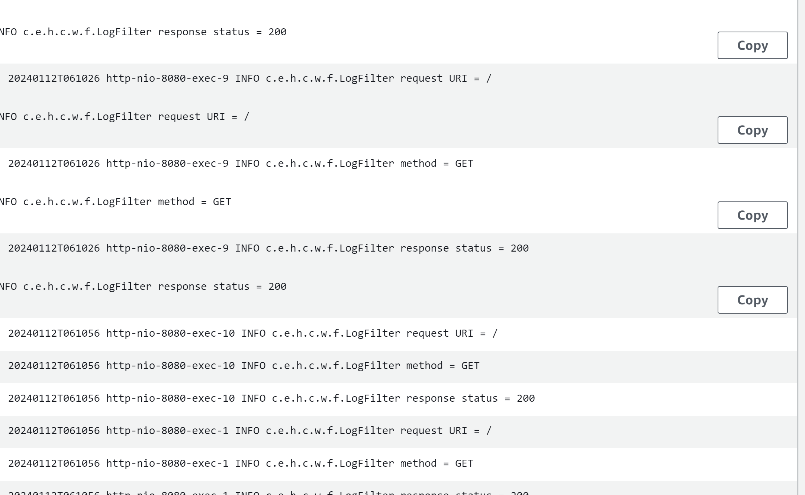

### JSON 형태로 저장하기

로그를 텍스트 형식으로 저장했는데,

로그 수집 과 분석을 위해서는 텍스트 형식 보다는 구조화 된 포맷을 사용하는 것이 좋다.

구조화된 로그 형식 중 가장 일반적인 것이 JSON 이다.

로그백에서 JSON으로 로그를 저장할 수 있다.

#### 의존성 추가

```groovy
implementation 'ch.qos.logback:logback-classic'
implementation 'ch.qos.logback.contrib:logback-json-classic:0.1.5'
implementation 'ch.qos.logback.contrib:logback-jackson:0.1.5'
```

#### 로그백 설정 추가

```xml
 <encoder class="ch.qos.logback.core.encoder.LayoutWrappingEncoder">
    <layout class="ch.qos.logback.contrib.json.classic.JsonLayout">
        <timestampFormat>yyyy-MM-dd'T'HH:mm:ss.SSSX</timestampFormat>
        <timestampFormatTimezoneId>Etc/UTC</timestampFormatTimezoneId>
        <jsonFormatter class="ch.qos.logback.contrib.jackson.JacksonJsonFormatter">
            <prettyPrint>true</prettyPrint>
        </jsonFormatter>
    </layout>
</encoder>
```

설정을 추가하고 CloudWatch 에 로그를 전송해보자

결과

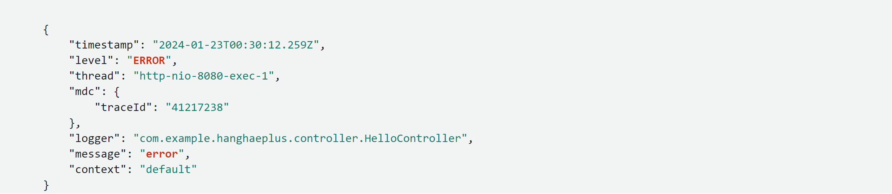

## Slack Webhook API를 활용한 Alert 서비스

슬랙 채널에 특정 메시지를 외부에서 전송하기 위해 Webhook 설정을 진행하자

https://api.slack.com/

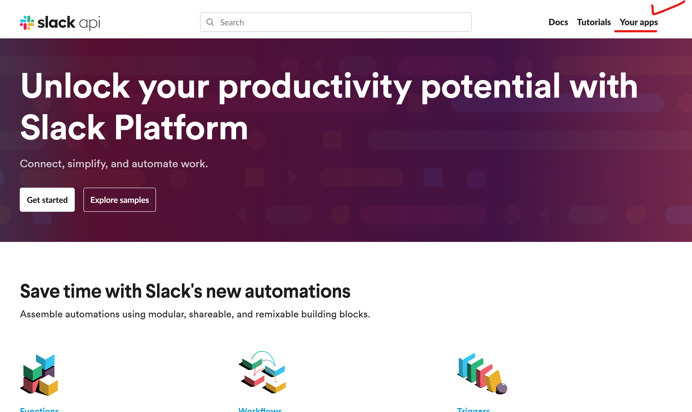

슬랙 APP을 생성한다.

Workspace의 특정 채널 (Webhook 을 받을) 에 대한 API를 생성해 둔다.

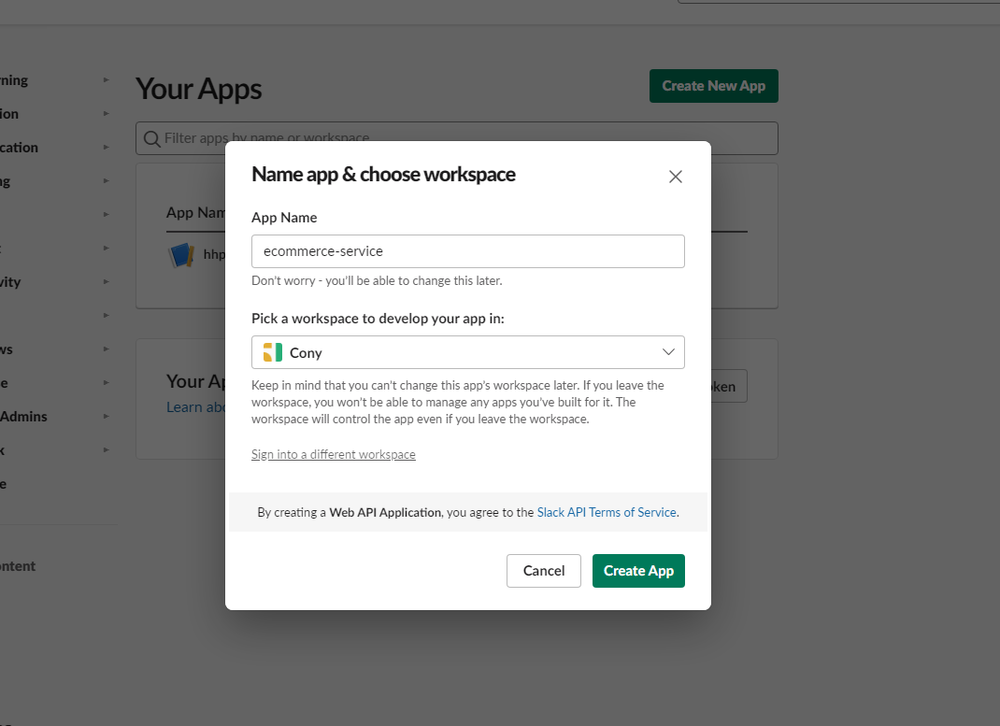

Webhook API

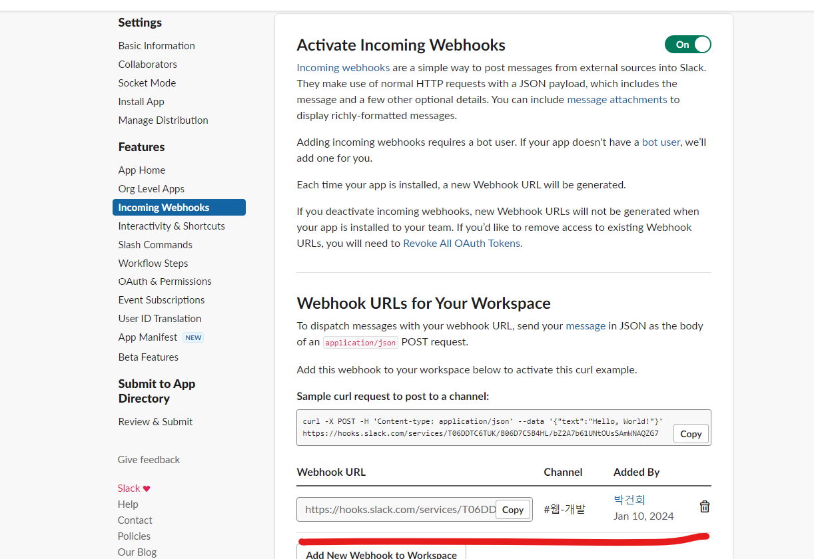

생성한 Webhook API가 잘 동작하는지, postman 으로 호출 해보자

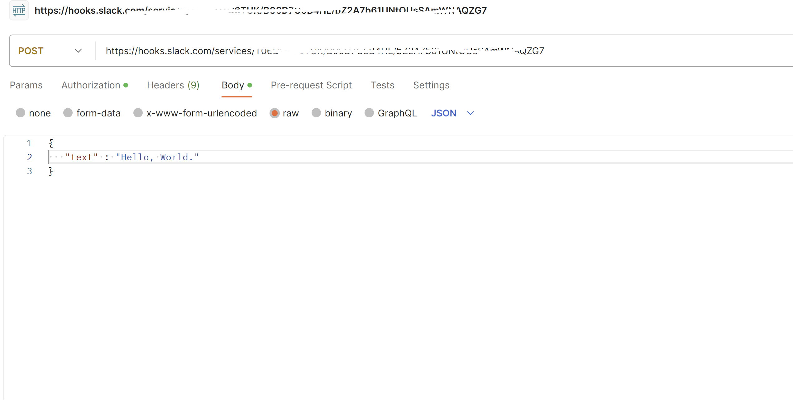

알림이 잘 온다.

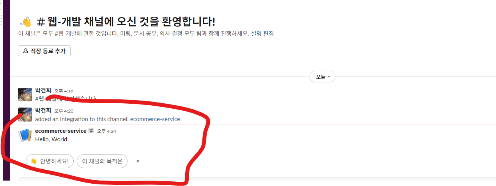

### Error Log Lambda 생성

#### 람다 함수 생성

언어는 Java 로 하려고 했는데 java 는 런타임 환경을 제공해주지 않아서 (소스 코드를 jar 빌드한 것을 업로드 하거나 S3에서 가져와야 한다.)

Node.js 로 설정하였다.

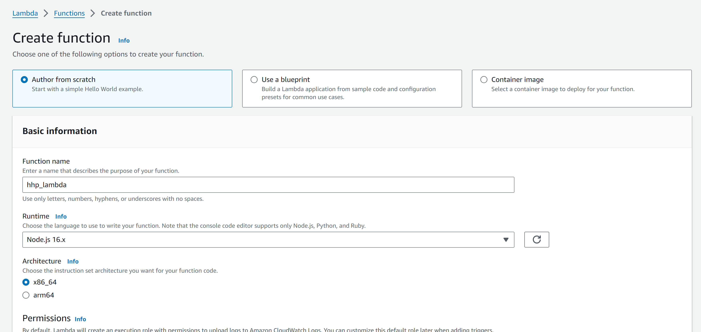

#### 환경 변수 생성

위에서 설정한 slack webhook API를 환경 변수로 등록하였다.

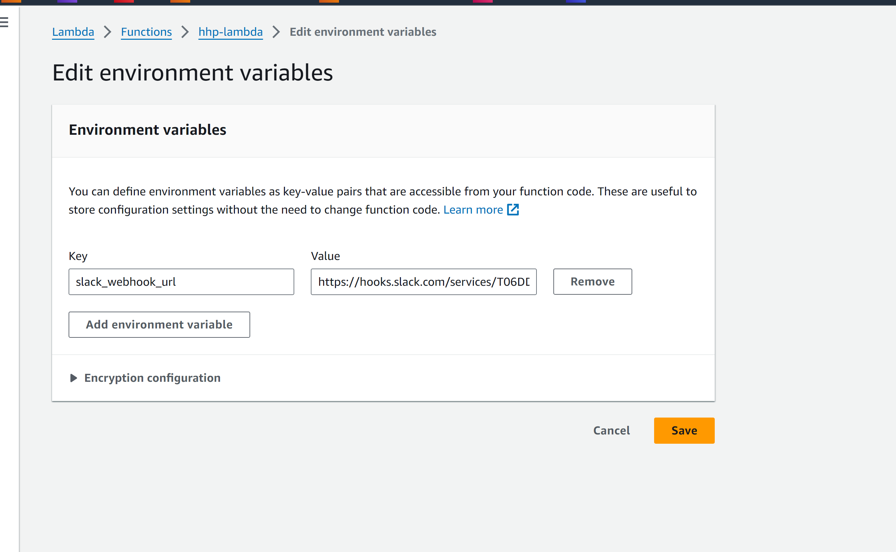

작성한 람다 함수가 잘 동작하는지 테스트 해보자

```javascript
const axios = require('axios')

exports.handler = async event => {
  try {
    const slackWebhookUrl = process.env.slack_webhook_url

    if (!slackWebhookUrl) {
      throw new Error('Slack webhook URL not found in environment variables')
    }

    const response = await axios.post(slackWebhookUrl, {
      text: '람다 테스트 테스트',
    })

    return {
      statusCode: 200,
      body: JSON.stringify('Successfully sent message to Slack!'),
    }
  } catch (error) {
    console.error('Error sending message to Slack:', error.message)

    return {
      statusCode: 500,
      body: JSON.stringify('Error sending message to Slack'),
    }
  }
}
```

환경 변수에 등록 slack webhook API 에 post 요청을 보내는 코드이다.

코드 Deploy 한다.

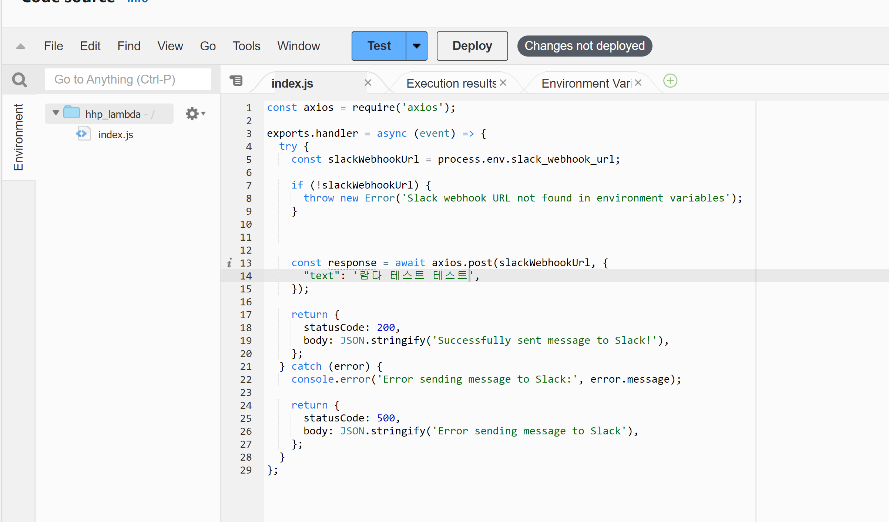

Deploy 한 람다 함수가 잘 동작하는지 테스트 하기 위해 이벤트를 생성한다.

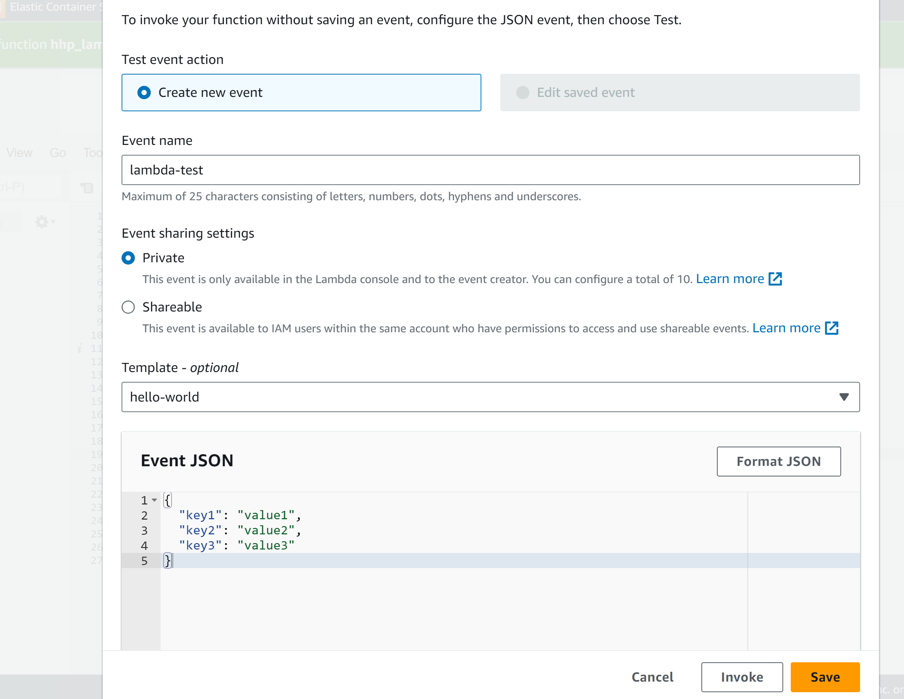

테스트 해보면
axios 모듈을 찾을 수 없다는 에러가 발생한다.

axios 모듈을 사용하려면 node_modules 가 필요하고 node_modules 는 AWS lambda layer 에서 모듈화 해야 한다.

아래 링크를 참고하여 layer 를 추가하였다.

https://medium.com/@sunjang/aws-lambda-layer-%EC%82%AC%EC%9A%A9%ED%95%98%EA%B8%B0-node-js-8c299a1d0a6f <br/>

layer 추가 후에 다시 테스트 해보면

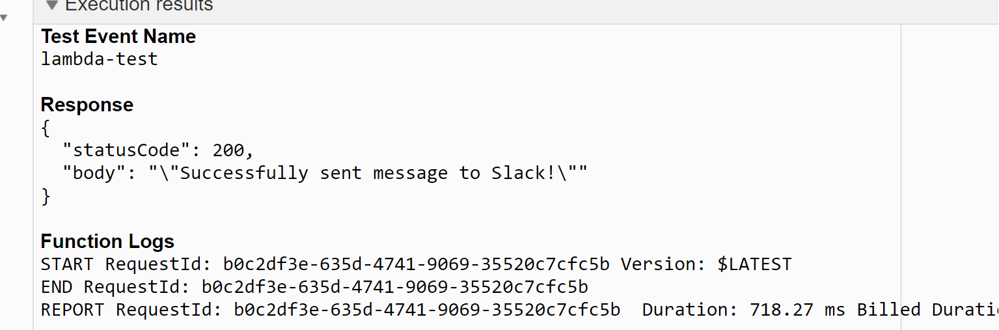

요청에 성공하였고

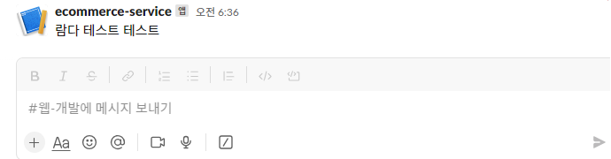

슬랙에도 알림이 왔다.

#### Error Log 알림 보내기

CloudWatch 로그 그룹을 트리거에 추가한다.

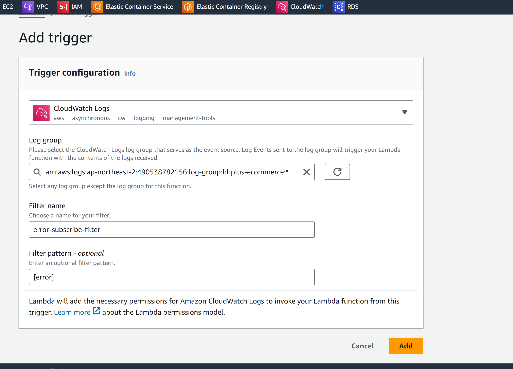

그리고 CloudWatch 로그 그룹에 있는 로그 스트림의 마지막 event 에 있는 로그 메세지를
가져와서 slack webhook API에 전송하는 코드를 작성한다.

```javascript
// imports
const https = require('https')
const AWS = require('aws-sdk')
// get envarionment variables
const ENV = process.env
const webhookUrl = ENV.slack_webhook_url

exports.handler = async (event, context) => {
  const cloudwatchlogs = new AWS.CloudWatchLogs()
  const logGroupName = 'hhplus-ecommerce'
  const logStreamPrefix = 'error'
  const logStreamName = 'error' // 여기에 로그 스트림 이름을 입력하세요

  try {
    const logStreamsResponse = await cloudwatchlogs
      .describeLogStreams({
        logGroupName,
        logStreamNamePrefix: logStreamPrefix,
        descending: true,
        limit: 1,
      })
      .promise()

    if (
      logStreamsResponse.logStreams &&
      logStreamsResponse.logStreams.length > 0
    ) {
      const latestLogStream = logStreamsResponse.logStreams[0]
      const latestLogStreamName = latestLogStream.logStreamName

      const data = await cloudwatchlogs
        .getLogEvents({
          logGroupName,
          logStreamName: latestLogStreamName,
          startFromHead: false,
          limit: 1,
        })
        .promise()

      console.log('event data ==> ', data)

      if (data && data.events && data.events.length > 0) {
        const latestLog = data.events[0].message
        console.log('latestLog => ', latestLog)
        await exports.handleLogMessage(latestLog)
      } else {
        console.log('No log events found.')
      }
    } else {
      console.log('No log events found.')
    }
  } catch (err) {
    console.error('Error fetching log events:', err)
  }
}

// set handle event func
exports.handleLogMessage = async logMessage => {
  const slackMessage = exports.createSlackMessage(logMessage)
  await exports.sendToSlack(slackMessage)
}
// create slack message
exports.createSlackMessage = message => {
  const time = exports.formatDate(message.StateChangeTime)
  return {
    attachments: [
      {
        title: `:warning: *[error]*`,
        fields: [
          {
            title: '발생시각',
            value: time,
          },
          {
            title: '로그',
            value: message,
          },
        ],
      },
    ],
  }
}
// request slack webhook api
exports.sendToSlack = async message => {
  try {
    const options = getSlackOptions()
    const response = await requestSlackWebhook(options, message)
  } catch (error) {
    console.error('Error sending message to Slack:', error)
  }
}

function getSlackOptions() {
  const { host, pathname } = new URL(webhookUrl)
  return {
    hostname: host,
    path: pathname,
    method: 'POST',
    headers: {
      'Content-Type': 'application/json',
    },
  }
}
function requestSlackWebhook(options, payload) {
  return new Promise((resolve, reject) => {
    const request = https.request(options, response => {
      response.setEncoding('utf8')
      let responseBody = ''
      response.on('data', chunk => {
        responseBody += chunk
      })
      response.on('end', () => {
        resolve(responseBody)
      })
    })

    request.on('error', e => {
      console.error(e)
      reject(e)
    })

    request.write(JSON.stringify(payload))
    request.end()
  })
}

// util - current timestamp
exports.formatDate = () => {
  function zerofill(n) {
    return n < 10 ? '0' + n : n
  }

  const kstDate = new Date(new Date().getTime() + 9 * 60 * 60 * 1000)

  return (
    kstDate.getFullYear().toString() +
    '-' +
    zerofill(kstDate.getMonth() + 1) +
    '-' +
    zerofill(kstDate.getDate()) +
    '-' +
    zerofill(kstDate.getHours()) +
    ':' +
    zerofill(kstDate.getMinutes()) +
    ':' +
    zerofill(kstDate.getSeconds())
  )
}
```

코드를 작성하고 Deploy 한 뒤에 테스트를 해보면

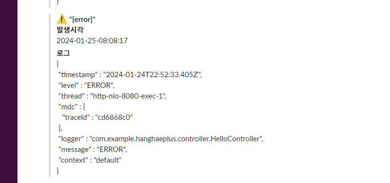

슬랙에 알림이 온다.

## 참고

https://www.whatap.io/ko/blog/5/ <br/>
https://newrelic.com/kr/blog/how-to-relic/what-is-log-management <br/>
https://tecoble.techcourse.co.kr/post/2021-08-07-logback-tutorial/<br/>
https://055055.tistory.com/96 <br/>
https://0soo.tistory.com/246 <br/>
https://newrelic.com/kr/resources/white-papers/log-management-best-practices <br/>

https://www.youtube.com/watch?v=fkwb8coxBJM
